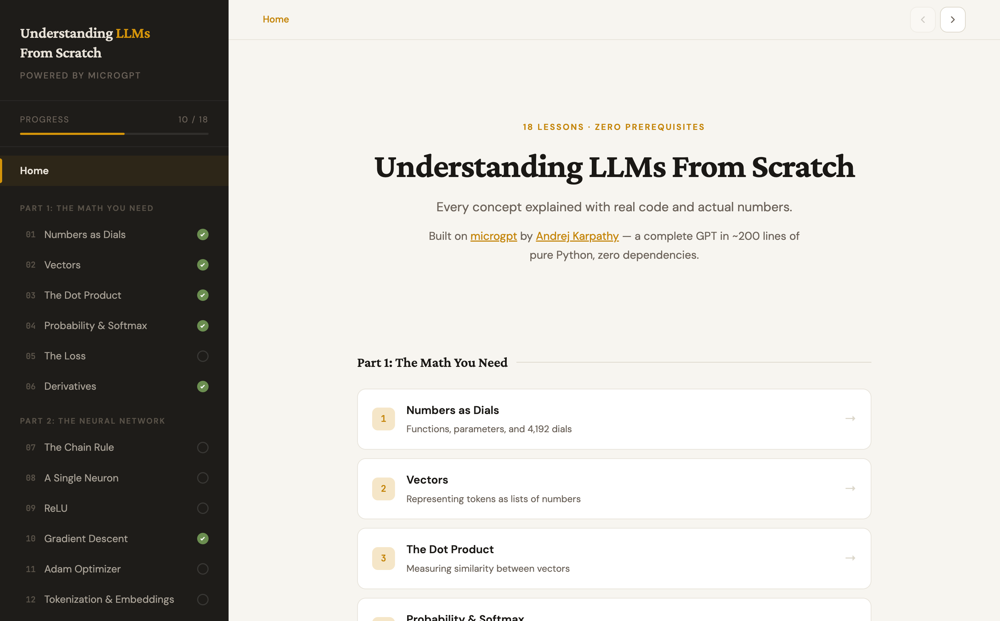
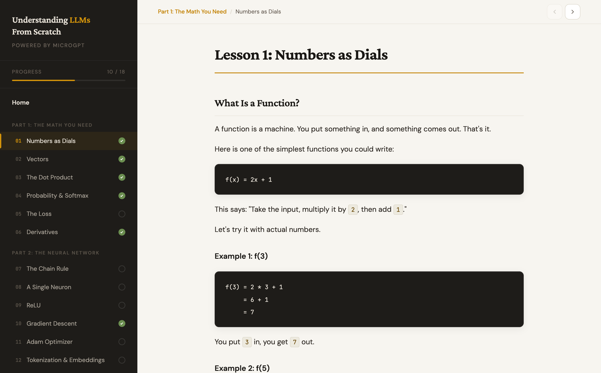
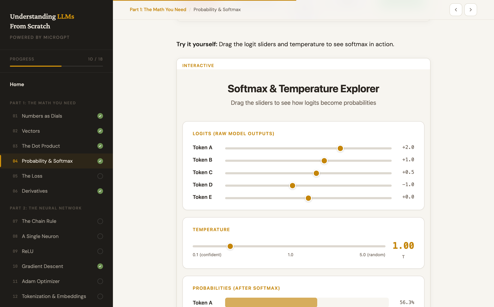
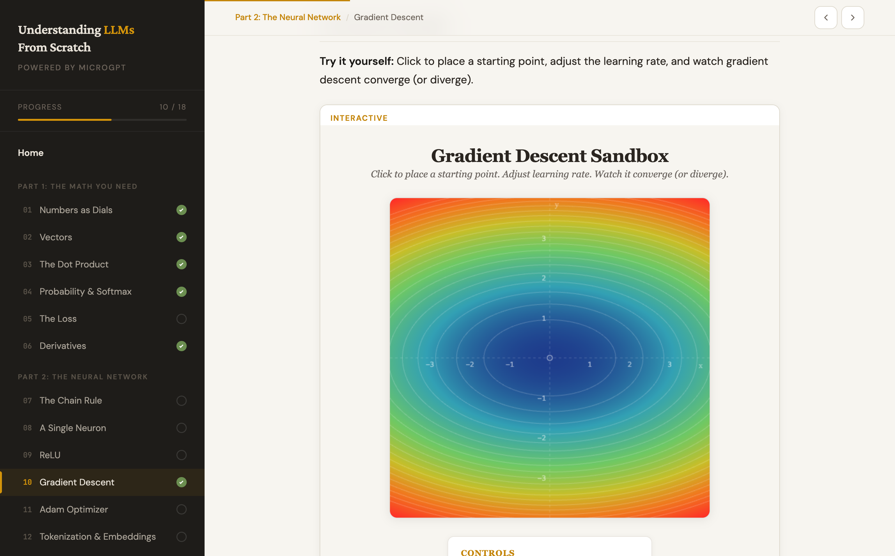
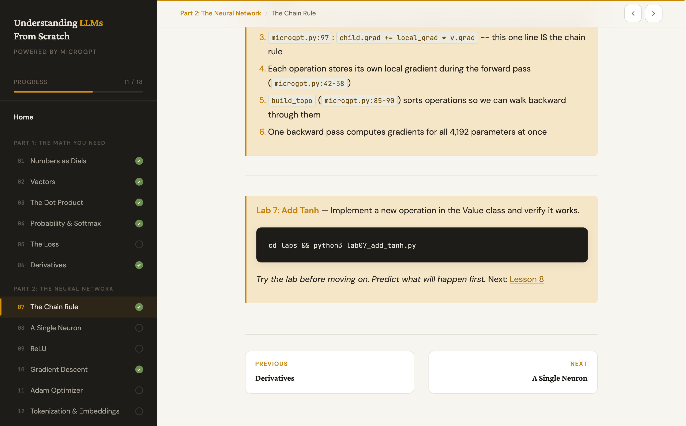

# Understanding LLMs From Scratch

A free, interactive course that teaches you how large language models work — from absolute zero to GPT-4 — using ~200 lines of pure Python as the only textbook.

**[Start the course](https://asulik1988.github.io/llm-learning/)**



## What is this?

This is a complete curriculum for understanding how LLMs work at a fundamental level. No hand-waving, no "it's like a brain." Every concept is explained with actual numbers, traced through real code, and made tangible with interactive visualizations and hands-on labs.

The entire course is built around [microgpt](https://gist.github.com/karpathy/8627fe009c40f57531cb18360106ce95) by [Andrej Karpathy](https://karpathy.ai/) — a complete GPT implementation in ~200 lines of pure Python with zero dependencies. It trains on 32,000 names and learns to generate new ones. The same architecture powers GPT-4 and Claude, just at a different scale.

### Who is this for?

- You're curious about how ChatGPT/Claude actually works under the hood
- You want to understand LLMs beyond "it predicts the next token"
- You don't have a math or CS background (or you do, but never learned ML)
- You learn best by building, breaking, and experimenting

### What you'll understand after completing this course

- What a parameter is and why a model has billions of them
- How text becomes numbers the model can process
- What attention actually does (not the hand-wavy version)
- How backpropagation traces blame through a computation graph
- Why the training loop works: predict, measure error, adjust, repeat
- How 200 lines of Python and 4,192 parameters scale to GPT-4

## The Course

### 18 Lessons

Every concept builds on the previous one. Start at Lesson 1.



| Part | Lessons | What You Learn |
|------|---------|----------------|
| **Part 1: The Math You Need** | 1-6 | Functions, vectors, dot products, softmax, loss, derivatives |
| **Part 2: The Neural Network** | 7-12 | Chain rule, neurons, ReLU, gradient descent, Adam, embeddings |
| **Part 3: The Transformer** | 13-18 | Attention, multi-head, forward pass, training loop, experiments, scaling |

Plus 3 appendices: [PyTorch mapping](lessons/appendix-pytorch-mapping.md), [glossary](lessons/glossary.md) (68 terms), and a [cheat sheet](lessons/cheat-sheet.md).

### 8 Interactive Visualizations

Embedded directly in the lessons. Drag sliders, click to experiment, see values update in real-time.

| Visualization | Lesson | What You Interact With |
|---|---|---|
| Function & Dials | 1 | Drag w and b sliders, watch f(x)=wx+b change |
| Dot Product Playground | 3 | Drag vectors in 2D, see similarity update live |
| Softmax Explorer | 4 | Adjust logits and temperature, see probabilities shift |
| Loss Explorer | 5 | Slide along the -log(x) curve |
| Backprop Stepper | 7 | Step through gradient computation node by node |
| Activation Explorer | 9 | Toggle ReLU/Tanh/None, see curve fitting succeed or fail |
| Gradient Descent Sandbox | 10 | Click to place a ball, adjust learning rate, watch it converge |
| Attention Heatmap | 13 | Type a name, see attention weights per head |





### 21 Hands-On Labs

Each lesson has a runnable Python lab that modifies microgpt to drive the concept home. Every lab starts with a "WHAT WE CHANGED" diff and a "PREDICTION" section — write down what you think will happen before you run it.



| Lab | What You Break/Build |
|-----|---------------------|
| Break Initialization | Zero init, huge init — see why random matters |
| See Embeddings | 2D scatter plot — watch vowels cluster |
| Dot Product Similarity | Compute similarity between letter embeddings |
| Temperature | 0.01 to 3.0 — robotic to chaotic |
| Watch the Loss | Trace -log(prob) at every position |
| Verify Gradients | Prove backprop is correct numerically |
| Add Tanh | Implement a new autograd operation |
| Inspect a Neuron | Look at weights, compute outputs by hand |
| Remove ReLU | See linearity collapse |
| Learning Rate Explorer | Plain SGD at 4 learning rates |
| Kill Momentum | Disable Adam's tricks one at a time |
| Trace the Pipeline | Walk "anna" through every step |
| Remove Attention | Skip attention — how much worse? |
| One vs Four Heads | Single head vs multi-head |
| Deeper Model | 1 layer vs 2 vs 4 |
| LR Warmup | Linear, cosine, warmup schedules |

Plus 5 bonus labs: Attention Scores, Overfit on Purpose, Freeze Layers, SGD vs Adam, Pokemon Names.

## Quick Start

### Option 1: Online (recommended)

**[https://asulik1988.github.io/llm-learning/](https://asulik1988.github.io/llm-learning/)**

No setup required. All lessons and interactive visualizations work in the browser.

### Option 2: Local

```bash
git clone https://github.com/asulik1988/llm-learning.git
cd llm-learning

# Run microgpt (trains in ~5 minutes, zero dependencies)
cd microgpt
python3 microgpt.py

# Browse the course locally
cd ../lessons
python3 -m http.server 8347
# Open http://localhost:8347/preview.html

# Run a lab
cd ../labs
python3 lab01_break_initialization.py
```

**Requirements:** Python 3.7+ (only for microgpt and labs). The course website has no dependencies.

## How It Works

The entire course is built around one file: [`microgpt.py`](microgpt/microgpt.py). It's Karpathy's most distilled teaching tool — a complete GPT (training AND inference) in ~200 lines of pure Python with zero external dependencies.

```
microgpt.py breakdown:
├── Lines 30-97:   Value class (autograd engine — backpropagation)
├── Lines 99-119:  Model parameters (4,192 random numbers)
├── Lines 121-134: Neural net ops (linear, softmax, rmsnorm)
├── Lines 136-179: The GPT model (embeddings, attention, MLP)
├── Lines 181-217: Training loop (Adam optimizer)
└── Lines 219-237: Inference (generate new names)
```

Each lesson takes a section of this code and explains it from first principles:
- **What** it does (the concept)
- **Why** it's needed (the motivation)
- **How** it works (the math, with actual numbers)
- **Where** it lives in microgpt (specific line numbers)

The interactive visualizations let you manipulate the concepts in real-time. The labs let you modify the code and see what breaks.

## Project Structure

```
llm-learning/
├── microgpt/
│   └── microgpt.py          # The complete GPT (~200 lines)
├── lessons/
│   ├── preview.html          # Course website
│   ├── 01-numbers-as-dials.md ... 18-from-microgpt-to-gpt4.md
│   ├── glossary.md           # 68-term quick reference
│   ├── cheat-sheet.md        # One-page architecture reference
│   ├── appendix-pytorch-mapping.md
│   ├── interactive/          # 8 browser-based visualizations
│   │   ├── softmax-explorer.html
│   │   ├── gradient-descent.html
│   │   ├── backprop-stepper.html
│   │   └── ...
│   └── images/               # 38 generated diagrams
├── labs/
│   ├── lab01_break_initialization.py ... lab16_lr_warmup.py
│   └── bonus_*.py            # 5 bonus labs
└── index.html                # GitHub Pages redirect
```

## Credits

- **[microgpt](https://gist.github.com/karpathy/8627fe009c40f57531cb18360106ce95)** by [Andrej Karpathy](https://karpathy.ai/) — the ~200-line GPT that powers this entire course
- Training data: [names.txt](https://github.com/karpathy/makemore) from Karpathy's makemore project

## License

The course content (lessons, labs, visualizations) is open source. microgpt is by Andrej Karpathy ([original gist](https://gist.github.com/karpathy/8627fe009c40f57531cb18360106ce95)).
