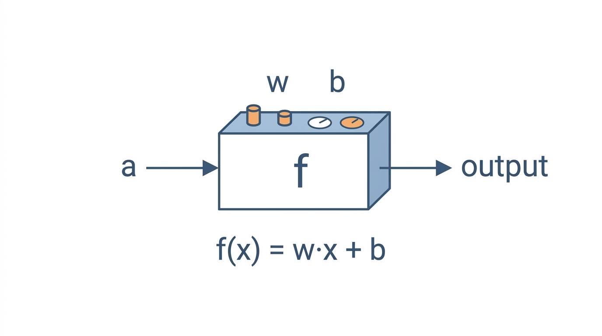
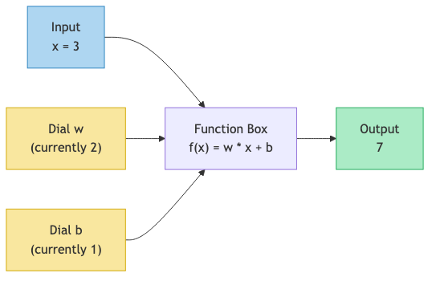
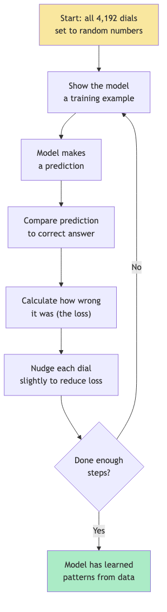

# Lesson 1: Numbers as Dials

## What Is a Function?

A function is a machine. You put something in, and something comes out. That's it.

Here is one of the simplest functions you could write:

```
f(x) = 2x + 1
```

This says: "Take the input, multiply it by `2`, then add `1`."

Let's try it with actual numbers.

### Example 1: f(3)

```
f(3) = 2 * 3 + 1
     = 6 + 1
     = 7
```

You put `3` in, you get `7` out.

### Example 2: f(5)

```
f(5) = 2 * 5 + 1
     = 10 + 1
     = 11
```

You put `5` in, you get `11` out.

Nothing mysterious here. A function is a recipe: follow the steps, get a result.

## Introducing Parameters (The "Dials")

Now look at this function:

```
f(x) = w * x + b
```

It looks similar, but we replaced the `2` and the `1` with letters: `w` and `b`. These are called **parameters**. Think of them as dials on a machine. The input `x` is what the user provides. The parameters `w` and `b` are settings that *we* control.

Different dial settings make the function behave completely differently:

| `w` | `b` | Function becomes | f(3) |
|-----|-----|------------------|------|
| `2` | `1` | `2x + 1` | `7` |
| `5` | `0` | `5x + 0` | `15` |
| `-1` | `10` | `-1x + 10` | `7` |
| `0.5` | `3` | `0.5x + 3` | `4.5` |
| `0` | `42` | `0x + 42` | `42` |

Same input (`3`), wildly different outputs -- all because we turned the dials.

Notice the last row: when `w = 0`, the input doesn't even matter. The function always outputs `42`. And when `b = 0` (second row), the function is pure scaling. The dials control everything about how the function behaves.

## A Function With Dials: The Diagram

Here is what's happening visually:





The yellow boxes are the dials (parameters). We can turn them to any value we want. The blue box is the input we're given. The green box is the output that results.

## A Model Is Just a Function With Thousands of Dials

This is the entire concept behind a language model. A model like microgpt is a function with:

- **Inputs**: a letter (like "a" or "m")
- **Output**: a prediction of the next letter
- **Parameters (dials)**: thousands of numbers that control the function's behavior

How many dials does microgpt have? We can check. In `microgpt.py:118-119`:

```python
params = [p for mat in state_dict.values() for row in mat for p in row]
print(f"num params: {len(params)}")
```

This collects every single parameter into one list and counts them. The answer: **4,192 parameters**. That's 4,192 dials that control how the model behaves.

For comparison:

| Model | Number of dials (parameters) |
|-------|-----|
| Our example `f(x) = w*x + b` | `2` |
| microgpt | `4,192` |
| GPT-2 (small) | `124,000,000` |
| GPT-3 | `175,000,000,000` |

The jump is enormous, but the concept is identical. More dials means the function can learn more complicated patterns. Our 2-dial function can only learn straight lines. microgpt's 4,192 dials can learn patterns in names. GPT-3's 175 billion dials can learn patterns in all of human language.

## All Dials Start Random

Here is the critical part: **nobody programs the rules**. Nobody tells the model "names that start with J often end in -ames" or "q is usually followed by u." Instead, all 4,192 dials start as random numbers.

In `microgpt.py:106`:

```python
matrix = lambda nout, nin, std=0.08: [[Value(random.gauss(0, std)) for _ in range(nin)] for _ in range(nout)]
```

`random.gauss(0, std)` generates a random number. The `0` means the numbers are centered around zero. The `std=0.08` means most numbers fall between roughly `-0.16` and `0.16`. So every dial starts as a small random number like `0.03` or `-0.07` or `0.12`.

At the very beginning, before any training, the model is pure noise. You give it the letter "J" and it predicts the next letter essentially by flipping a coin. It has no knowledge, no patterns, nothing useful.

## Training: Finding the Right Dial Settings

**Training** is the process of adjusting those random dials until the function does something useful.

The process works like this:

1. Show the model an example (like the name "emma")
2. The model predicts the next letter at each step
3. Compare the prediction to the actual next letter
4. Calculate a score for how wrong the model was (this is called the **loss**)
5. Nudge each dial a tiny bit in the direction that would make the prediction less wrong
6. Repeat thousands of times



After thousands of these nudges, the random dials have been shaped into values that make the function produce reasonable-looking names. Nobody wrote a single rule about English spelling or name patterns. All of that knowledge lives in the 4,192 numbers.

## No Rules Are Programmed

This is worth emphasizing because it's unintuitive. When microgpt generates a name like "emma" or "john," there is no rule inside the code that says "after 'j', pick 'o'." There is no dictionary of names. There is no grammar.

There are only 4,192 numbers. Those numbers were random garbage at the start. After training, they have been nudged -- one tiny step at a time -- into a configuration where the function happens to produce name-like outputs.

The patterns are not explicit rules. They are *implicit* in the dial settings. This is fundamentally different from traditional programming, where a human writes explicit rules.

| Traditional Programming | Machine Learning |
|---|---|
| Human writes rules | Rules emerge from data |
| Input + Rules = Output | Input + Output = Rules (dial settings) |
| Example: "if letter is 'q', next letter is 'u'" | Example: after training, the dials are set so the function gives high probability to 'u' after 'q' |

## What microgpt Actually Does

Let's make this concrete. microgpt learns to generate human names. It trains on a list of about 32,000 real names (like "emma", "olivia", "james") and learns patterns from them.

The model's job is simple: given some letters so far, predict the next letter. The input is one letter (plus its position in the name). The output is a prediction -- a probability for each of the 27 possible next tokens (26 letters plus a special "end of name" token).

Here is what the training data looks like (`microgpt.py:20-21`):

```python
docs = [line.strip() for line in open('input.txt') if line.strip()]
random.shuffle(docs)
```

It reads names from a file, one per line, and shuffles them. Then the training loop (`microgpt.py:188`) processes them one at a time, adjusting the dials after each name.

After training for 1,000 steps (`microgpt.py:186`), the model can generate new names it has never seen before. These aren't copied from the training data -- they are *invented* by the function, guided by the patterns encoded in its 4,192 dials. The inference code at `microgpt.py:223-238` does this: it starts with the "beginning of name" token and repeatedly asks the model "what comes next?" until the model predicts "end of name."

## A Preview of What's Inside

The 4,192 parameters are organized into groups, each with a different job. We'll explore all of these in upcoming lessons, but here's a preview:

| Parameter group | What it does | Count |
|---|---|---|
| Token embeddings (`wte`) | Represent each letter as 16 numbers | `27 * 16 = 432` |
| Position embeddings (`wpe`) | Represent each position as 16 numbers | `16 * 16 = 256` |
| Attention weights | Figure out which past letters matter | `4 * (16 * 16) = 1,024` |
| Feed-forward weights | Process and transform information | `2 * (64 * 16) = 2,048` |
| Output weights (`lm_head`) | Convert back to letter predictions | `27 * 16 = 432` |
| **Total** | | **4,192** |

Each group is just a collection of numbers (dials). They all start random. They all get adjusted during training. Together, they form a function that turns letters into predictions.

## Key Takeaways

> **What to remember from this lesson:**
>
> 1. A **function** takes an input and produces an output: `f(x) = w * x + b`
> 2. **Parameters** (`w` and `b`) are dials that control the function's behavior
> 3. A model is just a function with many dials -- microgpt has **4,192** of them (`microgpt.py:118-119`)
> 4. All dials start as **random numbers** (`microgpt.py:106`)
> 5. **Training** = showing examples and nudging dials to reduce errors
> 6. No rules are programmed. Patterns **emerge** from adjusting numbers

Next: [Lesson 2](./02-vectors.md)
