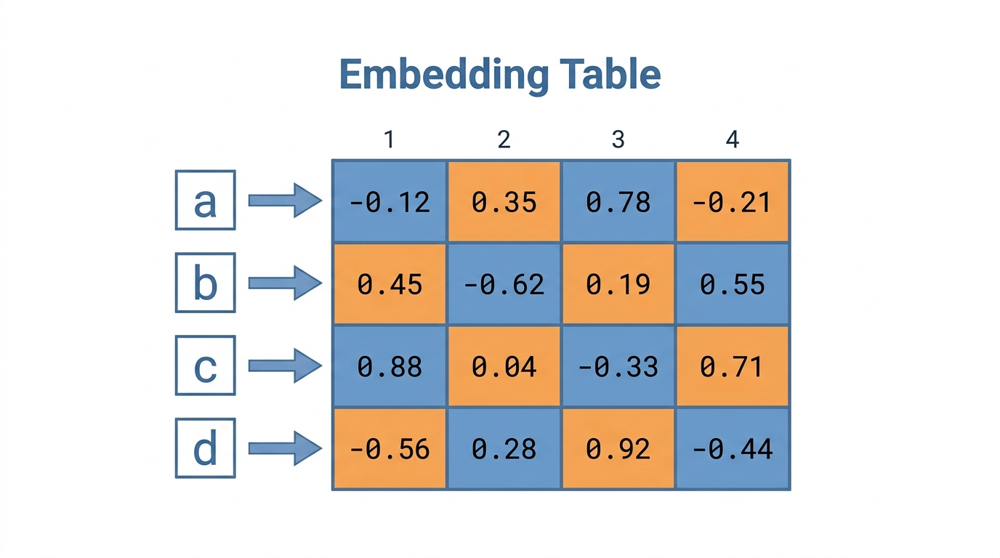
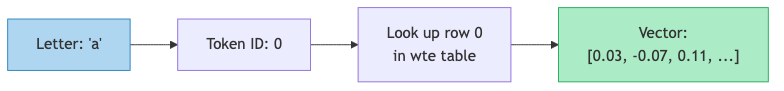
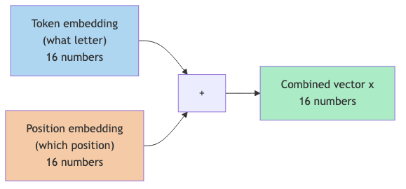

# Lesson 2: Lists of Numbers (Vectors)

Previous: [Lesson 1](./01-numbers-as-dials.md)



## One Number Is Not Enough

In the last lesson, our function `f(x) = w * x + b` had a single input `x`. That works fine for simple things. But how would you describe a person with just one number?

You could say "Alice is `170`" -- her height in centimeters. But that tells you nothing about her age, weight, or anything else. One number is a lossy, incomplete picture.

To describe something complex, you need **more than one number**. You need a list.

| Property | Value |
|----------|-------|
| Height (cm) | `170` |
| Weight (kg) | `65` |
| Age (years) | `30` |

Now Alice is described by three numbers: `[170, 65, 30]`. That's more informative than any single number could be.

## A Vector Is Just a List of Numbers

That's it. A vector is a list of numbers, written in square brackets:

```
[0.3, -0.1, 0.7]
```

This vector has 3 numbers, so we say it has **3 dimensions**. Each position in the list is one dimension.

Here are a few more examples:

| Vector | Dimensions | What it could represent |
|--------|-----------|----------------------|
| `[170, 65, 30]` | `3` | A person (height, weight, age) |
| `[0.9, 0.1]` | `2` | Probability of heads vs tails |
| `[0.3, -0.1, 0.7, 0.2, -0.5]` | `5` | Some abstract description |
| `[0.02, -0.07, 0.11, ...]` (16 numbers) | `16` | A letter's meaning in microgpt |

That last row is where things get interesting.

## How microgpt Represents Letters

microgpt works with letters. Its vocabulary is the 26 lowercase letters a-z plus a special "beginning/end of sequence" token (27 tokens total, as computed in `microgpt.py:27`).

The model needs to turn each letter into numbers so it can do math on it. But a single number per letter would be too limited. Instead, microgpt represents each letter as a vector of **16 numbers**.

In `microgpt.py:101`:

```python
n_embd = 16
```

`n_embd` stands for "number of embedding dimensions." Each letter gets 16 numbers to describe it.

Why 16? It's a design choice. More dimensions means a richer, more expressive representation, but also more parameters and slower training. Different models use different sizes:

| Model | Embedding dimensions |
|-------|---------------------|
| microgpt | `16` |
| GPT-2 (small) | `768` |
| GPT-3 | `12,288` |

microgpt uses 16 because it's a tiny educational model that only needs to learn patterns in short names.

## The Embedding Table: A Big Lookup Grid

So where do these 16 numbers for each letter come from? They live in a table called the **embedding table** (or `wte` -- "word token embeddings").

In `microgpt.py:108`:

```python
state_dict = {'wte': matrix(vocab_size, n_embd), ...}
```

`matrix(vocab_size, n_embd)` creates a table with `vocab_size` rows (27) and `n_embd` columns (16). That's a 27-row by 16-column grid.

Each row corresponds to one token (letter). Each row contains 16 numbers.

Here's what the table looks like conceptually (with made-up numbers for illustration):

```
             dim0    dim1    dim2    dim3   ...  dim15
token 0 (a): [ 0.03, -0.07,  0.11,  0.02, ...,  0.05]
token 1 (b): [-0.01,  0.08, -0.03,  0.14, ..., -0.02]
token 2 (c): [ 0.06,  0.01,  0.09, -0.11, ...,  0.07]
...
token 25(z): [-0.04,  0.05,  0.02,  0.08, ..., -0.06]
token 26(BOS):[ 0.01, -0.03,  0.07, -0.01, ...,  0.04]
```

Every single number in this table is a parameter -- a dial that gets adjusted during training. The table has `27 * 16 = 432` parameters just for token embeddings.

## Walking Through a Lookup

Let's say the model sees the letter "a". Here is exactly what happens.

**Step 1: Convert the letter to a token ID.**

The code in `microgpt.py:25-26` builds a sorted list of unique characters. In a typical names dataset, "a" would be the first letter alphabetically, so its token ID is `0`.

**Step 2: Look up that row in the embedding table.**

In `microgpt.py:139`:

```python
tok_emb = state_dict['wte'][token_id]
```

If `token_id` is `0`, this grabs row 0 from the table. The result is a list of 16 numbers:

```
tok_emb = [0.03, -0.07, 0.11, 0.02, -0.05, 0.08, -0.01, 0.04, 0.09, -0.06, 0.03, 0.12, -0.08, 0.01, 0.07, 0.05]
```

That's it. The letter "a" is now a vector of 16 numbers that the model can do math with.



## What Do These 16 Numbers Mean?

Here is the honest answer: **we don't know**, and that's the point.

In our "describe a person" example, each dimension had a clear human meaning: height, weight, age. In the embedding table, the 16 dimensions don't have pre-assigned meanings. They start as random numbers and get shaped by training.

After training, the numbers end up encoding useful patterns, but in a way that humans can't easily interpret. Dimension 3 might partially encode "how often does this letter appear at the start of a name" and partially encode "does this letter tend to be followed by a vowel" -- but it's all mixed together.

What we *can* say is this: if two letters behave similarly in names (like "m" and "n" -- both appear in similar positions, both are consonants), their vectors will end up being **similar** after training. The 16 numbers for "m" will be close to the 16 numbers for "n."

How we measure "similar" is the topic of the next lesson.

## Position Embeddings: Where Are You in the Name?

There is one more embedding table worth mentioning. Besides knowing *which* letter we're looking at, the model also needs to know *where* that letter is in the name. The first letter of a name behaves very differently from the fifth letter.

In `microgpt.py:108`, there is another table called `wpe` ("word position embeddings"):

```python
state_dict = {'wte': matrix(vocab_size, n_embd), 'wpe': matrix(block_size, n_embd), ...}
```

This is a `16 x 16` table (16 possible positions, each represented as 16 numbers). Position 0 gets one vector, position 1 gets another, and so on.

In `microgpt.py:139-141`, both embeddings are looked up and added together:

```python
tok_emb = state_dict['wte'][token_id]       # what letter is it?
pos_emb = state_dict['wpe'][pos_id]         # where in the name is it?
x = [t + p for t, p in zip(tok_emb, pos_emb)]  # combine both
```

The addition merges the "what" and "where" into a single vector of 16 numbers. This combined vector is what the rest of the model works with.



### A Concrete Example

Let's say we're processing the letter "e" at position 2 (the third position, since counting starts at 0).

```
Token embedding for "e":  [ 0.04, -0.02,  0.09, 0.01, ..., -0.03]  (16 numbers)
Position embedding for 2: [-0.01,  0.05, -0.03, 0.08, ...,  0.06]  (16 numbers)
                           ─────────────────────────────────────────
Combined (element-wise +): [ 0.03,  0.03,  0.06, 0.09, ...,  0.03]  (16 numbers)
```

Each of the 16 numbers is simply added together, one pair at a time.

## These Numbers Start Random

Just like every other parameter in the model (as we discussed in Lesson 1), every number in both embedding tables starts as a random value generated by `random.gauss(0, 0.08)` on `microgpt.py:106`.

Before training, the vector for "a" is random garbage. The vector for "b" is different random garbage. The model has no idea that "a" and "e" are both vowels, or that "x" and "z" are both rare.

After training, the vectors have been adjusted so that letters with similar roles in names have similar vectors. This happens automatically, purely from the dial-turning process described in Lesson 1.

## Key Takeaways

> **What to remember from this lesson:**
>
> 1. A **vector** is just a list of numbers: `[0.3, -0.1, 0.7]`
> 2. microgpt represents each letter as **16 numbers** (`n_embd = 16`, `microgpt.py:101`)
> 3. The **embedding table** (`wte`) has 27 rows and 16 columns (`microgpt.py:108`) -- one row per token
> 4. Looking up a letter's vector is a simple table lookup (`microgpt.py:139`)
> 5. **Position embeddings** (`wpe`) encode *where* a letter is in the name (`microgpt.py:140`)
> 6. Token and position embeddings are **added** element-wise to form the combined representation (`microgpt.py:141`)
> 7. All embedding numbers start random and get shaped by training

Next: [Lesson 3](./03-dot-product.md)
