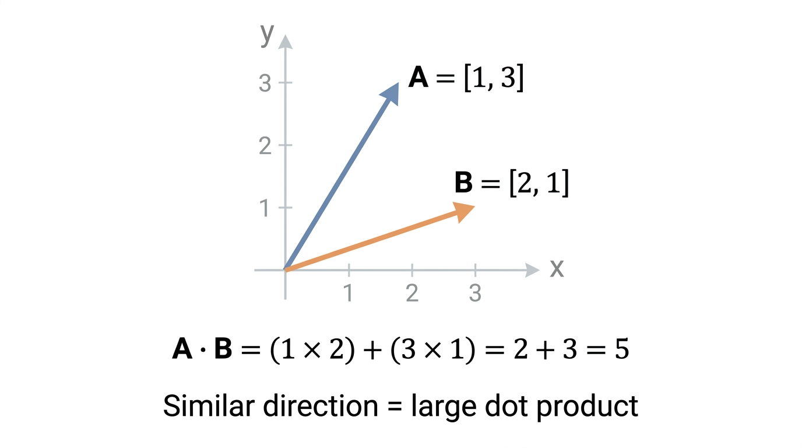
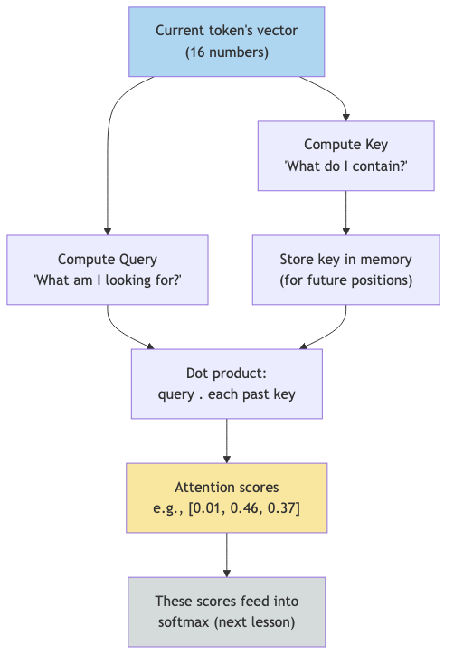

# Lesson 3: The Dot Product -- Measuring Similarity

Previous: [Lesson 2](./02-vectors.md)



## The Problem: Comparing Two Vectors

In the last lesson, we learned that each letter is represented as a vector of 16 numbers. Now we need a way to ask: **how similar are two vectors?**

This comes up constantly inside the model. When microgpt is trying to predict the next letter, it needs to figure out which past letters are relevant to the current prediction. To do that, it compares vectors. But how do you compare two lists of numbers and get a single answer?

## The Dot Product: Multiply and Sum

The dot product is a simple operation that takes two vectors of the same length and produces a single number.

The recipe:
1. Multiply the numbers at each matching position
2. Add up all the results

That's it.

### Concrete Example

Let's take two vectors with 3 numbers each:

```
A = [1, 2, 3]
B = [4, 5, 6]
```

**Step 1: Multiply at each position**

| Position | A | B | A * B |
|----------|---|---|-------|
| 0 | `1` | `4` | `1 * 4 = 4` |
| 1 | `2` | `5` | `2 * 5 = 10` |
| 2 | `3` | `6` | `3 * 6 = 18` |

**Step 2: Sum the results**

```
4 + 10 + 18 = 32
```

The dot product of A and B is `32`. Two vectors in, one number out.

### Another Example

```
C = [1, 0, -1]
D = [2, 5, 3]
```

| Position | C | D | C * D |
|----------|---|---|-------|
| 0 | `1` | `2` | `2` |
| 1 | `0` | `5` | `0` |
| 2 | `-1` | `3` | `-3` |

```
2 + 0 + (-3) = -1
```

**Try it yourself:** Drag the vectors to see how direction affects the dot product.

[Dot Product Playground](./interactive/dot-product.html)

The dot product is `-1`. Notice how position 1 contributed nothing (because `C` has a `0` there) and position 2 *subtracted* (because `C` has a negative number there).

## What Does the Dot Product Tell Us?

The dot product measures **how much two vectors point in the same direction**. Think of it as a similarity score:

| Dot product | Meaning |
|-------------|---------|
| Large positive (e.g., `32`) | Vectors point in a similar direction -- they are **similar** |
| Near zero (e.g., `0.1`) | Vectors are unrelated -- they point in **perpendicular** directions |
| Large negative (e.g., `-25`) | Vectors point in opposite directions -- they are **dissimilar** |

### Building Intuition With 2D Vectors

Let's use tiny 2-element vectors to see this clearly. Imagine each vector as an arrow on a flat piece of paper.

```
Same direction:     A = [1, 0]    B = [1, 0]     A . B = 1*1 + 0*0 = 1    (positive)
Similar direction:  A = [1, 0]    B = [1, 1]     A . B = 1*1 + 0*1 = 1    (positive)
Perpendicular:      A = [1, 0]    B = [0, 1]     A . B = 1*0 + 0*1 = 0    (zero)
Opposite direction: A = [1, 0]    B = [-1, 0]    A . B = 1*(-1) + 0*0 = -1 (negative)
```

When vectors agree (both positive in the same positions, or both negative), the products are positive and the sum grows. When they disagree (one positive where the other is negative), the products are negative and the sum shrinks.

### A More Realistic Example

Suppose, after training, the model has learned these embedding vectors for three letters:

```
"m" = [ 0.5,  0.3, -0.1,  0.4]
"n" = [ 0.4,  0.3, -0.2,  0.5]
"z" = [-0.3,  0.1,  0.6, -0.4]
```

Let's compute dot products:

**"m" and "n" (both common consonants in names):**
```
0.5*0.4 + 0.3*0.3 + (-0.1)*(-0.2) + 0.4*0.5
= 0.20 + 0.09 + 0.02 + 0.20
= 0.51
```

**"m" and "z" (very different usage patterns):**
```
0.5*(-0.3) + 0.3*0.1 + (-0.1)*0.6 + 0.4*(-0.4)
= -0.15 + 0.03 + -0.06 + -0.16
= -0.34
```

The dot product says "m" and "n" are similar (`0.51`, positive) and "m" and "z" are dissimilar (`-0.34`, negative). This matches our intuition: "m" and "n" appear in similar contexts in English names.

## The Dot Product in Attention

Now for the payoff. This is where the dot product does its most important work in microgpt.

When the model is processing a sequence of letters (say, the name "emma"), at each position it asks: **"Which of the previous letters should I pay attention to right now?"**

It answers this question using dot products. Here is the line that does it, `microgpt.py:162`:

```python
attn_logits = [sum(q_h[j] * k_h[t][j] for j in range(head_dim)) / head_dim**0.5
               for t in range(len(k_h))]
```

Let's break this apart piece by piece.

### Queries and Keys

For every letter the model processes, it creates two vectors:

- A **query** vector (`q`): "What am I looking for?"
- A **key** vector (`k`): "What do I contain?"

These are created on `microgpt.py:149-150`:

```python
q = linear(x, state_dict[f'layer{li}.attn_wq'])
k = linear(x, state_dict[f'layer{li}.attn_wk'])
```

(Don't worry about `linear` yet -- it's just a function that transforms the 16-number vector into a new 16-number vector using parameters.)

The dot product of a query with a key produces a **score**: how relevant is that past letter to the current prediction?

### Walking Through a Tiny Example

Suppose we are processing the name "emma" and we've reached the second "m" (position 2). The model has already seen "e" (position 0) and "m" (position 1).

For simplicity, let's use 4-dimensional vectors (microgpt actually uses `head_dim = 4`, since `n_embd = 16` divided among `n_head = 4` heads, as configured in `microgpt.py:103-104`).

```
Query for position 2 (current "m"):  q = [0.8, -0.3, 0.5, 0.1]

Key for position 0 ("e"):  k0 = [0.2, 0.4, -0.1, 0.3]
Key for position 1 ("m"):  k1 = [0.7, -0.2, 0.6, 0.0]
Key for position 2 ("m"):  k2 = [0.6, -0.1, 0.4, 0.2]
```

**Dot product of query with key 0 ("e"):**
```
0.8*0.2 + (-0.3)*0.4 + 0.5*(-0.1) + 0.1*0.3
= 0.16 + (-0.12) + (-0.05) + 0.03
= 0.02
```

**Dot product of query with key 1 ("m"):**
```
0.8*0.7 + (-0.3)*(-0.2) + 0.5*0.6 + 0.1*0.0
= 0.56 + 0.06 + 0.30 + 0.00
= 0.92
```

**Dot product of query with key 2 (current "m"):**
```
0.8*0.6 + (-0.3)*(-0.1) + 0.5*0.4 + 0.1*0.2
= 0.48 + 0.03 + 0.20 + 0.02
= 0.73
```

The raw attention scores are:

| Past position | Letter | Dot product score |
|---------------|--------|-------------------|
| 0 | "e" | `0.02` |
| 1 | "m" | `0.92` |
| 2 | "m" (current) | `0.73` |

The model finds position 1 ("m") most relevant to the current prediction, and position 0 ("e") barely relevant. This makes intuitive sense: when you've seen "em" and you're at the second "m," the previous "m" is highly informative (doubled letters are common in names like "emma").

### The Scaling Factor

You might have noticed the `/ head_dim**0.5` part in the code. For `head_dim = 4`, this divides by `4**0.5 = 2.0`. This keeps the dot product scores from getting too large, which helps with the softmax step (covered in the next lesson).

After scaling, our scores become:

```
0.02 / 2.0 = 0.01
0.92 / 2.0 = 0.46
0.73 / 2.0 = 0.365
```

These scaled scores are what the code calls `attn_logits`.

## The Full Attention Flow

Here is what happens at each position in the sequence:



The attention scores tell the model how much to "pay attention" to each past letter. High scores mean "this past letter is very relevant to predicting what comes next." Low scores mean "this past letter doesn't matter much right now."

## Why This Matters

The dot product is deceptively simple -- multiply and sum. But it's the fundamental operation that lets the model compare things. Every time microgpt asks "is this letter relevant to that letter?" it's computing a dot product.

In the full model, this happens many times: microgpt has `4` attention heads (`microgpt.py:103`), each computing its own set of dot products with its own queries and keys. This lets the model check for multiple types of relevance simultaneously (one head might check for "same letter," another for "nearby vowel," etc.).

## Key Takeaways

> **What to remember from this lesson:**
>
> 1. The **dot product** multiplies corresponding elements and sums: `[1,2,3] . [4,5,6] = 4 + 10 + 18 = 32`
> 2. Large positive = similar, near zero = unrelated, large negative = opposite
> 3. Attention uses dot products to ask "how relevant is each past token?" (`microgpt.py:162`)
> 4. Each position computes a **query** ("what am I looking for?") and a **key** ("what do I contain?") (`microgpt.py:149-150`)
> 5. The dot product of query and key produces a raw attention **score**
> 6. Scores are divided by `head_dim**0.5` to keep them from growing too large


---

> **Lab 3: Dot Product Similarity** — Compute dot products between trained letter embeddings. See which letters the model considers similar.
>
> ```bash
> cd labs && python3 lab03_dot_product_similarity.py
> ```
>
> *Try the lab before moving on. Predict what will happen first.*
Next: [Lesson 4](./04-probability-and-softmax.md)
