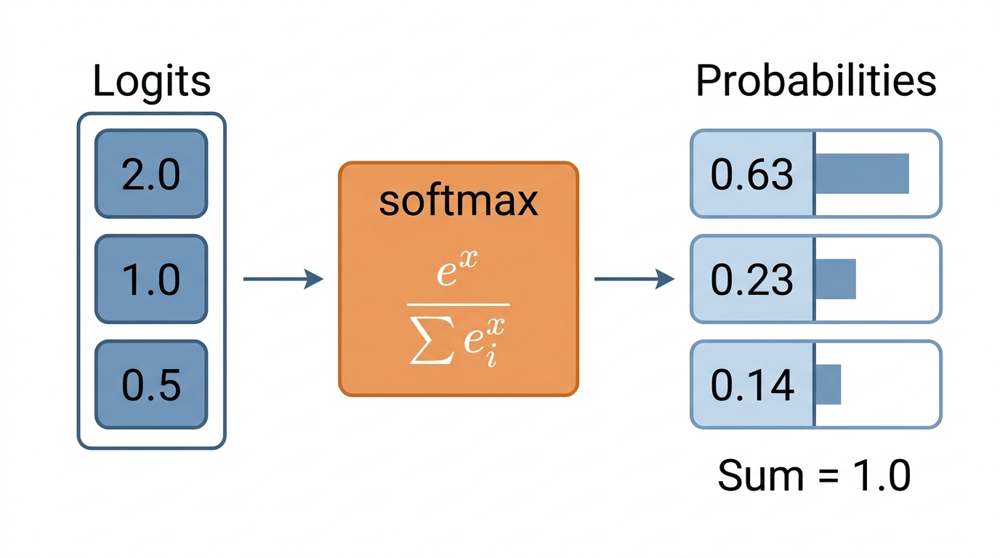
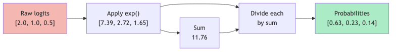
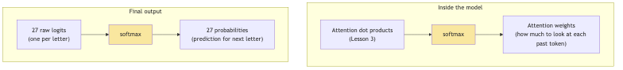

# Lesson 4: Probability and Softmax

Previous: [Lesson 3](./03-dot-product.md)



## What Is Probability?

Probability is a number between `0` and `1` that represents how likely something is.

| Probability | Meaning |
|-------------|---------|
| `0.0` | Impossible -- will never happen |
| `0.1` | 10% chance -- unlikely |
| `0.5` | 50% chance -- coin flip |
| `0.9` | 90% chance -- very likely |
| `1.0` | 100% chance -- certain |

When you list the probabilities of all possible outcomes, they **must add up to `1`**. If there are three possible outcomes, their probabilities might be `[0.6, 0.3, 0.1]`. Check: `0.6 + 0.3 + 0.1 = 1.0`. Good.

This makes sense: something has to happen, so the total chance across all possibilities is 100%.

### Example: Next-Letter Prediction

microgpt has 27 possible tokens (26 letters + the start/end token). After processing the letters "em", the model needs to assign a probability to each possible next letter:

```
P(a) = 0.02    P(b) = 0.01    P(c) = 0.01    ...
P(m) = 0.45    P(n) = 0.08    ...
P(i) = 0.15    P(e) = 0.10    ...
```

All 27 probabilities must sum to `1.0`. The highest probability (`0.45` for "m") is the model's best guess, but it's not certain -- there's a 15% chance of "i" (as in "emit") and 10% chance of "e" (as in "emerald").

## The Problem: Raw Scores Aren't Probabilities

The model doesn't directly output probabilities. It outputs **logits** -- raw scores that can be any number: positive, negative, huge, tiny. They come from the final linear layer in `microgpt.py:178`:

```python
logits = linear(x, state_dict['lm_head'])
```

This produces 27 numbers (one per token), and they might look like this:

```
logits = [2.0, 1.0, 0.5, -1.5, 3.2, -0.8, ...]  (27 numbers)
```

These numbers are not between `0` and `1`. They don't sum to `1`. They're not probabilities. But they do encode the model's preferences: a higher logit means the model thinks that token is more likely.

We need a way to convert these messy raw scores into clean probabilities. That's what softmax does.

## The Exponential Function: Making Everything Positive

Before we get to softmax, we need one building block: the **exponential function**, written `exp(x)`.

The exponential function takes any number and makes it positive. It also has a useful property: bigger inputs produce *dramatically* bigger outputs.

| Input `x` | `exp(x)` |
|-----------|----------|
| `-2` | `0.14` |
| `-1` | `0.37` |
| `0` | `1.00` |
| `1` | `2.72` |
| `2` | `7.39` |
| `3` | `20.09` |
| `5` | `148.41` |

Key observations:
- Negative inputs produce small positive numbers (but never zero or negative)
- Zero gives exactly `1`
- Positive inputs produce large numbers that grow fast

This is exactly what we need: a way to turn any number into a positive number, while preserving the ordering (bigger input = bigger output).

## Softmax: The Full Recipe

Softmax converts a list of any numbers into valid probabilities in two steps:

1. Apply `exp()` to each number (making them all positive)
2. Divide each result by the sum of all results (making them sum to `1`)

The formula:

```
softmax(x_i) = exp(x_i) / sum of all exp(x_j)
```

### Full Worked Example

Let's convert these three logits into probabilities:

```
logits = [2.0, 1.0, 0.5]
```

**Step 1: Apply exp() to each**

```
exp(2.0) = 7.389
exp(1.0) = 2.718
exp(0.5) = 1.649
```

**Step 2: Sum them up**

```
total = 7.389 + 2.718 + 1.649 = 11.756
```

**Step 3: Divide each by the total**

```
7.389 / 11.756 = 0.628
2.718 / 11.756 = 0.231
1.649 / 11.756 = 0.140
```

**Result:**

| Logit | After exp() | Probability |
|-------|-------------|-------------|
| `2.0` | `7.389` | `0.628` (62.8%) |
| `1.0` | `2.718` | `0.231` (23.1%) |
| `0.5` | `1.649` | `0.140` (14.0%) |
| **Total** | **11.756** | **0.999** (rounding) |

We started with `[2.0, 1.0, 0.5]` (not probabilities) and ended with `[0.628, 0.231, 0.140]` (valid probabilities that sum to 1). The relative ordering is preserved: `2.0` was the highest logit, so `0.628` is the highest probability.



**Try it yourself:** Drag the logit sliders and temperature to see softmax in action.

[Softmax Explorer](./interactive/softmax-explorer.html)

### What Softmax Does to Differences

Softmax amplifies differences. A small gap in logits becomes a bigger gap in probabilities:

| Logits | Probabilities | Observation |
|--------|---------------|-------------|
| `[1.0, 1.0, 1.0]` | `[0.333, 0.333, 0.333]` | Equal logits give equal probabilities |
| `[2.0, 1.0, 1.0]` | `[0.576, 0.212, 0.212]` | One logit slightly higher dominates |
| `[5.0, 1.0, 1.0]` | `[0.952, 0.024, 0.024]` | One logit much higher nearly takes all |
| `[10.0, 1.0, 1.0]` | `[0.9999, 0.00005, 0.00005]` | Extreme difference makes it nearly certain |

This is a useful behavior: the more confident the model is (bigger gap between the top logit and the rest), the closer the top probability gets to `1.0`.

## Softmax in microgpt

Here is the actual softmax function from `microgpt.py:125-129`:

```python
def softmax(logits):
    max_val = max(val.data for val in logits)
    exps = [(val - max_val).exp() for val in logits]
    total = sum(exps)
    return [e / total for e in exps]
```

Let's walk through each line:

**Line 126: `max_val = max(val.data for val in logits)`**

Find the largest logit value. If our logits are `[2.0, 1.0, 0.5]`, then `max_val = 2.0`.

**Line 127: `exps = [(val - max_val).exp() for val in logits]`**

Subtract `max_val` from each logit *before* applying `exp()`. So we compute:

```
exp(2.0 - 2.0) = exp(0.0) = 1.000
exp(1.0 - 2.0) = exp(-1.0) = 0.368
exp(0.5 - 2.0) = exp(-1.5) = 0.223
```

**Wait -- why subtract the maximum?**

This is the **numerical stability trick**. Without it, if a logit is very large (say `1000`), then `exp(1000)` is an astronomically huge number that breaks the computer's ability to represent it (this is called "overflow"). By subtracting the maximum first, the largest value fed to `exp()` is always `0`, and all others are negative. Since `exp(0) = 1` and `exp(negative) < 1`, the numbers stay manageable.

The beautiful part: this subtraction doesn't change the final probabilities at all. The math works out identically. It's purely a practical trick to avoid crashes.

**Line 128: `total = sum(exps)`**

```
total = 1.000 + 0.368 + 0.223 = 1.591
```

**Line 129: `return [e / total for e in exps]`**

```
1.000 / 1.591 = 0.629
0.368 / 1.591 = 0.231
0.223 / 1.591 = 0.140
```

Same answer as before (within rounding): `[0.629, 0.231, 0.140]`.

## Where Softmax Appears in microgpt

Softmax is used in **two places** in microgpt:

### 1. Attention Weights (microgpt.py:163)

```python
attn_weights = softmax(attn_logits)
```

After computing the dot-product attention scores (from Lesson 3), softmax converts them into weights that sum to `1`. This tells the model how much to "pay attention" to each past position. For example, attention weights `[0.05, 0.70, 0.25]` mean "pay 70% attention to position 1, 25% to position 2, and 5% to position 0."

### 2. Final Output Probabilities (microgpt.py:200)

```python
probs = softmax(logits)
```

After the model produces 27 logits (one per possible next token), softmax converts them into 27 probabilities. This is the model's final prediction: "I think there's a 45% chance the next letter is 'm,' a 15% chance it's 'i,' etc."



## Putting It All Together

Let's trace the full path from logits to a prediction. Suppose after processing "em", microgpt's final layer produces these 27 logits (simplified to show just a few):

```
Token  0 (a): logit = -0.8     Token 12 (m): logit = 3.1
Token  1 (b): logit = -1.2     Token 13 (n): logit = 0.5
Token  4 (e): logit = 1.1      Token 8  (i): logit = 1.8
...other tokens: various small/negative logits...
```

After softmax, these become probabilities. Token 12 ("m") has the highest logit (`3.1`), so it gets the highest probability. The model predicts "m" is most likely the next letter after "em" -- which makes sense, since "emma" is a common name.

## Key Takeaways

> **What to remember from this lesson:**
>
> 1. **Probability** is a number between `0` and `1`; all probabilities must sum to `1`
> 2. The model outputs **logits** -- raw scores that can be any number (`microgpt.py:178`)
> 3. **Softmax** converts logits into probabilities: apply `exp()`, then divide by the sum
> 4. Worked example: `[2.0, 1.0, 0.5]` becomes `[0.63, 0.23, 0.14]`
> 5. microgpt subtracts the max logit first for **numerical stability** (`microgpt.py:126`) -- this doesn't change the answer
> 6. Softmax appears twice: for **attention weights** (`microgpt.py:163`) and for **final predictions** (`microgpt.py:200`)


---

> **Lab 4: Temperature** — Generate names at temperatures from 0.01 to 3.0. See the full spectrum.
>
> ```bash
> cd labs && python3 lab04_temperature.py
> ```
>
> *Try the lab before moving on. Predict what will happen first.*
Next: [Lesson 5](./05-loss.md)
