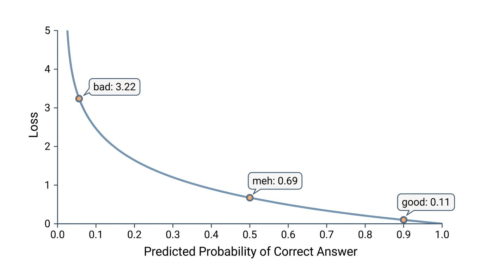
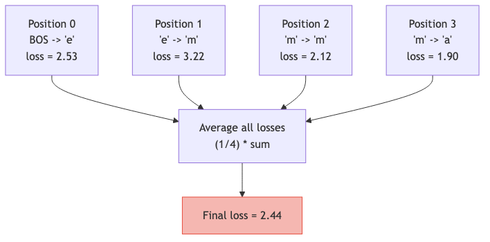
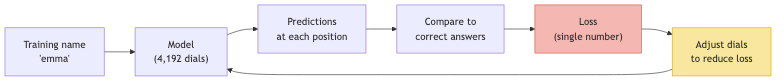

# Lesson 5: The Loss -- The Model's Report Card

Previous: [Lesson 4](./04-probability-and-softmax.md)



## The Setup

After softmax, we have probabilities. The model just processed "em" and produced 27 probabilities -- one for each possible next letter. In the training data, the correct next letter is "m" (the name is "emma").

Now we need a way to **grade** the prediction. Is it good? Is it terrible? We need a single number that answers this question. That number is called the **loss**.

## Intuition: What Makes a Good Prediction?

The model assigned some probability to the correct answer "m." Let's think about what makes that probability good or bad:

| Scenario | P("m") | Quality |
|----------|--------|---------|
| Model is very confident in "m" | `0.90` | Excellent |
| Model thinks "m" is somewhat likely | `0.50` | Decent |
| Model barely considers "m" | `0.04` | Poor |
| Model essentially dismisses "m" | `0.01` | Terrible |

We only care about one number out of the 27 probabilities: the probability assigned to the **correct answer**. High probability for the correct answer means the model is doing well. Low probability means it's doing badly.

## Negative Log Likelihood: Turning Probability Into a Score

We need to convert that probability into a "badness score" -- a loss. We want:

- Low probability (bad prediction) to give a **high** loss
- High probability (good prediction) to give a **low** loss

The function that does this is **negative log**, written `-log(p)`.

### What Does log Do?

The log function (natural logarithm) takes a positive number and returns:

| Input | `log(input)` |
|-------|-------------|
| `0.01` | `-4.61` |
| `0.1` | `-2.30` |
| `0.5` | `-0.69` |
| `1.0` | `0.00` |

For numbers between `0` and `1` (which probabilities always are), the log is always negative. Smaller inputs give more negative outputs.

### Adding the Negative Sign

Since `log(probability)` is always negative (for probabilities less than 1), we negate it to get a positive loss:

```
loss = -log(probability of correct answer)
```

Now let's compute the loss for different prediction qualities:

```
P(correct) = 0.90  -->  loss = -log(0.90) = 0.11
P(correct) = 0.50  -->  loss = -log(0.50) = 0.69
P(correct) = 0.04  -->  loss = -log(0.04) = 3.22
P(correct) = 0.01  -->  loss = -log(0.01) = 4.61
```

### The Full Picture

| P(correct) | -log(P) = Loss | Verdict |
|------------|----------------|---------|
| `1.00` | `0.00` | Perfect (impossible in practice) |
| `0.90` | `0.11` | Excellent |
| `0.70` | `0.36` | Good |
| `0.50` | `0.69` | Mediocre |
| `0.30` | `1.20` | Poor |
| `0.10` | `2.30` | Bad |
| `0.04` | `3.22` | Very bad |
| `0.01` | `4.61` | Terrible |
| `0.001` | `6.91` | Catastrophic |

Notice the pattern: as the probability drops, the loss doesn't just increase -- it **accelerates**. Going from `0.50` to `0.30` adds about `0.5` to the loss. Going from `0.04` to `0.01` adds about `1.4`. The model gets punished more and more severely as its prediction gets worse.

This acceleration is desirable. A model that gives the right answer 4% probability is bad, but a model that gives it 0.1% is *much* worse, and the loss reflects that.

## Why Specifically log?

There are other functions that turn high probability into low loss and vice versa. Why do we use `log` instead of, say, `1/p` or `(1-p)`? A few reasons:

**1. Perfect prediction gives exactly zero loss.** When `P = 1.0`, `log(1.0) = 0`, so `-log(1.0) = 0`. The best possible score is zero.

**2. Impossible prediction gives infinite loss.** As probability approaches `0`, `-log(p)` approaches infinity. You can never fully excuse giving zero probability to something that actually happened.

**3. Mathematical convenience.** The log function has nice properties that make computing derivatives (Lesson 6) much cleaner. This matters enormously for training.

## This Exact Computation in microgpt

Here are the lines that compute the loss. In `microgpt.py:200-201`:

```python
probs = softmax(logits)
loss_t = -probs[target_id].log()
```

Let's unpack this:

- `probs = softmax(logits)` -- convert the 27 raw logits into 27 probabilities (exactly as in Lesson 4)
- `probs[target_id]` -- grab the probability assigned to the correct next token. If the correct answer is "m" and its token ID is `12`, then this is `probs[12]`
- `.log()` -- take the natural log of that probability
- The leading `-` negates it, giving us the loss

So if `probs[12] = 0.04` (model gave 4% chance to the correct answer "m"):

```
loss_t = -log(0.04) = 3.22
```

The model gets a score of `3.22` for this one prediction. That's a bad score.

## Loss Across an Entire Name

A name like "emma" has multiple letters, and the model makes a prediction at every position. It doesn't just predict one next letter -- it predicts all of them:

| Position | Input | Target (correct next letter) | P(target) | Loss |
|----------|-------|-----|-----------|------|
| 0 | BOS (start) | "e" | `0.08` | `2.53` |
| 1 | "e" | "m" | `0.04` | `3.22` |
| 2 | "m" | "m" | `0.12` | `2.12` |
| 3 | "m" | "a" | `0.15` | `1.90` |

Each position produces a `loss_t` value. These are collected in `microgpt.py:195-202`:

```python
losses = []

for pos_id in range(n):
    token_id, target_id = tokens[pos_id], tokens[pos_id + 1]
    logits = gpt(token_id, pos_id, keys, values)
    probs = softmax(logits)
    loss_t = -probs[target_id].log()
    losses.append(loss_t)
```

Then on `microgpt.py:204`, all the per-position losses are **averaged**:

```python
loss = (1 / n) * sum(losses)
```

For our example with 4 positions:

```
loss = (1/4) * (2.53 + 3.22 + 2.12 + 1.90)
     = (1/4) * 9.77
     = 2.44
```

The average loss for this training example is `2.44`. This single number summarizes how well the model predicted the name "emma."



## The Loss Is the Only Signal

This is a crucial point. The loss is the **only** signal that drives all learning. The entire training process (adjusting all 4,192 dials) exists to make this one number smaller.



The rest of the model -- embeddings, attention, dot products, softmax -- is all machinery. Its entire purpose is to produce predictions that, when scored by the loss function, yield a small number. Everything else is in service of reducing the loss.

## Tracking the Loss During Training

In `microgpt.py:217`:

```python
print(f"step {step+1:4d} / {num_steps:4d} | loss {loss.data:.4f}", end='\r')
```

This prints the loss at each training step. At the beginning of training, when all dials are random, the loss is high (around `3.3` -- roughly `-log(1/27)`, which is what you'd get from random guessing across 27 tokens). As training progresses, the loss decreases, meaning the model's predictions are getting better.

| Training step | Typical loss | What it means |
|---------------|-------------|---------------|
| `1` | `~3.30` | Random guessing |
| `100` | `~2.80` | Slightly better than random |
| `500` | `~2.20` | Learning common patterns |
| `1000` | `~1.80` | Reasonably good predictions |

The loss will never reach `0` -- names are inherently unpredictable (after "ma", the next letter could be "r" or "t" or "x"). But a lower loss means the model has learned real patterns in the data.

## Why the Starting Loss Is About 3.3

This is a useful sanity check. Before training, the model assigns roughly equal probability to all 27 tokens. Equal probability means `1/27` for each token, so:

```
loss = -log(1/27)
     = -log(0.037)
     = 3.30
```

If you see a starting loss much higher than `3.3`, something is broken. If it starts much lower, the model got lucky or something is wrong with the data. This baseline of `3.3` is "random guessing" loss for a 27-token vocabulary.

## Key Takeaways

> **What to remember from this lesson:**
>
> 1. The **loss** measures how bad the model's prediction is -- lower is better
> 2. Loss = `-log(probability of correct answer)` -- this is called **negative log likelihood**
> 3. High probability (good) gives low loss: `-log(0.9) = 0.11`. Low probability (bad) gives high loss: `-log(0.01) = 4.61`
> 4. microgpt computes loss at each position (`microgpt.py:201`) and averages them (`microgpt.py:204`)
> 5. Random guessing on 27 tokens gives a loss of about `3.3`
> 6. The loss is the **only signal** that drives all learning -- every parameter adjustment aims to reduce this single number

Next: [Lesson 6](./06-derivatives.md)
