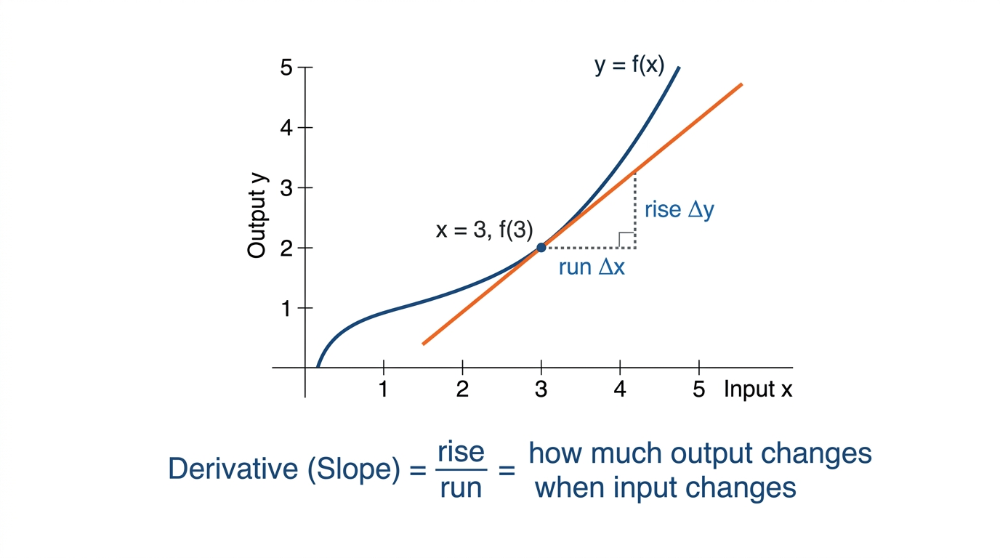
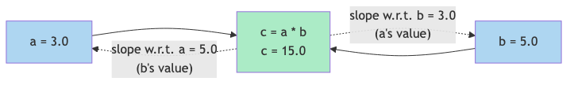
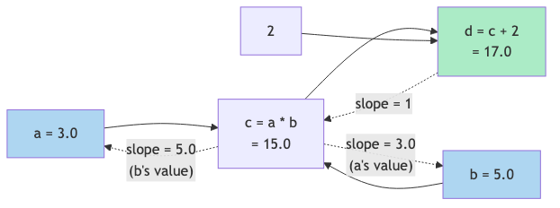

# Lesson 6: Slopes -- How Dials Affect the Output

Previous: [Lesson 5](./05-loss.md)



## The Core Question

We have 4,192 dials. We have a loss (the model's report card). We want to make the loss smaller. But there are 4,192 dials to adjust. For each one, we need to answer:

**If I turn this dial up a tiny bit, does the loss go up or down?**

That's what a derivative tells us. It answers this question for every single dial, simultaneously.

## Slopes Without Calculus

You already know what a slope is. If you walk uphill, the slope is positive (ground goes up as you walk forward). Downhill, the slope is negative. Flat ground has a slope of zero.

A slope is just:

```
slope = (change in height) / (change in horizontal distance)
```

Or more generally:

```
slope = (change in output) / (change in input)
```

This is often called "rise over run."

## A Concrete Example

Let's compute the slope of a simple function. Consider:

```
f(x) = x * x     (x squared)
```

We want to know the slope at `x = 3`. Here's the trick: nudge the input by a tiny amount and see how the output changes.

**Compute f at x = 3:**

```
f(3) = 3 * 3 = 9
```

**Compute f at x = 3.001 (a tiny nudge):**

```
f(3.001) = 3.001 * 3.001 = 9.006001
```

**Compute the slope:**

```
slope = (9.006001 - 9) / (3.001 - 3)
      = 0.006001 / 0.001
      = 6.001
```

The slope at `x = 3` is approximately `6`. This means: if you increase `x` by a tiny amount from `3`, the output increases by about `6` times that amount.

Let's check at another point, `x = 5`:

```
f(5) = 25
f(5.001) = 25.010001
slope = (25.010001 - 25) / 0.001 = 10.001 ≈ 10
```

The slope at `x = 5` is approximately `10`. The slope is different at different points. At `x = 3` it was `6`, at `x = 5` it's `10`. The function `x * x` gets steeper as `x` gets bigger.

(If you know calculus, you'll recognize that the derivative of `x^2` is `2x`. At `x = 3`, that's `2*3 = 6`. At `x = 5`, that's `2*5 = 10`. Our numerical nudging gave the same answer.)

## Why Slopes Matter for Training

Here's how this connects to microgpt. Recall from Lesson 5: the loss is a single number that we want to make smaller. Every dial (parameter) in the model affects the loss, but in different ways:

| Situation | Slope of loss with respect to dial | What it means | What to do |
|-----------|------|------|------|
| Turning the dial up increases the loss | Positive slope | This dial is making things worse | Turn it **down** |
| Turning the dial up decreases the loss | Negative slope | This dial is helping | Turn it **up** |
| Turning the dial up doesn't change the loss | Zero slope | This dial doesn't matter right now | Leave it alone |

The slope tells us the **direction** to nudge each dial. If the slope is positive, nudge down. If negative, nudge up. Always move opposite to the slope -- this is why it's called **gradient descent** (descending the slope).

## Derivatives of Basic Operations

Computing the slope by nudging (like we did above) works, but it's slow -- you'd have to nudge each of the 4,192 dials separately. Instead, there are shortcuts: simple rules for the slope of common operations.

### Addition: f(a, b) = a + b

If `f = a + b`, how does `f` change when you nudge `a`?

```
a = 3, b = 5, f = 8
Nudge a to 3.001:  f = 3.001 + 5 = 8.001
Change in f = 0.001
Slope with respect to a = 0.001 / 0.001 = 1
```

And when you nudge `b`?

```
a = 3, b = 5, f = 8
Nudge b to 5.001:  f = 3 + 5.001 = 8.001
Change in f = 0.001
Slope with respect to b = 0.001 / 0.001 = 1
```

**The slope of addition is `1` for both inputs.** A tiny nudge to either input passes through unchanged. This makes intuitive sense: `a + b` treats both inputs equally.

In `microgpt.py:40-42`, the `__add__` method of the `Value` class:

```python
def __add__(self, other):
    other = other if isinstance(other, Value) else Value(other)
    return Value(self.data + other.data, (self, other), (1, 1))
```

The `(1, 1)` at the end is exactly these slopes (called `local_grads` -- local gradients). Both inputs have a slope of `1`.

### Multiplication: f(a, b) = a * b

If `f = a * b`, how does `f` change when you nudge `a`?

```
a = 3, b = 5, f = 15
Nudge a to 3.001:  f = 3.001 * 5 = 15.005
Change in f = 0.005
Slope with respect to a = 0.005 / 0.001 = 5
```

The slope with respect to `a` is `5` -- which is `b`'s value.

And when you nudge `b`?

```
a = 3, b = 5, f = 15
Nudge b to 5.001:  f = 3 * 5.001 = 15.003
Change in f = 0.003
Slope with respect to b = 0.003 / 0.001 = 3
```

The slope with respect to `b` is `3` -- which is `a`'s value.

**For multiplication, the slope of each input is the other input's value.** This is a beautiful, simple rule: the slope of `a` is `b`, and the slope of `b` is `a`.

In `microgpt.py:44-46`:

```python
def __mul__(self, other):
    other = other if isinstance(other, Value) else Value(other)
    return Value(self.data * other.data, (self, other), (other.data, self.data))
```

The `(other.data, self.data)` is exactly this rule: the slope for `self` is `other.data`, and the slope for `other` is `self.data`.

### Summary of Rules

| Operation | Slope w.r.t. `a` | Slope w.r.t. `b` | microgpt line |
|-----------|-------------------|-------------------|---------------|
| `a + b` | `1` | `1` | `microgpt.py:42` |
| `a * b` | `b` | `a` | `microgpt.py:46` |

There are similar rules for every operation in the `Value` class: power (`microgpt.py:48-49`), log (`microgpt.py:51-52`), exp (`microgpt.py:54-55`), and relu (`microgpt.py:57-58`). Each one stores its slope rule in `local_grads`.

## The Gradient: A Slope for Every Dial

The **gradient** is the collection of all these slopes. For every single parameter in the model, the gradient tells us: "how much does the loss change if this parameter changes by a tiny amount?"

In `microgpt.py:36`:

```python
self.grad = 0
```

Every `Value` object (every number in the computation) has a `.grad` attribute. This starts at `0` and gets filled in during backpropagation (which we'll explain in the next lesson). After backpropagation, `p.grad` contains the slope of the loss with respect to parameter `p`.

## A Simple Example: Derivatives Flowing Backward

Let's trace through a tiny computation to see how derivatives work in practice.

Suppose we have two parameters `a` and `b` and a simple computation:

```
a = 3.0
b = 5.0
c = a * b     = 15.0
```

We want to know: how does `c` change with respect to `a` and `b`?

Using the multiplication rule:
- Slope of `c` with respect to `a` = `b` = `5.0`
- Slope of `c` with respect to `b` = `a` = `3.0`



The solid arrows show the forward computation (compute the output). The dashed arrows show the derivatives flowing backward (how much each input contributed to the output). This backward flow is the key idea behind training.

### A Two-Step Example

Now let's add one more operation:

```
a = 3.0
b = 5.0
c = a * b     = 15.0
d = c + 2     = 17.0
```

What is the slope of `d` with respect to `a`?

- Slope of `d` with respect to `c` = `1` (addition rule: the slope is always `1`)
- Slope of `c` with respect to `a` = `5` (multiplication rule: the slope is `b`)

Nudging `a` up by `0.001` causes `c` to change by `0.001 * 5 = 0.005`, which causes `d` to change by `0.005 * 1 = 0.005`. So the total slope of `d` with respect to `a` is `5 * 1 = 5`.

We just multiplied the slopes along the path from `d` back to `a`. This is called the **chain rule** -- but that's the topic of the next lesson. For now, the important thing is that each operation knows its own local slope.



## How This Connects to Training

After computing the loss (Lesson 5), microgpt calls `loss.backward()` on `microgpt.py:205`:

```python
loss.backward()
```

This fills in the `.grad` attribute for every parameter in the model. After this call, each of the 4,192 parameters knows its slope: how much the loss would change if that parameter changed by a tiny amount.

Then the training step uses those gradients to nudge each dial. In `microgpt.py:209-215`:

```python
for i, p in enumerate(params):
    # ... optimizer math ...
    p.data -= lr_t * m_hat / (v_hat ** 0.5 + eps_adam)
    p.grad = 0
```

The `p.data -=` line nudges the parameter in the opposite direction of the gradient (to reduce the loss). Then `p.grad = 0` resets the gradient for the next training step.

The key operator is `-=` (subtract-equals). If the gradient is positive (increasing this dial increases the loss), we *subtract*, making the dial smaller. If the gradient is negative (increasing this dial *decreases* the loss), subtracting a negative is the same as adding, making the dial larger. Either way, we move in the direction that reduces the loss.

## What This Lesson Covered (and What It Didn't)

This lesson covered the concept of a derivative for a **single operation**: how the output of one addition or one multiplication changes when you nudge one of its inputs.

What we haven't yet covered is how to chain these together across the entire model -- from the loss all the way back through softmax, attention, embeddings, and down to the original parameters. That chaining process is called **backpropagation** and relies on the **chain rule** (multiplying local slopes along a path, as we briefly saw in the two-step example).

But the foundation is here: every operation in microgpt's `Value` class stores its local slopes in `_local_grads`. Backpropagation just multiplies and accumulates them.

## Key Takeaways

> **What to remember from this lesson:**
>
> 1. The **derivative** (slope) tells us: if I nudge this input up, does the output go up or down, and by how much?
> 2. We compute slopes by "nudge and measure": `slope = (change in output) / (change in input)`
> 3. Simple rules: **addition** has slopes `(1, 1)` (`microgpt.py:42`); **multiplication** of `a * b` has slopes `(b, a)` (`microgpt.py:46`)
> 4. The **gradient** is the slope of the loss with respect to every parameter, stored in `.grad` (`microgpt.py:36`)
> 5. To reduce the loss, nudge each dial **opposite** to its gradient (gradient descent)
> 6. `loss.backward()` (`microgpt.py:205`) computes gradients for all 4,192 parameters
> 7. This lesson covers single-step derivatives; the **chain rule** (composing them across many operations) is the next topic


---

> **Lab 6: Verify Gradients** — Numerically verify that backward() computes correct gradients.
>
> ```bash
> cd labs && python3 lab06_verify_gradients.py
> ```
>
> *Try the lab before moving on. Predict what will happen first.*
Next: [Lesson 7](./07-chain-rule.md)
