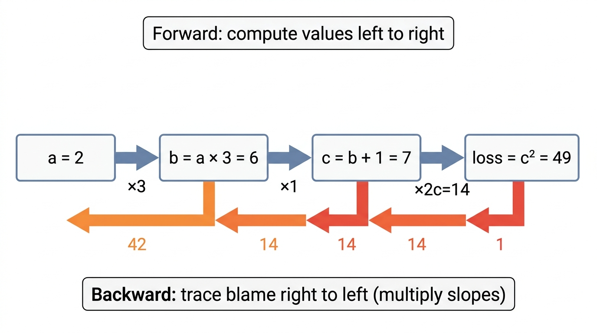
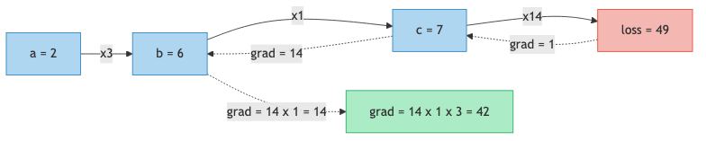
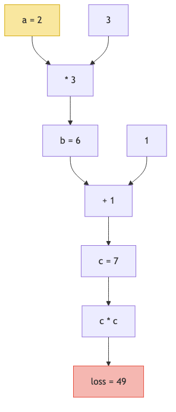

# Lesson 7: The Chain Rule — Tracing Blame Backward

Previous: [Lesson 6](./06-derivatives.md)



## Where We Are

In lesson 6 you learned that the derivative (slope) tells you: "if I nudge this number up a tiny bit, how much does the loss change?" You saw how microgpt's `Value` class stores these slopes in `.grad`.

But there is a problem. microgpt does not apply one operation and stop. It chains dozens of operations together: multiply, add, multiply again, exponentiate, divide, take the log... The loss at the end depends on the parameters at the beginning through a long chain of steps.

The question is: **if a parameter at the very start changes by a tiny amount, how much does the loss at the very end change?**

The answer is the chain rule, and it is simpler than you might expect.

## The Key Idea: Multiply the Slopes

Suppose you have three operations chained together:

```
a = 2
b = a * 3        (multiply by 3)
c = b + 1         (add 1)
loss = c * c      (square it)
```

Let's compute the values first:

```
a = 2
b = 2 * 3 = 6
c = 6 + 1 = 7
loss = 7 * 7 = 49
```

Now the question: if we nudge `a` up by a tiny amount, how much does `loss` change?

We could try to figure this out all at once, but the chain rule says: **don't**. Instead, figure out each link separately and then multiply.

### Link 1: How does `loss` change when `c` changes?

```
loss = c * c = c²
d(loss)/d(c) = 2 * c = 2 * 7 = 14
```

This means: if `c` goes up by `0.001`, the loss goes up by about `14 * 0.001 = 0.014`.

### Link 2: How does `c` change when `b` changes?

```
c = b + 1
d(c)/d(b) = 1
```

Addition by a constant has a slope of `1`. If `b` goes up by `0.001`, then `c` goes up by `0.001`.

### Link 3: How does `b` change when `a` changes?

```
b = a * 3
d(b)/d(a) = 3
```

Multiplying by a constant has a slope equal to that constant. If `a` goes up by `0.001`, then `b` goes up by `3 * 0.001 = 0.003`.

### Chain rule: multiply the links

```
d(loss)/d(a) = d(loss)/d(c) * d(c)/d(b) * d(b)/d(a)
             = 14 * 1 * 3
             = 42
```

That's it. To find how `a` affects `loss` through a chain, you just multiply each individual slope along the path.

### Verifying by hand

Let's check. Change `a` from `2` to `2.001` and recompute everything:

```
a = 2.001
b = 2.001 * 3 = 6.003
c = 6.003 + 1 = 7.003
loss = 7.003 * 7.003 = 49.042009
```

The loss changed from `49` to `49.042009`, a change of `0.042009`.

We predicted: `42 * 0.001 = 0.042`. Close enough (the tiny difference is because `0.001` is not infinitely small).

The chain rule works.

## Why "Chain" Rule?

Think of it like a chain of gears. If gear A turns gear B at 3x speed, and gear B turns gear C at 1x speed, and gear C turns the dial at 14x speed, then gear A turns the dial at `3 * 1 * 14 = 42x` speed.

Each operation is one gear. The chain rule says: **to find the total effect, multiply all the individual gear ratios.**



The solid arrows show the **forward pass**: data flowing left to right, computing the loss. The dashed arrows show the **backward pass**: gradients flowing right to left, tracing blame back to each input.

## This IS Backpropagation

You may have heard the word "backpropagation" and thought it was something complicated. It is not. Backpropagation is just the chain rule applied automatically, step by step, from the loss back to every parameter.

That's the whole thing. There is no additional trick. No magic. Just: multiply the slopes along each chain.

The word "back" in backpropagation means we start from the loss (the end) and work **backward** to the parameters (the beginning). The word "propagation" means we are propagating (spreading) the gradient information backward through the chain.

## How microgpt Does It: The backward() Method

Let's look at how this actually works in code. The `backward()` method lives at `microgpt.py:81-97`:

```python
def backward(self):
    topo = []
    visited = set()

    def build_topo(v):
        if v not in visited:
            visited.add(v)
            for child in v._children:
                build_topo(child)
            topo.append(v)

    build_topo(self)
    self.grad = 1
```

### Step 1: Sort the operations

`build_topo` at `microgpt.py:85-90` walks through every `Value` that contributed to the loss and puts them in **topological order**. This is a fancy term that means: if `a` was used to compute `b`, then `a` comes before `b` in the list.

In our example, the list would be: `[a, b, c, loss]`.

### Step 2: Seed the gradient

`microgpt.py:93` sets `self.grad = 1`. Since `self` is the loss, this is saying: "the loss's effect on itself is 1." This is the starting point. The gradient of the loss with respect to itself is always `1`.

### Step 3: Walk backward, applying the chain rule

```python
for v in reversed(topo):
    for child, local_grad in zip(v._children, v._local_grads):
        child.grad += local_grad * v.grad
```

This is `microgpt.py:95-97`, and it is the chain rule in three lines of code.

`reversed(topo)` walks the list backward: `[loss, c, b, a]`. For each value `v`, it looks at its children (the values that were used to compute `v`) and for each child:

```
child.grad += local_grad * v.grad
```

This line IS the chain rule. Let's trace it through our example:

| Step | `v` | `child` | `local_grad` | `v.grad` | `child.grad +=` |
|------|-----|---------|--------------|----------|-----------------|
| Start | loss | - | - | `1` (seeded) | - |
| 1 | loss=c*c | c (first) | `c.data = 7` | `1` | `0 + 7 * 1 = 7` |
| 1 | loss=c*c | c (second) | `c.data = 7` | `1` | `7 + 7 * 1 = 14` |
| 2 | c=b+1 | b | `1` (addition) | `14` | `0 + 1 * 14 = 14` |
| 3 | b=a*3 | a | `3` (the constant) | `14` | `0 + 3 * 14 = 42` |

And we get `a.grad = 42`, exactly what we computed by hand.

Note that in step 1, `c` appears twice as a child of `loss = c * c`. The `+=` in `child.grad += local_grad * v.grad` is important here. It accumulates both contributions: `7 * 1` from the first use and `7 * 1` from the second use, giving `14` total. This is how the code handles a value that gets used more than once.

### Where do the local_grads come from?

Each operation stores its own local gradient when the forward pass runs. Go back to the `Value` class:

```python
def __mul__(self, other):
    return Value(self.data * other.data, (self, other), (other.data, self.data))
```

At `microgpt.py:46`, multiplication stores `(other.data, self.data)` as the local gradients. This makes sense: the derivative of `a * b` with respect to `a` is `b`, and with respect to `b` is `a`.

```python
def __add__(self, other):
    return Value(self.data + other.data, (self, other), (1, 1))
```

At `microgpt.py:42`, addition stores `(1, 1)`. The derivative of `a + b` with respect to either input is always `1`.

Each operation knows its own local slope. The backward pass just chains them together.

## The Computation Graph

Every time microgpt runs a forward pass, it is secretly building a **computation graph**: a record of every operation performed, and which values fed into which.

For our simple example, the graph looks like this:



The yellow node is a parameter (a dial we can adjust). The red node is the loss (the thing we want to minimize). Every node in between is an intermediate computation.

When we call `loss.backward()`, gradients flow from the red node back through every edge to the yellow node. Each edge multiplies by the local gradient. That's the chain rule.

In the real microgpt, this graph has thousands of nodes (one for every add, multiply, relu, exp, log, etc. in the forward pass). But the principle is identical.

## Why "Backward"?

There are two directions you could trace blame:

**Forward**: "If I change `a`, how does `b` change? Then how does `c` change? Then how does loss change?" You would have to do this separately for every parameter. With 4,192 parameters, that's 4,192 forward passes.

**Backward**: "Starting from the loss, how much blame does each parent get?" One backward pass gives you the gradient of every parameter simultaneously.

This is why backward is efficient. One forward pass computes the loss. One backward pass computes all 4,192 gradients. That's the power of backpropagation.

## The Chain Rule in One Sentence

If `a` affects `b` with slope `3`, and `b` affects the loss with slope `14`, then `a` affects the loss with slope `3 * 14 = 42`.

Multiply the slopes along the chain. That's the chain rule. That's backpropagation. That's how every neural network learns.

## Key Takeaways

> **What to remember from this lesson:**
>
> 1. The **chain rule** says: to find how A affects C through B, multiply the individual slopes
> 2. **Backpropagation** is just the chain rule applied automatically, starting from the loss
> 3. `microgpt.py:97`: `child.grad += local_grad * v.grad` -- this one line IS the chain rule
> 4. Each operation stores its own local gradient during the forward pass (`microgpt.py:42-58`)
> 5. `build_topo` (`microgpt.py:85-90`) sorts operations so we can walk backward through them
> 6. One backward pass computes gradients for all 4,192 parameters at once

Next: [Lesson 8](./08-neuron.md)
