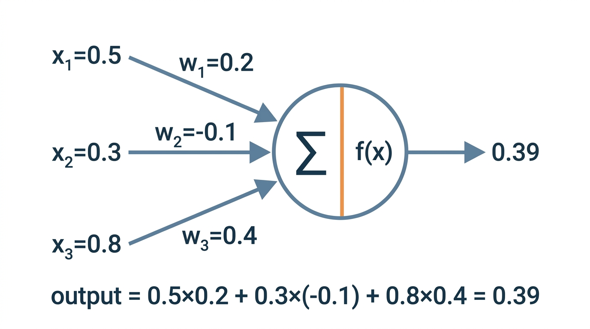
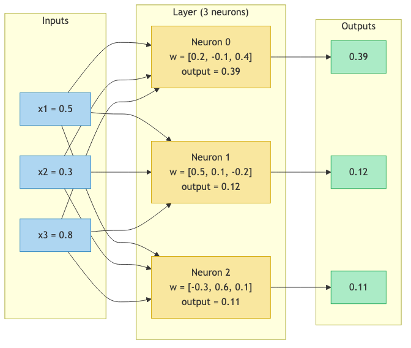
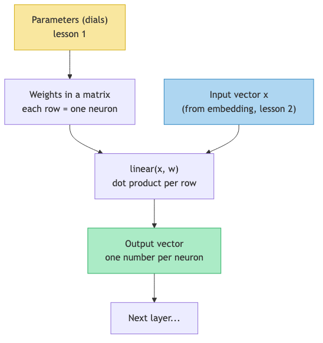

# Lesson 8: A Single Neuron

Previous: [Lesson 7](./07-chain-rule.md)



## What Is a Neuron?

A neuron does ONE thing: it takes a list of numbers as input, multiplies each one by a corresponding weight, and adds up the results. That is the entire operation.

```
output = w1*x1 + w2*x2 + w3*x3 + ...
```

If this looks familiar, it should. This is a **dot product** (lesson 3). A neuron computes the dot product of its weights with its inputs.

## A Concrete Example

Suppose we have three inputs and three weights:

| | Input (`x`) | Weight (`w`) | Product (`w * x`) |
|---|---|---|---|
| 1 | `0.5` | `0.2` | `0.5 * 0.2 = 0.10` |
| 2 | `0.3` | `-0.1` | `0.3 * (-0.1) = -0.03` |
| 3 | `0.8` | `0.4` | `0.8 * 0.4 = 0.32` |
| **Sum** | | | **`0.10 + (-0.03) + 0.32 = 0.39`** |

The neuron's output is `0.39`.

That's it. Multiply each input by its weight, then add everything up. The neuron is a weighted sum -- nothing more.

## What the Weights Mean

Each weight controls how much the neuron "cares about" that input:

- **Positive weight** (`0.2`, `0.4`): the neuron pays attention to that input. Higher input means higher output.
- **Negative weight** (`-0.1`): the neuron is repelled by that input. Higher input means lower output.
- **Weight near zero**: the neuron ignores that input.

The weights ARE the parameters (dials) from lesson 1. They start random and get adjusted during training until the neuron learns to pay attention to the right things.

## microgpt's linear() Function

Now let's see where neurons live in the actual code. Look at `microgpt.py:122-123`:

```python
def linear(x, w):
    return [sum(wi * xi for wi, xi in zip(wo, x)) for wo in w]
```

This is a compact two lines, so let's unpack it carefully.

### What `w` looks like

`w` is a list of lists (a matrix). Each row is one neuron's weights. For example, if `w` has 3 rows and each row has 4 numbers:

```
w = [
    [0.2, -0.1, 0.4, 0.3],    # neuron 0's weights
    [0.5,  0.1, -0.2, 0.1],   # neuron 1's weights
    [-0.3, 0.6, 0.1, -0.4],   # neuron 2's weights
]
```

### What `x` looks like

`x` is a single list of numbers -- the input. For example:

```
x = [0.5, 0.3, 0.8, 0.2]
```

### What the code does

The list comprehension `[... for wo in w]` loops over each row of `w`. Each row `wo` is one neuron's weights. For each row, it computes:

```python
sum(wi * xi for wi, xi in zip(wo, x))
```

This is the dot product: pair up each weight with the corresponding input, multiply, and sum. This is exactly what our single neuron example did.

Let's trace it for neuron 0:

```
wo = [0.2, -0.1, 0.4, 0.3]
x  = [0.5,  0.3, 0.8, 0.2]

zip(wo, x) = [(0.2, 0.5), (-0.1, 0.3), (0.4, 0.8), (0.3, 0.2)]

wi * xi for each pair: [0.10, -0.03, 0.32, 0.06]

sum = 0.10 + (-0.03) + 0.32 + 0.06 = 0.45
```

The function returns a list with one output per neuron:

```
linear(x, w) = [0.45, 0.33, 0.11]   # one output per neuron
```

Each element in the output came from one neuron computing its weighted sum.

## A Layer = Many Neurons in Parallel

A single neuron takes inputs and produces one number. A **layer** is a group of neurons that all receive the same inputs and each produce their own output.



Every input connects to every neuron. Each neuron has its own set of weights, so each neuron computes a different weighted sum. The layer transforms a list of 3 numbers into a new list of 3 numbers -- but the output list is a different size if the layer has a different number of neurons.

## Layers in microgpt

Let's look at the actual layers in `microgpt.py:110-116`:

```python
state_dict[f'layer{i}.attn_wq'] = matrix(n_embd, n_embd)    # 16x16
state_dict[f'layer{i}.attn_wk'] = matrix(n_embd, n_embd)    # 16x16
state_dict[f'layer{i}.attn_wv'] = matrix(n_embd, n_embd)    # 16x16
state_dict[f'layer{i}.attn_wo'] = matrix(n_embd, n_embd)    # 16x16
state_dict[f'layer{i}.mlp_fc1'] = matrix(4 * n_embd, n_embd)  # 64x16
state_dict[f'layer{i}.mlp_fc2'] = matrix(n_embd, 4 * n_embd)  # 16x64
```

Each one is a matrix. Each row in the matrix is one neuron. Let's break down the sizes:

| Layer | Shape | Meaning |
|-------|-------|---------|
| `attn_wq` | `16 x 16` | 16 neurons, each taking 16 inputs |
| `attn_wk` | `16 x 16` | 16 neurons, each taking 16 inputs |
| `attn_wv` | `16 x 16` | 16 neurons, each taking 16 inputs |
| `attn_wo` | `16 x 16` | 16 neurons, each taking 16 inputs |
| `mlp_fc1` | `64 x 16` | 64 neurons, each taking 16 inputs |
| `mlp_fc2` | `16 x 64` | 16 neurons, each taking 64 inputs |

The most interesting one is `mlp_fc1`: it's a `64 x 16` matrix. That means 64 neurons, each with 16 weights. It takes the 16-dimensional embedding vector and transforms it into a 64-dimensional vector. Then `mlp_fc2` does the reverse: 16 neurons each taking 64 inputs, compressing back down to 16 dimensions.

## Counting the Parameters

Each neuron has one weight per input. So the total number of parameters in a layer is:

```
parameters = number_of_neurons * number_of_inputs_per_neuron
```

For `mlp_fc1`: `64 * 16 = 1,024` parameters. That's 1,024 dials just in this one layer.

For all six weight matrices in one transformer layer:

```
attn_wq:  16 * 16 =  256
attn_wk:  16 * 16 =  256
attn_wv:  16 * 16 =  256
attn_wo:  16 * 16 =  256
mlp_fc1:  64 * 16 = 1024
mlp_fc2:  16 * 64 = 1024
                   ------
              total: 3072
```

The remaining `4192 - 3072 = 1120` parameters live in the embedding tables (`wte`, `wpe`, `lm_head`), which we will cover in lesson 12.

## How linear() Is Used in the Model

Every time you see `linear(x, ...)` in the `gpt()` function, that is a layer of neurons doing weighted sums. Let's trace them in `microgpt.py:149-175`:

```python
# Line 149: 16 inputs → 16 outputs (query projection)
q = linear(x, state_dict[f'layer{li}.attn_wq'])

# Line 150: 16 inputs → 16 outputs (key projection)
k = linear(x, state_dict[f'layer{li}.attn_wk'])

# Line 151: 16 inputs → 16 outputs (value projection)
v = linear(x, state_dict[f'layer{li}.attn_wv'])

# Line 167: 16 inputs → 16 outputs (attention output)
x = linear(x_attn, state_dict[f'layer{li}.attn_wo'])

# Line 173: 16 inputs → 64 outputs (expand)
x = linear(x, state_dict[f'layer{li}.mlp_fc1'])

# Line 174: relu activation (next lesson!)
x = [xi.relu() for xi in x]

# Line 175: 64 inputs → 16 outputs (compress)
x = linear(x, state_dict[f'layer{li}.mlp_fc2'])
```

The pattern is always the same: take a vector, pass it through a layer of neurons (a `linear()` call), get a new vector out. The neurons' weights decide what information to amplify, what to suppress, and how to mix the inputs together.

## A Neuron Can Learn to Detect Patterns

A neuron is simple, but it is not useless. Consider a neuron with 16 inputs (matching microgpt's 16-dimensional embeddings). By adjusting its 16 weights, it could learn to:

- **Respond strongly** to vectors that look like vowels (by having large positive weights aligned with the "vowel direction" in embedding space)
- **Stay quiet** for vectors that look like consonants (by having weights that cancel out for those vectors)
- **Respond negatively** to certain patterns (by having large negative weights in specific positions)

One neuron can only detect one pattern. But a layer of 64 neurons (like `mlp_fc1`) can detect 64 different patterns simultaneously. And when you stack layers, the neurons in later layers can detect patterns of patterns.

## The Big Picture So Far

Here is how all the pieces connect:



The parameters from lesson 1 are organized into weight matrices. Each row of a weight matrix is one neuron. The `linear()` function runs each neuron on the input (a dot product per row, using the operation from lesson 3). The output is a new vector that flows into the next step.

## Key Takeaways

> **What to remember from this lesson:**
>
> 1. A **neuron** computes a weighted sum: `w1*x1 + w2*x2 + ... + wn*xn` -- it's a dot product
> 2. `microgpt.py:122-123`: `linear(x, w)` computes one dot product per row of `w`
> 3. Each row of a weight matrix is one neuron. The matrix shape tells you: rows = neurons, columns = inputs per neuron
> 4. `mlp_fc1` (`microgpt.py:115`) is a `64 x 16` matrix = 64 neurons, each taking 16 inputs
> 5. A neuron's **weights** are its parameters -- they start random and are tuned by training
> 6. Every `linear()` call in the model is a layer of neurons running in parallel


---

> **Lab 8: Inspect a Neuron** — Look at a single neuron's weights, compute its output by hand, see what letters it responds to.
>
> ```bash
> cd labs && python3 lab08_inspect_a_neuron.py
> ```
>
> *Try the lab before moving on. Predict what will happen first.*
Next: [Lesson 9](./09-relu.md)
