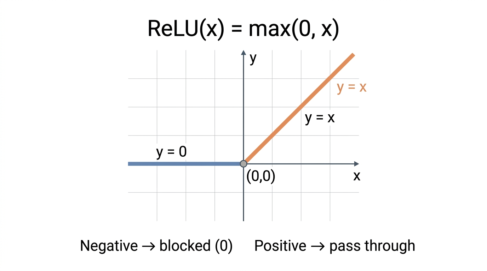
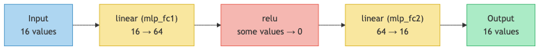

# Lesson 9: Why ReLU Matters — Breaking Linearity

Previous: [Lesson 8](./08-neuron.md)



## The Problem With Stacking Neurons

In lesson 8, you learned that a neuron computes a weighted sum. A layer of neurons is just many weighted sums in parallel. It seems natural to think: "More layers = more power." Stack two layers of neurons together and you can learn more complex patterns, right?

Wrong. And the reason is surprisingly simple.

## Two Linear Layers = One Linear Layer

A neuron computes a weighted sum. That's a **linear** operation. And here's the problem: if you apply one linear operation and then another linear operation, the result is... just another linear operation.

Let's see this with the simplest possible example. One input, two "layers":

```
Layer 1:  f(x) = 2x       (multiply by 2)
Layer 2:  g(x) = 3x       (multiply by 3)

Combined: g(f(x)) = 3 * (2x) = 6x
```

The combined result is `6x`. That's still just "multiply by a constant." We could have done this with one layer. Two layers gave us nothing extra.

Let's try with addition too:

```
Layer 1:  f(x) = 2x + 1
Layer 2:  g(x) = 3x + 5

Combined: g(f(x)) = 3 * (2x + 1) + 5
                   = 6x + 3 + 5
                   = 6x + 8
```

Again, the result is just `6x + 8`. A single layer with weight `6` and bias `8` would produce exactly the same output.

This is not a coincidence. It's a mathematical fact: **a linear function of a linear function is always linear**. No matter how many layers you stack, the result is always equivalent to a single layer. You could have one layer or a hundred -- the expressive power is the same.

**Try it yourself:** Toggle between activation functions and see how they affect what a network can learn.

[Activation Function Explorer](./interactive/relu-explorer.html)

### What "linear" means visually

A linear function draws a straight line:

```
 output
   |       /
   |      /
   |     /        f(x) = 2x + 1
   |    /
   |   /
   |  /
   +------------- input
```

Stack as many linear layers as you want, you still get a straight line. The slope and position might change, but it's always straight. You can never learn curves, bends, or anything more complex than a line.

## Enter ReLU

ReLU stands for **Rectified Linear Unit**. Despite the fancy name, it does something absurdly simple:

```
relu(x) = max(0, x)
```

If the number is positive, keep it. If it's negative, replace it with zero.

That's the whole thing. Here's a table:

| Input | `relu(input)` | What happened |
|-------|-------------|---------------|
| `-2.0` | `0` | Negative, clamped to zero |
| `-1.0` | `0` | Negative, clamped to zero |
| `-0.5` | `0` | Negative, clamped to zero |
| `0.0` | `0` | Zero stays zero |
| `0.5` | `0.5` | Positive, passed through |
| `1.0` | `1.0` | Positive, passed through |
| `2.0` | `2.0` | Positive, passed through |
| `3.0` | `3.0` | Positive, passed through |

### The shape of ReLU

```
 output
   |      /
   |     /
   |    /
   |   /
   |  /
 --+--/------------ input
   | (flat at zero
   |  for negatives)
```

There's a **bend** at zero. For negative inputs, the output is flat (always zero). For positive inputs, the output is the input unchanged.

That bend is the key to everything.

## Why the Bend Matters

ReLU is **not** linear. It has a kink at zero. And because it's not linear, stacking layers with ReLU between them does NOT collapse into a single layer. Each layer can create new bends, and those bends combine to form complex shapes.

Consider this sandwich: linear, then ReLU, then linear:

```
Layer 1:    f(x) = 2x - 1
ReLU:       relu(f(x)) = max(0, 2x - 1)
Layer 2:    g(x) = 3 * relu(f(x)) + 2
```

Let's compute the output for several inputs:

| `x` | `f(x) = 2x - 1` | `relu(f(x))` | `g = 3 * relu + 2` |
|-----|-----------------|-------------|-----------------|
| `-1` | `-3` | `0` | `3 * 0 + 2 = 2` |
| `0` | `-1` | `0` | `3 * 0 + 2 = 2` |
| `0.5` | `0` | `0` | `3 * 0 + 2 = 2` |
| `1` | `1` | `1` | `3 * 1 + 2 = 5` |
| `2` | `3` | `3` | `3 * 3 + 2 = 11` |

The output is flat at `2` for `x <= 0.5`, then rises sharply. That's NOT a straight line. ReLU created a bend that no stack of linear layers could produce.

With many neurons and many ReLU operations, you can approximate any shape. Flat here, steep there, another bend somewhere else. This is what gives neural networks their power.

## ReLU in microgpt

Now let's find it in the actual code. At `microgpt.py:57-58`:

```python
def relu(self):
    return Value(max(0, self.data), (self,), (float(self.data > 0),))
```

Two things happen here:

**Forward pass** (computing the output): `max(0, self.data)`. If the data is positive, pass it through. If negative, output zero. Exactly what we described.

**Local gradient** (for backpropagation): `float(self.data > 0)`. This evaluates to `1.0` if the data was positive, and `0.0` if it was negative or zero.

### Why is the gradient 1 or 0?

Think about what ReLU does in each case:

- **Positive input**: ReLU is the identity function (`relu(x) = x`). The slope of `x` is `1`. So the gradient is `1` -- blame passes straight through.
- **Negative input**: ReLU outputs zero regardless of the input (`relu(x) = 0`). The slope is `0`. So the gradient is `0` -- blame is completely blocked.

| Input | Output | Gradient | Effect on backprop |
|-------|--------|----------|-------------------|
| Positive | Input unchanged | `1` | Gradient flows through |
| Negative or zero | `0` | `0` | Gradient is blocked |

A neuron that outputs a positive value is "on" -- it participates in the computation and its weights get updated during training. A neuron that outputs a negative value (before ReLU) is "off" -- it contributes nothing to the output and its gradient is zero.

## The MLP Sandwich

ReLU appears in microgpt between two linear layers. Look at `microgpt.py:173-175`:

```python
x = linear(x, state_dict[f'layer{li}.mlp_fc1'])   # 16 → 64 dimensions
x = [xi.relu() for xi in x]                        # bend!
x = linear(x, state_dict[f'layer{li}.mlp_fc2'])   # 64 → 16 dimensions
```

This three-line pattern is called the **MLP** (multi-layer perceptron) or feed-forward network. It's a sandwich:



### Step by step

1. **Expand** (`mlp_fc1`): 64 neurons each compute a weighted sum of the 16 inputs. Output: 64 values. This is like looking at the input from 64 different angles.

2. **Bend** (ReLU): Each of the 64 values is passed through `max(0, x)`. Some survive (the positive ones), some get zeroed out (the negative ones). This is where nonlinearity enters.

3. **Compress** (`mlp_fc2`): 16 neurons each compute a weighted sum of the 64 post-ReLU values. Output: 16 values. This combines the 64 angles back into the 16-dimensional space.

### What does ReLU look like on actual values?

Suppose after `mlp_fc1`, the 64 values look like this (showing the first 8):

```
Before ReLU: [0.12, -0.45, 0.03, -0.21, 0.87, -0.09, 0.34, -0.56, ...]
After ReLU:  [0.12,  0.00, 0.03,  0.00, 0.87,  0.00, 0.34,  0.00, ...]
```

Four of the eight values got zeroed out. The neurons that produced negative values are "off" for this particular input. Different inputs will turn different neurons on and off, creating different activation patterns.

## The Power of On/Off Patterns

After ReLU, each of the 64 neurons is either on (positive) or off (zero). This creates a binary pattern -- a specific combination of active and inactive neurons.

With 64 neurons, there are `2^64` possible on/off patterns. That's `18,446,744,073,709,551,616` -- over 18 quintillion distinct patterns. Each pattern represents a different region of input space.

In each region, the overall transformation is linear (because ReLU behaves linearly for positive values and is constant zero for negative). But different regions have different linear functions. The result is a piecewise-linear function -- straight-line segments joined at bends. Enough segments can approximate any curve.

## Without ReLU: Useless. With ReLU: Powerful.

Let's summarize the difference:

| Without ReLU | With ReLU |
|---|---|
| `linear → linear` | `linear → relu → linear` |
| Equivalent to one layer | Cannot be collapsed |
| Can only represent straight lines | Can represent any shape |
| Adding layers does nothing | Adding layers adds power |
| No learning benefit from depth | Depth = more complex patterns |

ReLU is the cheapest operation in the network (just `max(0, x)`), but it is what makes the network actually work. Without it, all those thousands of parameters would be wasted -- they could only produce a trivial linear transformation.

## ReLU's Gradient Is the Simplest Possible

Looking back at the backpropagation from lesson 7, ReLU's contribution is almost trivially simple:

- If the neuron was on (positive input), gradient passes through unchanged (multiply by `1`)
- If the neuron was off (negative input), gradient is killed (multiply by `0`)

This means during training, neurons that were off don't get updated. Only the neurons that contributed to the output get their weights adjusted. This is efficient and it makes sense: if a neuron didn't contribute, there's nothing to blame it for.

## Key Takeaways

> **What to remember from this lesson:**
>
> 1. Stacking linear layers without ReLU is pointless -- they collapse into a single layer
> 2. `relu(x) = max(0, x)` -- if positive keep it, if negative make it zero
> 3. ReLU creates **bends** that let the network approximate any shape
> 4. `microgpt.py:174`: `x = [xi.relu() for xi in x]` -- applied between the two MLP layers
> 5. `microgpt.py:57-58`: gradient is `1` (on) or `0` (off) -- the simplest possible gradient
> 6. The MLP sandwich is: linear (expand 16 to 64) then relu (bend) then linear (compress 64 to 16)


---

> **Lab 9: Remove ReLU** — Delete the nonlinearity. See linearity collapse in action.
>
> ```bash
> cd labs && python3 lab09_remove_relu.py
> ```
>
> *Try the lab before moving on. Predict what will happen first.*
Next: [Lesson 10](./10-gradient-descent.md)
