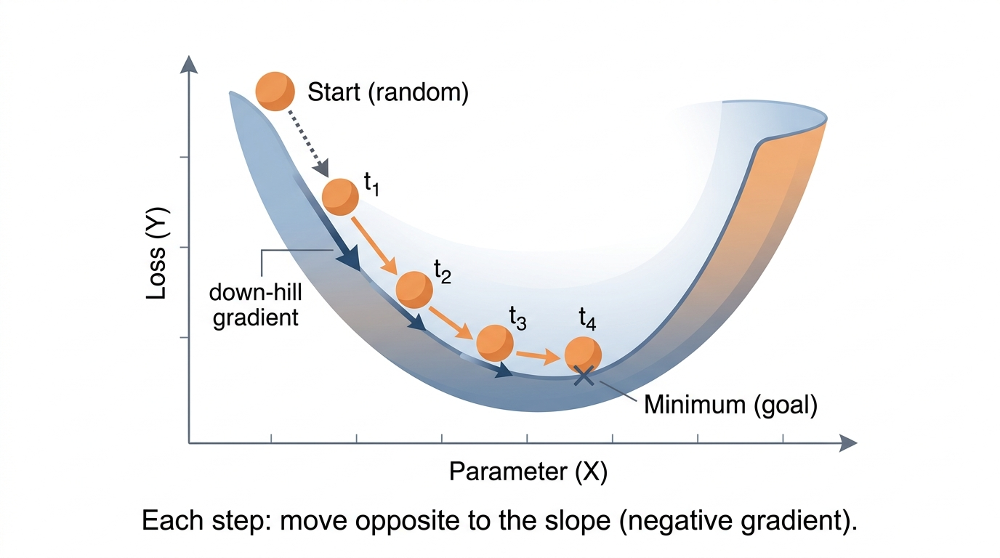
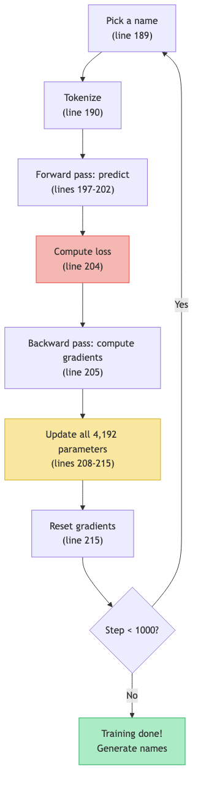

# Lesson 10: Gradient Descent — Walking Downhill

Previous: [Lesson 9](./09-relu.md)



## All the Pieces So Far

Let's lay out what we know:

1. **Forward pass**: Feed an input through the model, get a prediction (lessons 2, 8, 9)
2. **Loss**: Measure how wrong the prediction is with `-log(P(correct))` (lesson 5)
3. **Backward pass**: Use the chain rule to compute the gradient of every parameter (lessons 6, 7)

We can compute how much each of the 4,192 dials contributes to the error. But we haven't done anything with that information yet.

The missing step: **actually turn the dials**.

## The Blindfolded Hill Analogy

Imagine you are blindfolded, standing on a hilly landscape. Your goal is to find the lowest point (the valley). You can't see, but you can feel the slope of the ground under your feet.

What do you do? You feel which direction is downhill, and you take a step that way. Then you feel the slope again, and take another step. Repeat. Eventually you reach a low point.

This is gradient descent:

- The **landscape** is the loss function -- every possible combination of parameter values gives a different loss
- Your **position** is the current parameter values
- The **slope** is the gradient -- it tells you which direction increases the loss
- You step in the **opposite direction** -- toward lower loss

## The Update Rule

The simplest version of gradient descent is one line:

```
p.data -= learning_rate * p.grad
```

Let's unpack each part:

- `p.data` is the current value of one parameter (one dial)
- `p.grad` is the gradient: how much the loss increases when this parameter increases
- `learning_rate` is how big a step we take
- `-=` means subtract: we go in the **opposite** direction of the gradient

### Why subtract?

If `p.grad` is positive, that means: "increasing this parameter increases the loss." We want to decrease the loss, so we should **decrease** the parameter. Subtracting a positive number decreases it.

If `p.grad` is negative, that means: "increasing this parameter decreases the loss." Great -- we should **increase** the parameter. Subtracting a negative number increases it.

Either way, subtracting the gradient moves us toward lower loss.

## A Concrete Example

**Try it yourself:** Click to place a starting point, adjust the learning rate, and watch gradient descent converge (or diverge).

[Gradient Descent Sandbox](./interactive/gradient-descent.html)

Say we have one parameter:

```
p.data = 0.50       (current value of the dial)
p.grad = 2.0        (positive: increasing p increases loss)
learning_rate = 0.01
```

The update:

```
p.data -= 0.01 * 2.0
p.data -= 0.02
p.data = 0.50 - 0.02 = 0.48
```

The parameter moved from `0.50` to `0.48`. A small step in the direction that reduces the loss.

### What about a negative gradient?

```
p.data = 0.50
p.grad = -3.0       (negative: increasing p DECREASES loss)
learning_rate = 0.01
```

The update:

```
p.data -= 0.01 * (-3.0)
p.data -= -0.03
p.data = 0.50 + 0.03 = 0.53
```

The parameter moved from `0.50` to `0.53`. The gradient said "going up is good," so we went up.

## The Learning Rate

The learning rate controls how big each step is. It's a crucial choice:

| Learning rate | Step size | Risk |
|---|---|---|
| Too large (`0.1`) | Big jumps | Overshoot the valley, loss bounces around or explodes |
| Just right (`0.01`) | Moderate steps | Steady progress toward low loss |
| Too small (`0.000001`) | Tiny steps | Will eventually get there, but takes forever |

microgpt uses `learning_rate = 0.01` (set at `microgpt.py:182`).

Think of it this way: the gradient tells you the **direction** to go. The learning rate tells you how **far** to go in that direction. You need both.

## The Full Training Loop

Now let's see how all these pieces come together in the actual code. The training loop lives at `microgpt.py:188-217`:

### Step 1: Pick a training example (`microgpt.py:189`)

```python
doc = docs[step % len(docs)]
```

Pick one name from the dataset. On step 0, it picks the first name. On step 1, the second, and so on, cycling through all the names.

### Step 2: Tokenize it (`microgpt.py:190`)

```python
tokens = [BOS] + [uchars.index(ch) for ch in doc] + [BOS]
```

Convert the name to a list of numbers. For example, "anna" becomes `[26, 0, 13, 13, 0, 26]` where `26` is the special BOS token marking the start and end.

### Step 3: Run the forward pass (`microgpt.py:197-202`)

```python
for pos_id in range(n):
    token_id, target_id = tokens[pos_id], tokens[pos_id + 1]
    logits = gpt(token_id, pos_id, keys, values)
    probs = softmax(logits)
    loss_t = -probs[target_id].log()
    losses.append(loss_t)
```

For each position in the name, feed the current token into the model, get a prediction, compute the loss. This is the forward pass -- data flows through all the neurons, through attention, through ReLU, and out the other side.

### Step 4: Average the losses (`microgpt.py:204`)

```python
loss = (1 / n) * sum(losses)
```

Combine the losses from all positions into one number. This is the overall "how wrong was the model on this name."

### Step 5: Backward pass (`microgpt.py:205`)

```python
loss.backward()
```

One call. The chain rule runs backward through the entire computation graph, computing the gradient of every one of the 4,192 parameters. After this line, every parameter's `.grad` field contains its gradient.

### Step 6: Update all parameters (`microgpt.py:208-215`)

```python
lr_t = learning_rate * (1 - step / num_steps)
for i, p in enumerate(params):
    # ... (Adam optimizer, covered in lesson 11)
    p.data -= lr_t * m_hat / (v_hat ** 0.5 + eps_adam)
    p.grad = 0
```

Loop through all 4,192 parameters and nudge each one. The gradient tells us which direction, the learning rate tells us how far. (The actual update uses Adam, a smarter version of gradient descent -- lesson 11 covers the details.)

### Step 7: Reset gradients (`microgpt.py:215`)

```python
p.grad = 0
```

Zero out every gradient. We need a fresh start for the next training step, because `backward()` accumulates gradients with `+=` (lesson 7). If we don't reset, the gradients from step 2 would pile on top of the gradients from step 1.

### Step 8: Repeat 1,000 times (`microgpt.py:188`)

```python
for step in range(num_steps):
```

`num_steps = 1000` (set at `microgpt.py:186`). The loop runs 1,000 times. Each time: pick a name, predict, measure error, compute gradients, update dials, reset.

## The Training Loop as a Cycle



Each loop around this cycle makes the model a tiny bit better. The loss decreases, the predictions improve, and the generated names start to look more realistic.

## Watching the Loss Decrease

At `microgpt.py:217`:

```python
print(f"step {step+1:4d} / {num_steps:4d} | loss {loss.data:.4f}", end='\r')
```

This prints the loss at each step. A typical run might look like:

```
step    1 / 1000 | loss 3.4012
step  100 / 1000 | loss 2.8341
step  200 / 1000 | loss 2.5102
step  500 / 1000 | loss 2.2450
step 1000 / 1000 | loss 2.0123
```

The loss starts high (around `3.4` -- the model is guessing randomly) and decreases over training (down to around `2.0` -- the model has learned some patterns).

Is `2.0` good? Recall from lesson 5: a loss of `2.0` means the model assigns roughly `e^(-2.0) = 0.135` or about `13.5%` probability to the correct next character. In a 27-character vocabulary, random guessing would give `1/27 = 3.7%`, so `13.5%` is nearly 4x better than random. Not perfect, but the model has clearly learned something.

## Why Small Steps?

You might wonder: why not just take one giant step to the optimal parameters?

The problem is that the gradient only tells you the slope **right where you are**. It is a local measurement. After you take a step, the slope changes. If you take too big a step, the slope you measured at your old position is no longer accurate at your new position.

Imagine walking down a steep hill. The gradient says "go this way, steeply." But if you leap 100 meters in that direction, you might fly right past the valley and end up on the opposite slope. Small steps are safer because the gradient stays approximately correct for small changes.

This is the same idea behind the `0.001` verification we did in lesson 7. The derivative is exact for infinitely small changes, and approximately correct for small changes. The learning rate keeps the steps small enough that the approximation holds.

## Gradient Descent in One Sentence

Compute the gradient (which way is uphill), then step the opposite way (downhill), using a small step size (the learning rate). Repeat.

## Key Takeaways

> **What to remember from this lesson:**
>
> 1. **Gradient descent**: `p.data -= learning_rate * p.grad` -- move each dial to reduce the loss
> 2. We **subtract** the gradient because the gradient points uphill and we want to go downhill
> 3. The **learning rate** (`0.01` in microgpt) controls step size -- too big overshoots, too small is slow
> 4. The training loop (`microgpt.py:188-217`): pick name, predict, compute loss, backward, update, reset, repeat
> 5. **Reset gradients** (`p.grad = 0`) after each step, because backward accumulates with `+=`
> 6. Loss decreases from ~`3.4` to ~`2.0` over 1,000 steps -- the model is learning


---

> **Lab 10: Learning Rate Explorer** — Try plain gradient descent with different step sizes. Too small, just right, and way too big.
>
> ```bash
> cd labs && python3 lab10_learning_rate_explorer.py
> ```
>
> *Try the lab before moving on. Predict what will happen first.*
Next: [Lesson 11](./11-adam.md)
