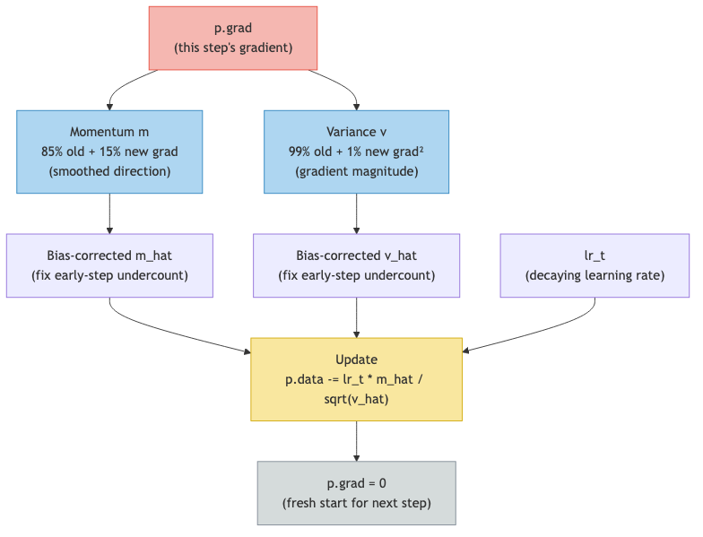

# Lesson 11: Adam — The Smarter Optimizer

Previous: [Lesson 10](./10-gradient-descent.md)

## What's Wrong With Plain Gradient Descent?

In lesson 10 we learned the simplest update rule:

```
p.data -= learning_rate * p.grad
```

This works, but it has two problems that become serious in practice.

### Problem 1: One Step Size Doesn't Fit All

Some parameters get large gradients (they strongly affect the loss), while others get tiny gradients (they barely matter on this particular training example). But plain gradient descent uses the same `learning_rate` for every parameter.

Imagine two parameters:

| Parameter | Gradient | Update (lr = 0.01) |
|---|---|---|
| `p1` | `50.0` (huge) | `p1 -= 0.01 * 50.0 = 0.50` (giant leap) |
| `p2` | `0.002` (tiny) | `p2 -= 0.01 * 0.002 = 0.00002` (barely moves) |

Parameter `p1` takes a massive step that might overshoot. Parameter `p2` takes a step so small it might as well not have moved. Neither is ideal. We'd want `p1` to take smaller steps and `p2` to take relatively larger steps.

### Problem 2: Noisy Gradients

Each training step uses just one name from the dataset. The gradient computed from "emma" might point in a slightly different direction than the gradient from "john." Step to step, the gradients can flip-flop, causing the parameter to zigzag instead of making steady progress.

```
Step 1 (name: "emma"):  p.grad =  0.5  → p moves left
Step 2 (name: "john"):  p.grad = -0.3  → p moves right
Step 3 (name: "sarah"): p.grad =  0.4  → p moves left
Step 4 (name: "mike"):  p.grad = -0.2  → p moves right
```

The parameter is jittering back and forth instead of making steady progress in the overall downhill direction.

## Adam Fixes Both Problems

Adam is the optimizer that microgpt actually uses (`microgpt.py:208-215`). It fixes both problems with two clever tricks: **momentum** and **adaptive scaling**.

## Trick 1: Momentum — Smoothing the Noise

Look at `microgpt.py:210`:

```python
m[i] = beta1 * m[i] + (1 - beta1) * p.grad
```

`m[i]` is the **momentum** for parameter `i`. It's a running average of past gradients.

`beta1 = 0.85` (`microgpt.py:182`), which means: "85% of the old momentum, 15% of the new gradient."

### Working through the math

Let's trace the momentum for a parameter whose gradients over four steps are `[2.0, 1.8, 2.1, 1.9]`. Momentum starts at `0`:

**Step 1**: grad = `2.0`
```
m = 0.85 * 0 + 0.15 * 2.0 = 0.30
```

**Step 2**: grad = `1.8`
```
m = 0.85 * 0.30 + 0.15 * 1.8 = 0.255 + 0.27 = 0.525
```

**Step 3**: grad = `2.1`
```
m = 0.85 * 0.525 + 0.15 * 2.1 = 0.446 + 0.315 = 0.761
```

**Step 4**: grad = `1.9`
```
m = 0.85 * 0.761 + 0.15 * 1.9 = 0.647 + 0.285 = 0.932
```

The momentum is building up toward `~2.0`, the average gradient. It's not there yet because we've only seen 4 steps (the bias correction, covered below, helps with this).

### What momentum does for noisy gradients

Now let's see what happens with flip-flopping gradients `[0.5, -0.3, 0.4, -0.2]`:

**Step 1**: grad = `0.5`
```
m = 0.85 * 0 + 0.15 * 0.5 = 0.075
```

**Step 2**: grad = `-0.3`
```
m = 0.85 * 0.075 + 0.15 * (-0.3) = 0.064 + (-0.045) = 0.019
```

**Step 3**: grad = `0.4`
```
m = 0.85 * 0.019 + 0.15 * 0.4 = 0.016 + 0.060 = 0.076
```

**Step 4**: grad = `-0.2`
```
m = 0.85 * 0.076 + 0.15 * (-0.2) = 0.065 + (-0.030) = 0.035
```

The momentum stays near zero because the positive and negative gradients cancel out. The parameter barely moves, which is exactly right -- the gradients are telling it to go both ways, so the net signal is weak.

Think of momentum like a ball rolling downhill. On a consistent slope, it builds up speed. On bumpy terrain, it smooths over the bumps.

## Trick 2: Adaptive Scale — Each Parameter Gets Its Own Learning Rate

Look at `microgpt.py:211`:

```python
v[i] = beta2 * v[i] + (1 - beta2) * p.grad ** 2
```

`v[i]` tracks the running average of **squared** gradients. Squaring makes everything positive, so this tracks the magnitude (size) of the gradients, regardless of direction.

`beta2 = 0.99` (`microgpt.py:182`), which means: "99% old, 1% new." This changes very slowly, tracking the long-term volatility.

### How it's used

Later in the update (`microgpt.py:214`):

```python
p.data -= lr_t * m_hat / (v_hat ** 0.5 + eps_adam)
```

Notice the division by `v_hat ** 0.5`. The square root of the average squared gradient is roughly the typical size of the gradient. Dividing by it **normalizes** the step:

| Parameter | Typical gradient size | `v_hat ** 0.5` | Effective step |
|---|---|---|---|
| `p1` (huge gradients) | `50.0` | `~50.0` | `m_hat / 50.0` (small step) |
| `p2` (tiny gradients) | `0.002` | `~0.002` | `m_hat / 0.002` (large step) |

Parameters with historically large gradients get scaled down. Parameters with historically small gradients get scaled up. Each parameter effectively has its own learning rate, automatically adjusted based on its gradient history.

This solves Problem 1. No single learning rate needs to fit all parameters -- Adam adapts.

## Bias Correction

Look at `microgpt.py:212-213`:

```python
m_hat = m[i] / (1 - beta1 ** (step + 1))
v_hat = v[i] / (1 - beta2 ** (step + 1))
```

Both `m` and `v` start at zero. In the early steps, they haven't seen enough gradients to be accurate estimates. The bias correction compensates.

Let's see why this matters. After step 1 with `beta1 = 0.85`:

```
m = 0.85 * 0 + 0.15 * grad = 0.15 * grad
```

The momentum is only `0.15 * grad`, but the true average of one gradient should just be `grad`. The correction fixes this:

```
m_hat = m / (1 - 0.85^1) = 0.15 * grad / 0.15 = grad
```

After many steps, `beta1 ** (step + 1)` approaches zero, so `1 - beta1 ** (step + 1)` approaches `1`, and the correction disappears. It only matters in the early steps.

Let's trace the correction factor for `beta1 = 0.85`:

| Step | `beta1^(step+1)` | `1 - beta1^(step+1)` | Correction multiplier |
|---|---|---|---|
| 0 | `0.85` | `0.15` | `6.67x` (big boost) |
| 1 | `0.7225` | `0.2775` | `3.60x` |
| 5 | `0.3771` | `0.6229` | `1.61x` |
| 10 | `0.1969` | `0.8031` | `1.25x` |
| 20 | `0.0388` | `0.9612` | `1.04x` (nearly gone) |

By step 20, the correction is negligible. By step 100, it rounds to `1.00x`. The early-step boost ensures the optimizer isn't sluggish at the start.

## Learning Rate Decay

Look at `microgpt.py:208`:

```python
lr_t = learning_rate * (1 - step / num_steps)
```

The learning rate isn't constant. It shrinks linearly as training progresses.

| Step | `1 - step/1000` | `lr_t` (starting lr = 0.01) |
|---|---|---|
| 0 | `1.0` | `0.0100` |
| 100 | `0.9` | `0.0090` |
| 250 | `0.75` | `0.0075` |
| 500 | `0.5` | `0.0050` |
| 750 | `0.25` | `0.0025` |
| 999 | `0.001` | `0.00001` |

Early in training, the model is far from good settings. Big steps help it get in the right neighborhood quickly. Later, the model is close to good settings. Small steps help it fine-tune without overshooting.

This is like searching for your keys in a house. First, you quickly check each room (big steps). Once you've narrowed it down to the right room, you carefully search that room (small steps).

## The `eps_adam` Safety Net

In the update at `microgpt.py:214`:

```python
p.data -= lr_t * m_hat / (v_hat ** 0.5 + eps_adam)
```

`eps_adam = 1e-8` (`microgpt.py:182`), which is `0.00000001`. This tiny number is added to prevent division by zero. If `v_hat` were exactly zero (no gradient history), we'd divide by zero, which is undefined. Adding `eps_adam` ensures the denominator is always at least `0.00000001`.

In practice, `v_hat` is almost never exactly zero, so `eps_adam` has no noticeable effect on the math. It's purely a safety measure.

## Gradient Reset

After the update, `microgpt.py:215`:

```python
p.grad = 0
```

This zeros out every parameter's gradient. We covered this in lesson 10, but it's worth repeating why: `backward()` uses `+=` to accumulate gradients (lesson 7). If we don't reset, the next step's gradients would pile on top of this step's gradients, giving incorrect totals.

## Putting It All Together

Here is the complete Adam update for one parameter, step by step:

```
Starting values:
    p.data = 0.50       # current parameter value
    p.grad = 2.0        # gradient from backward pass
    m[i]   = 0.30       # momentum from previous steps
    v[i]   = 0.10       # variance from previous steps
    step   = 100        # current training step
    beta1  = 0.85, beta2 = 0.99, learning_rate = 0.01

Step 1: Learning rate decay (line 208)
    lr_t = 0.01 * (1 - 100/1000) = 0.01 * 0.9 = 0.009

Step 2: Update momentum (line 210)
    m[i] = 0.85 * 0.30 + 0.15 * 2.0 = 0.255 + 0.30 = 0.555

Step 3: Update variance (line 211)
    v[i] = 0.99 * 0.10 + 0.01 * 2.0^2 = 0.099 + 0.04 = 0.139

Step 4: Bias-correct momentum (line 212)
    m_hat = 0.555 / (1 - 0.85^101) = 0.555 / 0.99999... ≈ 0.555

Step 5: Bias-correct variance (line 213)
    v_hat = 0.139 / (1 - 0.99^101) = 0.139 / 0.6369 ≈ 0.218

Step 6: Update parameter (line 214)
    p.data -= 0.009 * 0.555 / (0.218^0.5 + 1e-8)
    p.data -= 0.009 * 0.555 / 0.467
    p.data -= 0.009 * 1.188
    p.data -= 0.0107
    p.data = 0.50 - 0.0107 = 0.4893

Step 7: Reset gradient (line 215)
    p.grad = 0
```

The parameter moved from `0.50` to `0.4893`. Not a huge step, but informed by the full history of past gradients.

## Adam Update as a Flow



## Plain Gradient Descent vs. Adam

| | Plain Gradient Descent | Adam |
|---|---|---|
| Step direction | Raw gradient | Smoothed gradient (momentum) |
| Step size | Same for all parameters | Adapted per parameter |
| Noisy gradients | Follows the noise | Averages it out |
| Early training | Same speed throughout | Bigger steps (lr decay) |
| Late training | Same speed throughout | Smaller steps (lr decay) |
| Extra memory | None | 2 numbers per parameter (m, v) |

Adam needs `2 * 4,192 = 8,384` extra numbers to track momentum and variance for each parameter. That's the cost. The benefit is significantly faster and more stable training.

## Key Takeaways

> **What to remember from this lesson:**
>
> 1. **Momentum** (`microgpt.py:210`): smooths gradients over time, builds speed on consistent slopes
> 2. **Adaptive scaling** (`microgpt.py:211`): tracks gradient magnitude, gives each parameter its own effective learning rate
> 3. **Bias correction** (`microgpt.py:212-213`): boosts early steps when m and v haven't warmed up yet
> 4. **Learning rate decay** (`microgpt.py:208`): big steps early, small steps late
> 5. **Gradient reset** (`microgpt.py:215`): zero out all gradients after each update
> 6. Adam = momentum + adaptive scaling + bias correction. That's the whole algorithm.

Next: [Lesson 12](./12-tokenization-and-embeddings.md)
