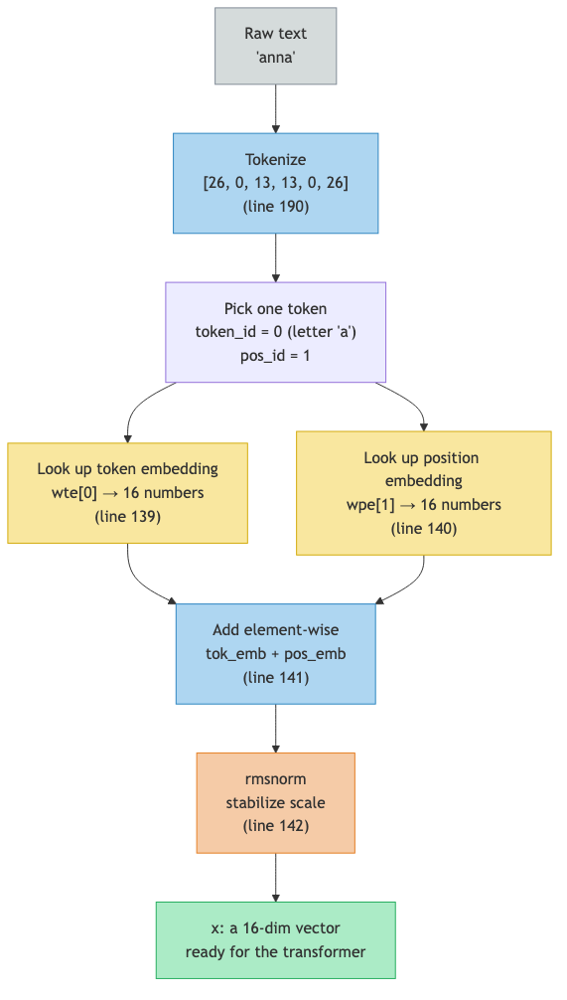

# Lesson 12: Tokenization and Embeddings — From Text to Vectors

Previous: [Lesson 11](./11-adam.md)

## The Gap Between Text and Math

Neural networks work with numbers. They multiply, add, and apply functions to numbers. But the input to a language model is **text** -- characters like "a", "m", "i".

This lesson covers the full pipeline that turns text into the numbers the model can actually work with. We touched on pieces of this in lessons 2 and 4, but now we'll walk through every step from raw text to the vector that enters the transformer.

## Step 1: Build the Vocabulary

Before the model can do anything, we need to decide what the basic units of text are. In microgpt, the units are **individual characters**.

At `microgpt.py:25`:

```python
uchars = sorted(set(''.join(docs)))
```

This line does three things:

1. `''.join(docs)` -- smash all the names together into one long string
2. `set(...)` -- find every unique character
3. `sorted(...)` -- put them in alphabetical order

The result is a list of the 26 lowercase letters:

```
uchars = ['a', 'b', 'c', 'd', 'e', 'f', 'g', 'h', 'i', 'j',
          'k', 'l', 'm', 'n', 'o', 'p', 'q', 'r', 's', 't',
          'u', 'v', 'w', 'x', 'y', 'z']
```

Each character gets an ID based on its position in the list:

| Character | ID |
|---|---|
| `a` | `0` |
| `b` | `1` |
| `c` | `2` |
| ... | ... |
| `n` | `13` |
| ... | ... |
| `z` | `25` |

This is the **vocabulary**: every possible token the model knows about.

## Step 2: The Special BOS Token

At `microgpt.py:26`:

```python
BOS = len(uchars)  # beginning/end of sequence token
```

`len(uchars)` is `26`, so `BOS = 26`. This is a special token that marks the **beginning** and **end** of a name. It's not a letter -- it's a signal that says "the name starts here" or "the name ends here."

The total vocabulary size is 27 (`microgpt.py:27`):

```python
vocab_size = len(uchars) + 1  # 26 letters + 1 BOS token = 27
```

| Token | ID | Meaning |
|---|---|---|
| `a` | `0` | The letter a |
| `b` | `1` | The letter b |
| ... | ... | ... |
| `z` | `25` | The letter z |
| `BOS` | `26` | Start/end of name |

## Step 3: Tokenize a Name

At `microgpt.py:190`:

```python
tokens = [BOS] + [uchars.index(ch) for ch in doc] + [BOS]
```

This converts a name into a list of token IDs. Let's trace it for the name "anna":

```
[BOS]                           → [26]
[uchars.index(ch) for ch in "anna"]
    uchars.index('a') = 0
    uchars.index('n') = 13
    uchars.index('n') = 13
    uchars.index('a') = 0       → [0, 13, 13, 0]
[BOS]                           → [26]

tokens = [26, 0, 13, 13, 0, 26]
```

The BOS token at the start tells the model "a name is beginning." The BOS token at the end tells the model "this name is finished." During training, the model learns to predict this end-of-name token, which is how it knows when to stop generating during inference.

Let's do one more. The name "bob":

```
tokens = [26, 1, 14, 1, 26]
         BOS  b   o  b  BOS
```

## Step 4: Look Up the Token Embedding

Now we have a number like `0` (for the letter "a"), but the model needs a **vector** -- a list of 16 numbers (lesson 2). This is where the embedding table comes in.

At `microgpt.py:139`:

```python
tok_emb = state_dict['wte'][token_id]
```

`state_dict['wte']` is a `27 x 16` matrix (created at `microgpt.py:108`). Each row is a 16-dimensional vector for one token. Looking up a token embedding is just indexing into this table:

```
state_dict['wte'] = [
    [0.03, -0.07, 0.12, ...],    # row 0: embedding for 'a'
    [0.08,  0.01, -0.05, ...],   # row 1: embedding for 'b'
    [0.02, -0.11, 0.06, ...],    # row 2: embedding for 'c'
    ...
    [-0.04, 0.09, 0.03, ...],   # row 26: embedding for BOS
]
```

For token ID `0` (the letter "a"):

```
tok_emb = state_dict['wte'][0]
        = [0.03, -0.07, 0.12, 0.01, -0.09, 0.05, 0.02, -0.04,
           0.11, -0.03, 0.08, -0.01, 0.06, -0.10, 0.04, 0.07]
```

This is not a hash or a code -- it's a learned representation. These 16 numbers start random but during training they get adjusted so that the vector for "a" captures something useful about the letter "a." The model decides what each dimension means.

### No computation, just a lookup

This is important: there's no multiplication, no function call. It's a pure table lookup. Token ID `0` fetches row `0`. Token ID `13` fetches row `13`. The embedding table is `27 * 16 = 432` parameters (dials) that get trained along with everything else.

## Step 5: Look Up the Positional Embedding

The token embedding tells the model **what** the token is. But it doesn't say **where** the token is in the sequence. Is this "a" the first letter of the name or the fourth? That matters -- the patterns after a first letter are different from the patterns after a fourth letter.

At `microgpt.py:140`:

```python
pos_emb = state_dict['wpe'][pos_id]
```

`state_dict['wpe']` is a `16 x 16` matrix (created at `microgpt.py:108`). Each row is a 16-dimensional vector for one position. `pos_id` is the position: `0` for the first token, `1` for the second, up to `15` for the sixteenth.

```
state_dict['wpe'] = [
    [0.05, -0.02, 0.08, ...],    # row 0: "I am at position 0"
    [-0.03, 0.11, -0.01, ...],   # row 1: "I am at position 1"
    [0.07, -0.06, 0.04, ...],    # row 2: "I am at position 2"
    ...
]
```

Just like token embeddings, these start random and get adjusted during training. The model learns what "being at position 3" should mean.

The positional embedding table is `16 * 16 = 256` parameters.

## Step 6: Combine Token + Position

At `microgpt.py:141`:

```python
x = [t + p for t, p in zip(tok_emb, pos_emb)]
```

Element-wise addition. Each of the 16 dimensions gets the token embedding value plus the positional embedding value:

```
tok_emb = [ 0.03, -0.07,  0.12, 0.01, ...]   (what: letter 'a')
pos_emb = [ 0.05, -0.02,  0.08, 0.03, ...]   (where: position 0)
      x = [ 0.08, -0.09,  0.20, 0.04, ...]   (what + where)
```

After this addition, the vector `x` encodes both **what** the token is and **where** it appears. The model can use both pieces of information.

### Why addition?

You might wonder: why not concatenate the two vectors (stick them end to end to make a 32-dimensional vector)? Addition is simpler and keeps the dimension at 16. It works because the model can learn to use different dimensions for different purposes -- some dimensions might carry mostly token information, others mostly position information. The training process sorts this out.

## Step 7: Normalize with rmsnorm

At `microgpt.py:142`:

```python
x = rmsnorm(x)
```

After adding two vectors together, the numbers might end up large or small in unpredictable ways. Normalization brings them to a consistent scale.

The `rmsnorm` function lives at `microgpt.py:131-134`:

```python
def rmsnorm(x):
    ms = sum(xi * xi for xi in x) / len(x)
    scale = (ms + 1e-5) ** -0.5
    return [xi * scale for xi in x]
```

Let's trace it with a short example. Suppose `x = [3.0, 4.0]` (just 2 dimensions to keep it simple):

**Step A: Mean of squares**
```
ms = (3.0² + 4.0²) / 2
   = (9.0 + 16.0) / 2
   = 25.0 / 2
   = 12.5
```

**Step B: Inverse square root (the scale factor)**
```
scale = (12.5 + 0.00001) ^ -0.5
      = 12.50001 ^ -0.5
      = 1 / sqrt(12.50001)
      = 1 / 3.5355
      = 0.2828
```

**Step C: Multiply each element by the scale**
```
x_normed = [3.0 * 0.2828, 4.0 * 0.2828]
         = [0.849, 1.131]
```

Let's verify: the root mean square of the output should be approximately `1.0`:

```
(0.849² + 1.131²) / 2 = (0.721 + 1.279) / 2 = 2.0 / 2 = 1.0 ✓
```

That's what rmsnorm does: it scales the vector so its root-mean-square is `1.0`. The direction of the vector (the ratio between elements) is preserved. Only the overall magnitude changes.

### Why normalize?

Without normalization, values can drift: some vectors might have elements in the hundreds, others near zero. This makes training unstable -- the learning rate that works for large values is too big for small values, and vice versa. Normalization keeps everything at a similar scale, making training smoother.

The `1e-5` added inside the square root (`microgpt.py:133`) is a tiny safety value. If all elements of `x` were zero, `ms` would be zero, and we'd divide by zero. Adding `0.00001` prevents that.

## The Complete Pipeline

Here is every step, from raw text to the vector that enters the transformer:



This pipeline runs for every token at every position. The output vector `x` is what flows into the attention mechanism and the MLP layers that make up the rest of the transformer.

## Counting the Embedding Parameters

Let's tally the parameters in the embedding tables:

| Table | Shape | Parameters | What it stores |
|---|---|---|---|
| `wte` (token embeddings) | `27 x 16` | `432` | A 16-dim vector per token |
| `wpe` (position embeddings) | `16 x 16` | `256` | A 16-dim vector per position |
| `lm_head` (output projection) | `27 x 16` | `432` | Converts back to token probabilities |
| **Total** | | **`1,120`** | |

These 1,120 parameters plus the 3,072 from the transformer layers (lesson 8) give us the full `4,192` parameters.

`lm_head` at `microgpt.py:108` is the reverse of the embedding: it takes the final 16-dimensional vector and projects it to 27 scores (one per possible next token). These scores become probabilities after softmax (lesson 4).

## Character-Level vs. BPE Tokenization

microgpt uses **character-level** tokenization: each character is one token. Real LLMs like GPT-4 use **BPE** (Byte Pair Encoding), which groups common character sequences into single tokens.

| | Character-level (microgpt) | BPE (real LLMs) |
|---|---|---|
| Example input | `"hello"` | `"hello"` |
| Tokens | `['h','e','l','l','o']` | `['hello']` or `['hel','lo']` |
| Vocab size | 27 (26 letters + BOS) | 50,000 - 100,000+ |
| Token count | 1 per character | Fewer tokens (common words = 1 token) |
| What it captures | Individual letters | Subwords and common words |

The concept is the same in both cases:

1. Split text into tokens
2. Convert each token to an ID number
3. Look up that ID in an embedding table
4. Get a vector that represents that token

The only difference is granularity. Character-level sees one letter at a time. BPE sees chunks. But the embedding lookup works identically: token ID goes in, vector comes out.

## Why Not One-Hot Encoding?

You might wonder: why not just represent "a" as `[1, 0, 0, ..., 0]`, "b" as `[0, 1, 0, ..., 0]`, etc.? This is called one-hot encoding, and it would work in a mechanical sense, but it has a problem: it says nothing about relationships between tokens.

In one-hot encoding, "a" and "b" are exactly as different as "a" and "z". Every pair of tokens is equally distant. But with learned embeddings, the model can place similar-sounding or similar-functioning letters closer together in the 16-dimensional space. Maybe vowels end up in one region, consonants in another. The model discovers these relationships during training.

The embedding table starts random. After training, the 16-dimensional vector for each token captures useful information about that token's role in name patterns. That's the power of learned representations.

## What Comes Next

The vector `x` that emerges from this pipeline -- a 16-dimensional vector encoding both the identity and position of a token, normalized to a stable scale -- is the input to the attention mechanism. Attention will look at all the previous tokens' vectors to figure out what should come next.

We now understand the full path from raw text to the model's internal representation. Everything beyond this point is the transformer processing these vectors to make predictions.

## Key Takeaways

> **What to remember from this lesson:**
>
> 1. **Vocabulary** (`microgpt.py:25`): 26 letters + 1 BOS token = 27 possible tokens
> 2. **Tokenize** (`microgpt.py:190`): "anna" becomes `[26, 0, 13, 13, 0, 26]`
> 3. **Token embedding** (`microgpt.py:139`): table lookup, token ID to 16-dim vector
> 4. **Position embedding** (`microgpt.py:140`): table lookup, position to 16-dim vector
> 5. **Combine** (`microgpt.py:141`): add token + position vectors element-wise
> 6. **rmsnorm** (`microgpt.py:131-134`): scale the vector so its root-mean-square is `1.0`
> 7. The embedding tables hold `1,120` of the model's `4,192` total parameters


---

> **Lab 12: Trace the Pipeline** — Walk through every step: text to tokens to embeddings to position to normalization. Print everything.
>
> ```bash
> cd labs && python3 lab12_trace_the_pipeline.py
> ```
>
> *Try the lab before moving on. Predict what will happen first.*
Next: [Lesson 13](./13-attention.md)
