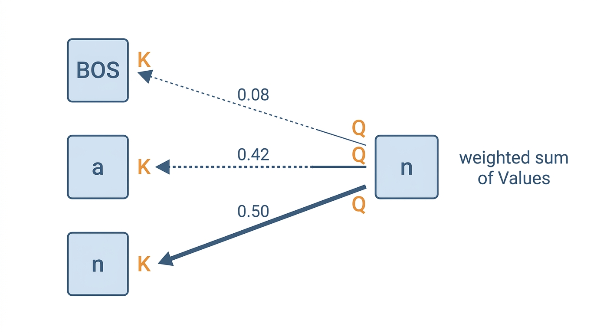
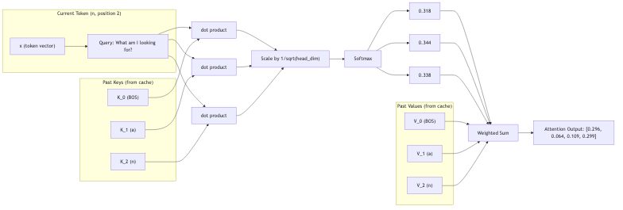

# Lesson 13: Attention -- What Should I Focus On?

Previous: [Lesson 12](./12-tokenization-and-embeddings.md)



## The Problem: Which Past Tokens Matter?

You are reading a sentence and trying to predict the next letter. You have already seen several past letters. But not all of them are equally useful for your prediction.

Consider the name `anna`. Suppose you have seen `a`, `n`, `n` and you need to predict what comes next. Which past letters should you focus on?

- The first `a` might be important -- it tells you this name started with a vowel.
- The most recent `n` might matter -- two `n`s in a row often get followed by a vowel.
- Or maybe the combination of all three is what matters.

The point is: **different situations require focusing on different past tokens**. After learning from thousands of names, the model needs a way to dynamically decide "which past tokens are relevant to my current prediction?"

This is exactly what attention does.

## The Core Idea

Attention is a mechanism that lets each token ask: "Of all the tokens that came before me, which ones should I pay attention to?"

It answers this question by computing a **relevance score** between the current token and every past token. High score means "very relevant." Low score means "not relevant." Then it takes a weighted combination of the past tokens' information, focusing mostly on the relevant ones.

## Three Questions for Every Token

When attention processes a token, it creates three vectors from that token's representation. Each vector serves a different purpose. Look at `microgpt.py:149-151`:

```python
q = linear(x, state_dict[f'layer{li}.attn_wq'])
k = linear(x, state_dict[f'layer{li}.attn_wk'])
v = linear(x, state_dict[f'layer{li}.attn_wv'])
```

These three vectors are:

| Vector | Name | Question it answers |
|--------|------|-------------------|
| `q` | **Query** | "What am I looking for?" |
| `k` | **Key** | "What do I contain?" |
| `v` | **Value** | "What information do I carry?" |

Each is produced by a `linear()` call -- a matrix multiplication (Lesson 8). The input `x` is the same 16-dim vector for all three, but each weight matrix (`attn_wq`, `attn_wk`, `attn_wv`) is different, so the outputs are different.

Think of it this way:

- The **Query** is a search term. The current token is saying "I need information about X."
- The **Key** is a label. Each past token says "I contain information about Y."
- The **Value** is the actual content. Each past token says "Here is my information."

## The Filing Cabinet Analogy

Imagine a filing cabinet. Every past token, when it was processed, filed away two things:

1. A **Key** (a label on the folder): describes what that token contains
2. A **Value** (the documents inside): the actual useful information

Now the current token walks up with a **Query** (a search term). It checks its Query against every Key in the cabinet. Where the Query matches a Key well, it pulls out that folder's Value. Where the match is poor, it mostly ignores that folder.

The match quality is measured by the **dot product** (Lesson 3) between the Query and each Key. High dot product = good match = "pay attention to this token."

## The KV Cache

After computing K and V for the current token, they get stored for future tokens to look at. This happens at `microgpt.py:152-153`:

```python
keys[li].append(k)
values[li].append(v)
```

So when the next token comes along and computes its Query, it can compare against all the Keys that have been stored so far -- including the one we just added. This growing collection of stored Keys and Values is called the **KV cache**.

### A note on causal masking

If you read about attention in PyTorch tutorials, you'll see something called a **causal mask** -- a triangular matrix that prevents each token from attending to future tokens. This is important because during training, the model shouldn't be able to "cheat" by looking ahead at the answer.

microgpt doesn't need an explicit mask because it processes tokens **one at a time, left to right**. When token 3 runs, only the Keys and Values for tokens 0, 1, 2, and 3 are in the cache. Tokens 4, 5, etc. haven't been processed yet, so their Keys and Values don't exist. Causality is enforced automatically by the sequential processing order.

In real implementations, all tokens in a sequence are processed in parallel for efficiency (as a single matrix multiplication). Since all tokens exist simultaneously, an explicit triangular mask is needed to hide future positions. The effect is identical -- each token can only attend to itself and earlier tokens -- but the mechanism differs.

## Computing Attention Scores

Now the actual attention computation. The current token's Query is compared against every stored Key using a dot product. This happens at `microgpt.py:162`:

```python
attn_logits = [sum(q_h[j] * k_h[t][j] for j in range(head_dim)) / head_dim**0.5
               for t in range(len(k_h))]
```

Let's break this down into pieces.

### Step 1: Dot product of Q with each K

For each past token `t`, we compute:

```
score_t = sum of (Q[j] * K_t[j]) for each dimension j
```

This is the dot product from Lesson 3. If Q and K point in similar directions, the score is high. If they point in different directions, the score is low.

**Try it yourself:** Type a name and see how each attention head focuses on different past tokens.

[Attention Heatmap](./interactive/attention-heatmap.html)

### Step 2: Divide by sqrt(head_dim)

The raw dot product is divided by `head_dim**0.5`. In microgpt, `head_dim = 4`, so we divide by `sqrt(4) = 2.0`.

Why? Without this division, the dot product scores can grow large when vectors have many dimensions. Large scores fed into softmax produce extreme probabilities (nearly 0 or nearly 1), which causes two problems:

1. The model becomes too "confident" and ignores most tokens entirely
2. Gradients become tiny (near-zero slopes), making learning extremely slow

Dividing by `sqrt(head_dim)` keeps the scores in a moderate range where softmax behaves well.

### Step 3: Softmax turns scores into weights

At `microgpt.py:163`:

```python
attn_weights = softmax(attn_logits)
```

Softmax (Lesson 4) converts the raw scores into probabilities that sum to `1`. A high score becomes a high weight. A low score becomes a low weight.

### Step 4: Weighted sum of Values

Finally, at `microgpt.py:164`:

```python
head_out = [sum(attn_weights[t] * v_h[t][j] for t in range(len(v_h)))
            for j in range(head_dim)]
```

For each dimension `j` of the output, we take a weighted sum of all the Value vectors. Tokens with high attention weights contribute more. Tokens with low attention weights contribute less.

The result is a new vector that blends the information from past tokens, weighted by relevance.

## Full Concrete Example

Let's walk through attention for a 3-token sequence: `[BOS, a, n]`. We are processing position 2 (the token `n`), and positions 0 and 1 have already been processed and their Keys and Values are stored in the cache.

For simplicity, let's use **4 dimensions** instead of 16 (we are looking at one head's slice -- more on that in Lesson 14).

### The stored Keys and Values

When BOS (position 0) was processed, it stored:

```
K_0 = [0.2, -0.1, 0.3, 0.0]
V_0 = [0.5,  0.1, -0.2, 0.3]
```

When `a` (position 1) was processed, it stored:

```
K_1 = [0.1,  0.4, -0.2, 0.1]
V_1 = [0.3, -0.3,  0.6, 0.1]
```

### Current token computes Q, K, V

Now `n` (position 2) is processed. It computes:

```
Q_2 = [0.3, 0.2, -0.1, 0.4]
K_2 = [0.0, 0.3,  0.1, 0.2]
V_2 = [0.1, 0.4, -0.1, 0.5]
```

K_2 and V_2 get appended to the cache. Now the cache has Keys and Values for positions 0, 1, and 2.

### Step 1: Dot products (Q with each K)

The Query from position 2 is compared with all three Keys:

**Q dot K_0:**

```
(0.3 * 0.2) + (0.2 * -0.1) + (-0.1 * 0.3) + (0.4 * 0.0)
= 0.06 + (-0.02) + (-0.03) + 0.00
= 0.01
```

**Q dot K_1:**

```
(0.3 * 0.1) + (0.2 * 0.4) + (-0.1 * -0.2) + (0.4 * 0.1)
= 0.03 + 0.08 + 0.02 + 0.04
= 0.17
```

**Q dot K_2:**

```
(0.3 * 0.0) + (0.2 * 0.3) + (-0.1 * 0.1) + (0.4 * 0.2)
= 0.00 + 0.06 + (-0.01) + 0.08
= 0.13
```

### Step 2: Scale by sqrt(head_dim)

`head_dim = 4`, so `sqrt(4) = 2.0`.

```
score_0 = 0.01 / 2.0 = 0.005
score_1 = 0.17 / 2.0 = 0.085
score_2 = 0.13 / 2.0 = 0.065
```

### Step 3: Softmax

First, subtract the max for numerical stability. The max is `0.085`.

```
exp(0.005 - 0.085) = exp(-0.080) = 0.923
exp(0.085 - 0.085) = exp(0.000)  = 1.000
exp(0.065 - 0.085) = exp(-0.020) = 0.980
```

Sum: `0.923 + 1.000 + 0.980 = 2.903`

```
weight_0 = 0.923 / 2.903 = 0.318
weight_1 = 1.000 / 2.903 = 0.344
weight_2 = 0.980 / 2.903 = 0.338
```

These weights sum to `1.0`. Position 1 (`a`) got the highest weight (`0.344`), meaning the model decided `a` is the most relevant past token for predicting what comes after `n`. Positions 0 and 2 got slightly lower but still significant weights.

### Step 4: Weighted sum of Values

For each dimension, combine the three Value vectors using the weights:

**Dimension 0:**

```
0.318 * 0.5 + 0.344 * 0.3 + 0.338 * 0.1
= 0.159 + 0.103 + 0.034
= 0.296
```

**Dimension 1:**

```
0.318 * 0.1 + 0.344 * (-0.3) + 0.338 * 0.4
= 0.032 + (-0.103) + 0.135
= 0.064
```

**Dimension 2:**

```
0.318 * (-0.2) + 0.344 * 0.6 + 0.338 * (-0.1)
= (-0.064) + 0.206 + (-0.034)
= 0.109
```

**Dimension 3:**

```
0.318 * 0.3 + 0.344 * 0.1 + 0.338 * 0.5
= 0.095 + 0.034 + 0.169
= 0.299
```

The attention output for this head is:

```
head_out = [0.296, 0.064, 0.109, 0.299]
```

This is a blend of all three Value vectors, weighted toward the most relevant past tokens. The information from `a` (position 1) contributed the most because its Key best matched the current Query.

## The Big Picture

Here is the full attention flow:



## Why Attention Is Powerful

Before attention, models processed sequences by just looking at a fixed window of recent tokens, or by compressing the entire past into a single vector (which loses information). Attention lets the model selectively focus on any past position, no matter how far back.

The key insight: the Query, Key, and Value weight matrices (`attn_wq`, `attn_wk`, `attn_wv`) are **learned parameters**. Through training, the model learns:

- What kind of Query to produce for each token (what to search for)
- What kind of Key to produce for each token (how to describe itself)
- What kind of Value to produce for each token (what information to make available)

Early in training, the attention weights are essentially random. After many training steps, the model learns attention patterns that are useful for predicting the next character -- like "when I see a consonant, attend to the most recent vowel."

## Summary

| Step | What happens | Code line |
|------|-------------|-----------|
| Compute Q, K, V | Three projections from the token vector | `microgpt.py:149-151` |
| Store K, V | Append to the cache for future tokens | `microgpt.py:152-153` |
| Dot product Q with Ks | Measure relevance of each past token | `microgpt.py:162` |
| Scale by `sqrt(head_dim)` | Prevent scores from getting too large | `microgpt.py:162` |
| Softmax | Turn scores into weights summing to `1` | `microgpt.py:163` |
| Weighted sum of Vs | Blend past information by relevance | `microgpt.py:164` |


---

> **Lab 13: Remove Attention** — Skip the attention block entirely. Measure how much worse the model gets.
>
> ```bash
> cd labs && python3 lab13_remove_attention.py
> ```
>
> *Try the lab before moving on. Predict what will happen first.*
Next: [Lesson 14](./14-multi-head-attention.md)
