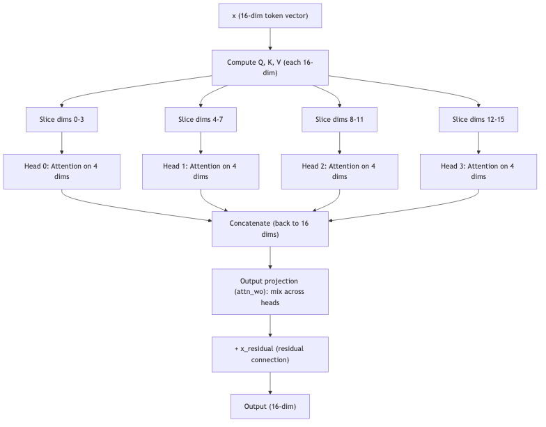

# Lesson 14: Multi-Head Attention -- Different Perspectives

Previous: [Lesson 13](./13-attention.md)

## One Attention Pattern Is Not Enough

In Lesson 13, we saw how attention lets a token focus on the most relevant past tokens. But what counts as "relevant" depends on the question being asked.

Consider predicting the next letter after `ann`. The model might benefit from knowing:

- **What was the last consonant?** (the `n` at position 2 -- useful for letter-pair patterns)
- **What was the first letter?** (the `a` at position 0 -- useful for name patterns that repeat the first letter)
- **What vowels have appeared?** (just the `a` -- useful for vowel harmony patterns)

A single attention mechanism computes one set of weights. It might focus on the recent `n`, but then it misses the information about the starting `a`. Or it focuses on the `a` and misses the `n`.

The solution: run **multiple attention mechanisms in parallel**, each one free to focus on different things.

## Splitting Into Heads

In microgpt, the model has `16` embedding dimensions and `4` attention heads (`microgpt.py:103-104`):

```python
n_head = 4
head_dim = n_embd // n_head  # 16 // 4 = 4
```

Instead of doing one attention computation over all `16` dimensions, we split the `16`-dim Q, K, and V vectors into `4` slices of `4` dimensions each. Each slice is one **head**.

| Head | Dimensions | Slice of the 16-dim vector |
|------|-----------|---------------------------|
| Head 0 | `0, 1, 2, 3` | First 4 numbers |
| Head 1 | `4, 5, 6, 7` | Next 4 numbers |
| Head 2 | `8, 9, 10, 11` | Next 4 numbers |
| Head 3 | `12, 13, 14, 15` | Last 4 numbers |

Each head independently runs the full attention process from Lesson 13 (dot products, scale, softmax, weighted sum) on its own 4-dim slice. They do not interfere with each other.

## The Multi-Head Loop in Code

The multi-head attention happens at `microgpt.py:156-165`:

```python
x_attn = []
for h in range(n_head):
    hs = h * head_dim
    q_h = q[hs:hs+head_dim]
    k_h = [ki[hs:hs+head_dim] for ki in keys[li]]
    v_h = [vi[hs:hs+head_dim] for vi in values[li]]
    attn_logits = [sum(q_h[j] * k_h[t][j] for j in range(head_dim)) / head_dim**0.5
                   for t in range(len(k_h))]
    attn_weights = softmax(attn_logits)
    head_out = [sum(attn_weights[t] * v_h[t][j] for t in range(len(v_h)))
                for j in range(head_dim)]
    x_attn.extend(head_out)
```

Let's trace through this line by line.

### Line by line

**`hs = h * head_dim`** (`microgpt.py:158`): computes the starting index for this head's slice.

| Head `h` | `hs = h * 4` | Slice |
|-----------|-------------|-------|
| `0` | `0` | `[0:4]` |
| `1` | `4` | `[4:8]` |
| `2` | `8` | `[8:12]` |
| `3` | `12` | `[12:16]` |

**`q_h = q[hs:hs+head_dim]`** (`microgpt.py:159`): takes this head's 4-dim slice of the full 16-dim Query.

**`k_h = [ki[hs:hs+head_dim] for ki in keys[li]]`** (`microgpt.py:160`): takes this head's 4-dim slice from every stored Key. If there are 3 tokens in the cache, this gives 3 vectors of 4 dims each.

**`v_h = [vi[hs:hs+head_dim] for vi in values[li]]`** (`microgpt.py:161`): same thing for Values.

**Lines 162-164**: the exact same attention computation from Lesson 13 -- dot products, scale, softmax, weighted sum -- but only on 4 dimensions instead of 16.

**`x_attn.extend(head_out)`** (`microgpt.py:165`): appends this head's 4-dim output to the growing list. After all 4 heads finish, `x_attn` is `4 * 4 = 16` dimensions -- back to the original size.

## Concrete Example: Four Heads, Different Focus

Let's process position 2 (`n`) in the sequence `[BOS, a, n]`, showing all 4 heads. Each head has its own 4-dim Q, K, and V slices, so each head computes its own attention weights.

The full 16-dim Q, K, V vectors were computed first (lines 149-151). Now each head takes its slice. Suppose the full 16-dim Q for the current token (`n` at position 2) is:

```
Q = [0.3, 0.2, -0.1, 0.4,  0.1, -0.3, 0.5, 0.0,  0.2, 0.1, 0.3, -0.2,  -0.1, 0.4, 0.0, 0.2]
      |--- Head 0 ---|      |--- Head 1 ---|       |--- Head 2 ----|       |--- Head 3 ---|
```

Each head grabs its 4 numbers:

```
Head 0: q_h = [0.3, 0.2, -0.1, 0.4]    (dims 0-3)
Head 1: q_h = [0.1, -0.3, 0.5, 0.0]    (dims 4-7)
Head 2: q_h = [0.2, 0.1, 0.3, -0.2]    (dims 8-11)
Head 3: q_h = [-0.1, 0.4, 0.0, 0.2]    (dims 12-15)
```

The same slicing happens for all cached Keys and Values. Each head gets a completely independent view of the data.

### Worked Example: Head 1 in Detail

Let's trace the full math for Head 1 (dimensions 4-7). The cached Keys for these dimensions are:

```
K_0 (BOS, dims 4-7): [-0.1, 0.2, 0.0, 0.1]
K_1 (a, dims 4-7):   [0.0, -0.4, 0.3, 0.1]
K_2 (n, dims 4-7):   [0.2, 0.1, 0.1, -0.2]
```

**Dot products of Head 1's Q with each K:**

```
Q dot K_0: (0.1 * -0.1) + (-0.3 * 0.2) + (0.5 * 0.0) + (0.0 * 0.1)
         = -0.01 + (-0.06) + 0.00 + 0.00 = -0.07

Q dot K_1: (0.1 * 0.0) + (-0.3 * -0.4) + (0.5 * 0.3) + (0.0 * 0.1)
         = 0.00 + 0.12 + 0.15 + 0.00 = 0.27

Q dot K_2: (0.1 * 0.2) + (-0.3 * 0.1) + (0.5 * 0.1) + (0.0 * -0.2)
         = 0.02 + (-0.03) + 0.05 + 0.00 = 0.04
```

**Scale by `sqrt(4) = 2.0`:**

```
score_0 = -0.07 / 2.0 = -0.035
score_1 =  0.27 / 2.0 =  0.135
score_2 =  0.04 / 2.0 =  0.020
```

**Softmax** (subtract max `0.135` for stability):

```
exp(-0.035 - 0.135) = exp(-0.170) = 0.844
exp( 0.135 - 0.135) = exp( 0.000) = 1.000
exp( 0.020 - 0.135) = exp(-0.115) = 0.891

Sum = 0.844 + 1.000 + 0.891 = 2.735

weight_0 = 0.844 / 2.735 = 0.309
weight_1 = 1.000 / 2.735 = 0.366
weight_2 = 0.891 / 2.735 = 0.326
```

Head 1 assigns the highest weight to position 1 (`a`). It is focusing most on the vowel. Now the cached Values for Head 1's dimensions:

```
V_0 (BOS, dims 4-7): [0.1, 0.3, -0.2, 0.0]
V_1 (a, dims 4-7):   [0.4, -0.1, 0.5, 0.2]
V_2 (n, dims 4-7):   [0.0, 0.2, 0.1, -0.1]
```

**Weighted sum of Values:**

```
Dim 4: 0.309 * 0.1 + 0.366 * 0.4 + 0.326 * 0.0 = 0.031 + 0.146 + 0.000 = 0.177
Dim 5: 0.309 * 0.3 + 0.366 * -0.1 + 0.326 * 0.2 = 0.093 + (-0.037) + 0.065 = 0.121
Dim 6: 0.309 * -0.2 + 0.366 * 0.5 + 0.326 * 0.1 = -0.062 + 0.183 + 0.033 = 0.154
Dim 7: 0.309 * 0.0 + 0.366 * 0.2 + 0.326 * -0.1 = 0.000 + 0.073 + (-0.033) = 0.041
```

Head 1's output: `[0.177, 0.121, 0.154, 0.041]`.

### All Four Heads' Results

Each of the other three heads does the same math on its own slice. Suppose they arrive at these attention weights and outputs:

**Head 0 (dimensions 0-3):**

```
Attention weights: [0.15, 0.25, 0.60]
                    BOS    a      n
Output: [0.12, -0.05, 0.31, 0.08]
```

Head 0 focuses mostly on the current token `n` (weight `0.60`). It might be learning: "what letter am I right now?"

**Head 1 (dimensions 4-7):** (we just computed this)

```
Attention weights: [0.309, 0.366, 0.326]
                    BOS     a       n
Output: [0.177, 0.121, 0.154, 0.041]
```

Head 1 focuses most on `a`. It might be learning: "what was the most recent vowel?"

**Head 2 (dimensions 8-11):**

```
Attention weights: [0.55, 0.25, 0.20]
                    BOS    a      n
Output: [-0.03, 0.41, 0.15, -0.11]
```

Head 2 focuses mostly on `BOS` (weight `0.55`). It might be learning: "how far am I from the start of the name?"

**Head 3 (dimensions 12-15):**

```
Attention weights: [0.30, 0.35, 0.35]
                    BOS    a      n
Output: [0.19, 0.06, 0.20, 0.17]
```

Head 3 spreads attention roughly evenly. It might be computing some average over all positions.

### Concatenation

The outputs are concatenated back together (`microgpt.py:165: x_attn.extend(head_out)`):

```
x_attn = [0.12, -0.05, 0.31, 0.08, 0.177, 0.121, 0.154, 0.041, -0.03, 0.41, 0.15, -0.11, 0.19, 0.06, 0.20, 0.17]
          |---- Head 0 ----|  |---- Head 1 -----|  |---- Head 2 ----|  |---- Head 3 ----|
```

That is 16 numbers -- the same dimensionality we started with. Each group of 4 was computed independently by its head, each potentially attending to different past tokens.

## The Output Projection

After concatenation, the result passes through one more linear layer at `microgpt.py:167`:

```python
x = linear(x_attn, state_dict[f'layer{li}.attn_wo'])
```

This is a `16x16` matrix multiplication. Why is this needed?

Each head operated independently on its own slice. The output projection (`attn_wo`) is where information from different heads gets **mixed together**. Head 0 learned something about the current letter. Head 1 learned something about recent vowels. The output projection combines these separate pieces of knowledge into a single coherent 16-dim vector.

Without this mixing step, the heads could never combine their findings. The output projection is like a meeting where each team member (head) shares what they found, and the group synthesizes it into a unified conclusion.

## The Residual Connection

Immediately after the output projection, we see at `microgpt.py:168`:

```python
x = [a + b for a, b in zip(x, x_residual)]  # residual connection
```

Remember that `x_residual` was saved before attention started (`microgpt.py:145`):

```python
x_residual = x
```

The residual connection **adds the original input back** to the attention output. This means attention only needs to learn **what to add** to the existing representation, not rebuild it from scratch.

Think of it like editing a document. Without the residual connection, attention would have to rewrite the entire document every time. With it, attention just writes a few notes in the margin. The original content is preserved, and the notes are added on top.

This has a huge practical benefit for training: gradients can flow directly through the addition, bypassing the attention layers if needed. This prevents the "vanishing gradient" problem where signals get weaker as they pass through many operations.

## Why Different Heads Specialize

The four heads start with random weights. During training, each head's Q, K, V weight matrices are adjusted by gradient descent. Because they start from different random points, they naturally end up learning different patterns.

In a character-level model like microgpt, heads might specialize in:

| Head | Possible specialization |
|------|------------------------|
| Head 0 | Attend to the immediately previous character |
| Head 1 | Attend to the first character of the name |
| Head 2 | Attend to the most recent vowel |
| Head 3 | Attend broadly to get a general sense |

In larger models trained on English text, researchers have found heads that specialize in:

- Attending to the previous word
- Attending to the subject of the sentence
- Attending to matching punctuation (opening parenthesis attends to closing)
- Attending to words that are syntactically related

The model discovers these patterns on its own through training. Nobody programs "Head 2 should track vowels." The loss function (Lesson 5) provides the signal, backpropagation (Lesson 7) traces the blame, and gradient descent (Lesson 10) adjusts each head's weights until useful patterns emerge.

## The Full Multi-Head Attention Pipeline



## Summary

| Concept | What it means | Code |
|---------|--------------|------|
| Multiple heads | Run several attention mechanisms in parallel | `microgpt.py:157` |
| Head slicing | Each head gets `n_embd / n_head = 4` dimensions | `microgpt.py:158-161` |
| Independent attention | Each head computes its own scores and weights | `microgpt.py:162-164` |
| Concatenation | Reassemble head outputs to full 16 dims | `microgpt.py:165` |
| Output projection | Mix information across heads | `microgpt.py:167` |
| Residual connection | Add original input back | `microgpt.py:168` |

The key takeaway: multi-head attention lets the model look at the same sequence from multiple angles simultaneously. One head might focus on "what letter was right before me?" while another focuses on "what letter started this name?" Together they give the model a richer understanding of context than any single attention pattern could.

Next: [Lesson 15](./15-full-forward-pass.md)
