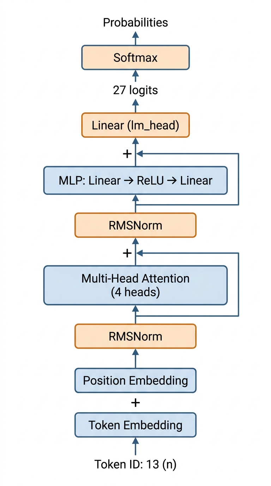
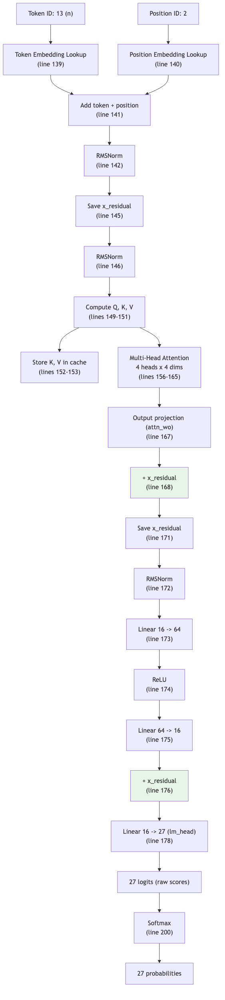

# Lesson 15: The Full Forward Pass -- From Token to Prediction

Previous: [Lesson 14](./14-multi-head-attention.md)



## Assembling the Whole Machine

Over the past lessons, we have built up each component of the model:

- **Embedding lookup** (Lesson 12): token integer to vector
- **Positional embedding** (Lesson 12): encodes position in the sequence
- **RMSNorm** (Lesson 12): stabilizes vector magnitudes
- **Attention** (Lessons 13-14): selects relevant past information
- **Linear layers** (Lesson 8): matrix multiplications
- **ReLU** (Lesson 9): nonlinear activation
- **Residual connections** (Lesson 14): preserve the original signal

Now we trace through the **entire** `gpt()` function (`microgpt.py:137-179`) with a concrete example. One token goes in, 27 probability scores come out -- one for each possible next character.

## Our Example: The Name "anna"

We are processing the name `anna`. The tokens are:

```
[26, 0, 13, 13, 0, 26]
 BOS  a   n   n   a  BOS
```

We will trace what happens when we process **position 2** -- the first `n`. The model has already seen `BOS` (position 0) and `a` (position 1), whose Keys and Values are in the cache. The model's job: predict what comes after `an`.

The correct answer is `n` (token `13`). Let's see how the model tries to figure that out.

## Step-by-Step Through gpt()

### Step 1: Token Embedding Lookup (line 139)

```python
tok_emb = state_dict['wte'][token_id]
```

Our `token_id` is `13` (the letter `n`). We look up row 13 of the token embedding table. This gives us 16 numbers -- the learned vector for `n`.

```
tok_emb = [0.02, -0.07, 0.11, 0.04, -0.03, 0.08, -0.01, 0.05,
           0.09, -0.06, 0.03, 0.07, -0.02, 0.10, 0.01, -0.04]
```

These are whatever values the 16 parameters for `n` have at this point in training.

### Step 2: Position Embedding Lookup (line 140)

```python
pos_emb = state_dict['wpe'][pos_id]
```

Our `pos_id` is `2`. We look up row 2 of the position embedding table. This gives another 16 numbers encoding "position 2."

```
pos_emb = [0.01, 0.03, -0.02, 0.06, 0.04, -0.05, 0.02, 0.08,
          -0.01, 0.07, 0.05, -0.03, 0.09, 0.01, -0.06, 0.04]
```

### Step 3: Add Them Together (line 141)

```python
x = [t + p for t, p in zip(tok_emb, pos_emb)]
```

Element-by-element addition. The result encodes both "what token" and "what position."

```
x[0]  = 0.02 + 0.01 =  0.03
x[1]  = -0.07 + 0.03 = -0.04
x[2]  = 0.11 + (-0.02) = 0.09
x[3]  = 0.04 + 0.06 =  0.10
...and so on for all 16 dimensions
```

The result is a single 16-dim vector representing "the letter `n` at position 2."

### Step 4: RMSNorm (line 142)

```python
x = rmsnorm(x)
```

RMSNorm (Lesson 12) rescales the vector so its values stay in a reasonable range. It computes the root-mean-square of all 16 values and divides each value by that. The direction of the vector is preserved, but the magnitude is normalized.

### Step 5: Enter the Transformer Layer (line 144)

```python
for li in range(n_layer):
```

microgpt has `n_layer = 1`, so this loop runs once. Each iteration is one complete transformer block: attention followed by an MLP.

### Step 6: Save Residual and Normalize (lines 145-146)

```python
x_residual = x
x = rmsnorm(x)
```

We save the current `x` so we can add it back later (residual connection). Then normalize again before feeding into attention. This "pre-norm" pattern helps training stability.

### Step 7: Compute Q, K, V (lines 149-151)

```python
q = linear(x, state_dict[f'layer{li}.attn_wq'])
k = linear(x, state_dict[f'layer{li}.attn_wk'])
v = linear(x, state_dict[f'layer{li}.attn_wv'])
```

Three separate matrix multiplications. Each takes the same 16-dim input `x` and multiplies it by a different `16x16` weight matrix, producing three different 16-dim vectors.

- `q` (Query): "Here is what I'm looking for in past tokens"
- `k` (Key): "Here is what I contain, as a searchable label"
- `v` (Value): "Here is my actual information to share"

### Step 8: Store K and V in Cache (lines 152-153)

```python
keys[li].append(k)
values[li].append(v)
```

K and V for this token are appended to the layer's cache. Now the cache for layer 0 has entries for positions 0, 1, and 2.

### Step 9: Multi-Head Attention (lines 156-165)

```python
x_attn = []
for h in range(n_head):   # 4 heads
    hs = h * head_dim      # head_dim = 4
    q_h = q[hs:hs+head_dim]
    k_h = [ki[hs:hs+head_dim] for ki in keys[li]]
    v_h = [vi[hs:hs+head_dim] for vi in values[li]]
    attn_logits = [sum(q_h[j] * k_h[t][j] for j in range(head_dim)) / head_dim**0.5
                   for t in range(len(k_h))]
    attn_weights = softmax(attn_logits)
    head_out = [sum(attn_weights[t] * v_h[t][j] for t in range(len(v_h)))
                for j in range(head_dim)]
    x_attn.extend(head_out)
```

This is the full multi-head attention from Lessons 13-14. Four heads, each operating on 4 dimensions:

- Each head slices its portion of Q, K, V
- Each head computes dot products between its Q slice and all cached K slices
- Each head applies softmax to get attention weights
- Each head computes a weighted sum of its V slices
- All 4 head outputs (each 4-dim) are concatenated into a 16-dim vector

After this step, `x_attn` is a 16-dim vector that contains information gathered from all past tokens, filtered by what each head deemed relevant.

### Step 10: Output Projection and Residual (lines 167-168)

```python
x = linear(x_attn, state_dict[f'layer{li}.attn_wo'])
x = [a + b for a, b in zip(x, x_residual)]
```

Two things happen:

1. The concatenated attention output passes through a `16x16` matrix (`attn_wo`). This mixes information across the four heads.
2. The residual from step 6 is added back. The attention block only needed to learn what to **add** to the representation.

After this, `x` is a 16-dim vector that combines the original token information with what attention found in past tokens.

### Step 11: MLP (lines 171-175)

```python
x_residual = x
x = rmsnorm(x)
x = linear(x, state_dict[f'layer{li}.mlp_fc1'])   # 16 -> 64
x = [xi.relu() for xi in x]                         # relu activation
x = linear(x, state_dict[f'layer{li}.mlp_fc2'])   # 64 -> 16
```

The MLP (multi-layer perceptron) is a two-layer feed-forward network. It processes each position independently (no looking at other tokens -- that was attention's job).

**Expand**: the first linear layer maps from 16 dims to `4 * 16 = 64` dims. This gives the model a larger space to work in.

**ReLU**: applies `max(0, x)` to each of the 64 values. This is the nonlinearity from Lesson 9 that lets the network compute complex functions.

**Compress**: the second linear layer maps back from 64 dims to 16 dims.

Why expand then compress? The expansion gives the network room to represent complex intermediate computations. The compression forces it to distill the results back into a compact form.

### Step 12: Second Residual Connection (line 176)

```python
x = [a + b for a, b in zip(x, x_residual)]
```

Same idea as step 10 -- add back what we had before the MLP. The MLP only learns what to add.

### Step 13: Final Projection to Logits (line 178)

```python
logits = linear(x, state_dict['lm_head'])
```

The final 16-dim vector is multiplied by the `lm_head` matrix, which has shape `27x16` (27 rows, one per vocabulary token). The output is 27 numbers -- one raw score (logit) per possible next character.

```
logits = [score_a, score_b, score_c, ..., score_z, score_BOS]
```

A high logit means the model thinks that character is likely to come next. A low logit means unlikely.

### After gpt() Returns: Softmax (line 200)

```python
probs = softmax(logits)
```

Back in the training loop, the 27 logits are passed through softmax (Lesson 4) to get probabilities that sum to 1. If the model is doing well, `probs[13]` (the probability for `n`) should be high, since the correct next character after `an` in `anna` is `n`.

## The Complete Pipeline



The green-highlighted additions are the residual connections.

## Component Summary Table

| Step | Component | Input dims | Output dims | Lines | Parameters |
|------|-----------|-----------|-------------|-------|------------|
| 1 | Token embedding | 1 integer | 16 | 139 | `wte`: 27 x 16 = 432 |
| 2 | Position embedding | 1 integer | 16 | 140 | `wpe`: 16 x 16 = 256 |
| 3 | Add | 16 + 16 | 16 | 141 | 0 |
| 4 | RMSNorm | 16 | 16 | 142 | 0 |
| 5 | RMSNorm | 16 | 16 | 146 | 0 |
| 6 | Q projection | 16 | 16 | 149 | `attn_wq`: 16 x 16 = 256 |
| 7 | K projection | 16 | 16 | 150 | `attn_wk`: 16 x 16 = 256 |
| 8 | V projection | 16 | 16 | 151 | `attn_wv`: 16 x 16 = 256 |
| 9 | Multi-head attention | 16 | 16 | 156-165 | 0 (uses stored K, V) |
| 10 | Output projection | 16 | 16 | 167 | `attn_wo`: 16 x 16 = 256 |
| 11 | Residual add | 16 + 16 | 16 | 168 | 0 |
| 12 | RMSNorm | 16 | 16 | 172 | 0 |
| 13 | MLP expand | 16 | 64 | 173 | `mlp_fc1`: 64 x 16 = 1024 |
| 14 | ReLU | 64 | 64 | 174 | 0 |
| 15 | MLP compress | 64 | 16 | 175 | `mlp_fc2`: 16 x 64 = 1024 |
| 16 | Residual add | 16 + 16 | 16 | 176 | 0 |
| 17 | Output projection | 16 | 27 | 178 | `lm_head`: 27 x 16 = 432 |

**Total parameters: 4,192** -- exactly the number reported at `microgpt.py:119`.

Let's verify: `432 + 256 + 256 + 256 + 256 + 256 + 1024 + 1024 + 432 = 4192`. Every single parameter in the model is in this table.

## One Layer vs. Many

microgpt has `n_layer = 1`. Steps 5 through 16 (everything inside the `for li in range(n_layer)` loop) happen once.

GPT-3 has `n_layer = 96`. That same block -- RMSNorm, attention, residual, RMSNorm, MLP, residual -- repeats 96 times. Each layer has its own set of weight matrices, so each layer learns to do something different:

- Early layers might learn basic character patterns (common letter pairs)
- Middle layers might learn word-level patterns
- Later layers might learn higher-level structure

But the structure of each layer is identical to what we just traced through.

## What Comes Out

At the end of all this, the model has produced 27 numbers. For our `an` example, a well-trained model might output something like:

```
probs[0]  (a): 0.08    probs[13] (n): 0.35    probs[26] (BOS): 0.01
probs[1]  (b): 0.01    probs[14] (o): 0.04
probs[2]  (c): 0.01    probs[15] (p): 0.01
probs[3]  (d): 0.05    probs[16] (q): 0.00
probs[4]  (e): 0.07    probs[17] (r): 0.01
probs[5]  (f): 0.01    probs[18] (s): 0.02
probs[6]  (g): 0.03    probs[19] (t): 0.04
probs[7]  (h): 0.02    probs[20] (u): 0.02
probs[8]  (i): 0.06    probs[21] (v): 0.01
probs[9]  (j): 0.01    probs[22] (w): 0.01
probs[10] (k): 0.02    probs[23] (x): 0.00
probs[11] (l): 0.03    probs[24] (y): 0.04
probs[12] (m): 0.01    probs[25] (z): 0.03
```

The model gives `n` the highest probability (`0.35`), meaning it thinks `n` is the most likely next character after `an`. The training loss for this position would be `-log(0.35) = 1.05`. Not terrible, but there is room to improve -- a perfect model would assign even more probability to `n`.


---

> **Lab 15: Deeper Model** — Add more transformer layers. Does depth help this tiny model?
>
> ```bash
> cd labs && python3 lab15_deeper_model.py
> ```
>
> *Try the lab before moving on. Predict what will happen first.*
Next: [Lesson 16](./16-full-training-step.md)
