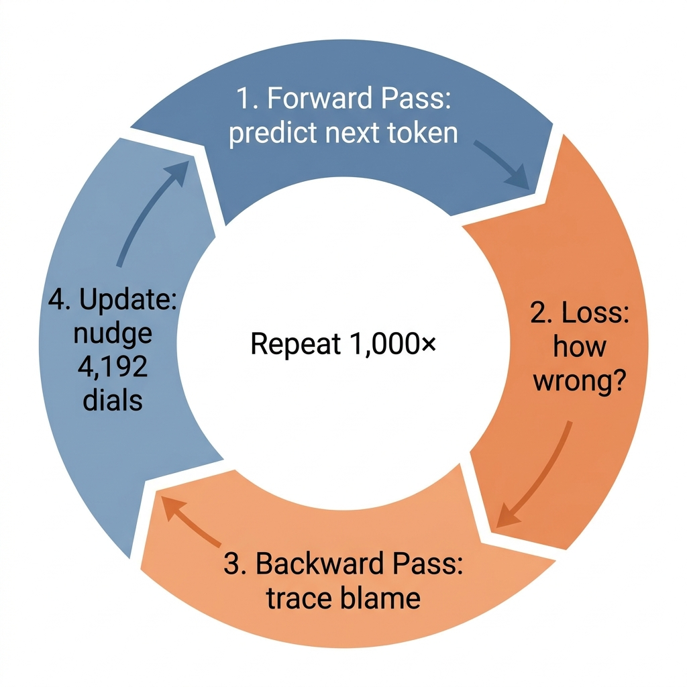
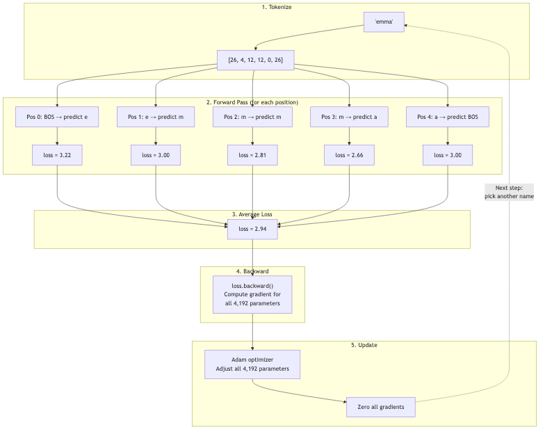

# Lesson 16: The Full Training Step -- One Complete Cycle

Previous: [Lesson 15](./15-full-forward-pass.md)



## Putting It All Together

We now know every component: how tokens become vectors (Lesson 12), how attention selects relevant context (Lessons 13-14), how the full forward pass produces predictions (Lesson 15), how loss measures error (Lesson 5), how backpropagation traces blame (Lesson 7), and how the optimizer updates parameters (Lesson 11).

This lesson follows one complete training step from beginning to end. Every piece connects.

## Our Example: Training on the Name "emma"

The training loop picks one name at a time. Let's say at step 47, it picks the name `emma`.

### Phase 1: Tokenization (line 190)

```python
tokens = [BOS] + [uchars.index(ch) for ch in doc] + [BOS]
```

Each character is converted to its integer index. `BOS = 26` is the special start/end token.

```
Character:  BOS   e   m   m   a   BOS
Token ID:   26    4   12  12  0   26
Position:   0     1   2   3   4   5
```

There are 6 tokens, which means 5 prediction tasks (each token predicts the next one).

### Phase 2: Initialize Caches (line 194)

```python
keys, values = [[] for _ in range(n_layer)], [[] for _ in range(n_layer)]
losses = []
```

Fresh KV caches -- empty lists. Each new name starts with no cached context.

### Phase 3: Process Each Position (lines 197-202)

```python
for pos_id in range(n):
    token_id, target_id = tokens[pos_id], tokens[pos_id + 1]
    logits = gpt(token_id, pos_id, keys, values)
    probs = softmax(logits)
    loss_t = -probs[target_id].log()
    losses.append(loss_t)
```

The model walks through the name one token at a time. At each step it sees the current token and must predict the next one.

#### Position 0: BOS predicts "e"

```
Input:  token_id = 26 (BOS), pos_id = 0
Target: target_id = 4 (e)
```

The model runs the full forward pass (Lesson 15) with just BOS as context. It has never seen any letters of this name yet, so it is essentially guessing.

After `gpt()` returns 27 logits, softmax converts them to probabilities. At the start of training, these are nearly uniform -- about `1/27 = 0.037` for each character. Suppose `probs[4] = 0.04` (the probability assigned to `e`).

```
loss_0 = -log(0.04) = 3.22
```

That is a high loss. The model gave `e` only a `4%` chance. There are thousands of names in the dataset that start with many different letters, so this is a hard prediction.

**Important**: this call to `gpt()` stored `BOS`'s Key and Value in the cache. Position 1 will be able to attend to them.

#### Position 1: "e" predicts "m"

```
Input:  token_id = 4 (e), pos_id = 1
Target: target_id = 12 (m)
```

Now the model has context: it can attend to both BOS (position 0) and the current token `e` (position 1). Suppose it assigns `probs[12] = 0.05`.

```
loss_1 = -log(0.05) = 3.00
```

Still high, but slightly better. The model has one letter of context now.

#### Position 2: "m" predicts "m"

```
Input:  token_id = 12 (m), pos_id = 2
Target: target_id = 12 (m)
```

Context available: BOS, `e`, `m`. The model needs to predict that after `em`, another `m` comes. Suppose `probs[12] = 0.06`.

```
loss_2 = -log(0.06) = 2.81
```

#### Position 3: "m" predicts "a"

```
Input:  token_id = 12 (m), pos_id = 3
Target: target_id = 0 (a)
```

Context: BOS, `e`, `m`, `m`. After `emm`, the model should predict `a`. Suppose `probs[0] = 0.07`.

```
loss_3 = -log(0.07) = 2.66
```

#### Position 4: "a" predicts BOS (end of name)

```
Input:  token_id = 0 (a), pos_id = 4
Target: target_id = 26 (BOS)
```

Context: BOS, `e`, `m`, `m`, `a`. The model needs to predict that `emma` ends here. Suppose `probs[26] = 0.05`.

```
loss_4 = -log(0.05) = 3.00
```

### Phase 4: Average the Losses (line 204)

```python
loss = (1 / n) * sum(losses)
```

We have 5 individual losses. The average is:

```
loss = (3.22 + 3.00 + 2.81 + 2.66 + 3.00) / 5
     = 14.69 / 5
     = 2.94
```

For reference, random guessing among 27 tokens gives `-log(1/27) = 3.30`. Our loss of `2.94` means the model is doing slightly better than random but still not good.

### Phase 5: Backward Pass (line 205)

```python
loss.backward()
```

This is the single most important line. It traces backward through **every** operation that produced the loss, computing a gradient for **every** parameter.

Think about what this traces through:

```
loss
  ← average of 5 individual losses
    ← each loss = -log(prob of correct token)
      ← prob came from softmax
        ← softmax input = logits from gpt()
          ← logits = linear(x, lm_head)
            ← x came from MLP with residual
              ← MLP input came from attention with residual
                ← attention used Q, K, V from linear projections
                  ← Q, K, V came from normalized embeddings
                    ← embeddings came from wte and wpe lookup tables
```

Every `Value` object in this chain stores its gradient after `backward()` runs. Every single one of the 4,192 parameters now has a `.grad` attribute saying "if this parameter increased slightly, the loss would change by this much."

### Phase 6: Adam Optimizer Update (lines 208-215)

```python
lr_t = learning_rate * (1 - step / num_steps)
for i, p in enumerate(params):
    m[i] = beta1 * m[i] + (1 - beta1) * p.grad
    v[i] = beta2 * v[i] + (1 - beta2) * p.grad ** 2
    m_hat = m[i] / (1 - beta1 ** (step + 1))
    v_hat = v[i] / (1 - beta2 ** (step + 1))
    p.data -= lr_t * m_hat / (v_hat ** 0.5 + eps_adam)
    p.grad = 0
```

For each of the 4,192 parameters, the Adam optimizer (Lesson 11):

1. **Computes the learning rate** (`line 208`): starts at `0.01` and decays linearly to `0` over the course of training
2. **Updates the momentum** (`line 210`): a smoothed running average of recent gradients
3. **Updates the velocity** (`line 211`): a smoothed running average of squared gradients
4. **Bias-corrects both** (`lines 212-213`): compensates for them starting at zero
5. **Adjusts the parameter** (`line 214`): moves it in the direction that reduces the loss
6. **Zeros the gradient** (`line 215`): clears the slate for the next step

After this, every parameter has been nudged slightly. The embedding for `e` might have changed so that next time it produces a better Q when followed by `m`. The attention weights might have shifted so that position 3 pays more attention to position 2. Thousands of tiny adjustments, all coordinated by the chain rule.

## The Full Cycle as a Diagram



## What Happens Over 1000 Steps

The training loop runs for `num_steps = 1000` (`microgpt.py:186`). Each step picks one name, runs the full cycle above, and updates all parameters.

Here is roughly what the loss looks like over time:

| Step | Approximate Loss | What's happening |
|------|-----------------|-----------------|
| `1` | `3.3` | Random guessing. `-log(1/27) = 3.3` |
| `10` | `3.1` | Tiny improvement. Learning that some letters are more common than others. |
| `50` | `2.8` | Starting to learn common letter pairs (like `th`, `an`, `er`). |
| `100` | `2.5` | Recognizing that names tend to end after certain patterns. |
| `200` | `2.3` | Learning position-dependent patterns (names often start with certain letters). |
| `500` | `2.1` | Good at common patterns. Still struggles with rare names. |
| `1000` | `2.0` | Reasonable quality. Can generate plausible-sounding names. |

The loss will never reach `0`. That would mean the model predicts every next character with `100%` confidence, which is impossible -- after `a`, many different letters could come next depending on the name.

## The Algorithm in Plain English

The entire training process can be stated in one paragraph:

**Show the model a name, one character at a time. At each step, ask it to predict the next character. Measure how wrong it was (cross-entropy loss). Trace that error backward through every computation to find out how much each parameter contributed to the mistake (backpropagation). Adjust each parameter slightly to reduce the error (Adam optimizer). Zero the gradients. Pick another name. Repeat 1000 times.**

That is the complete algorithm. Everything else -- attention, embeddings, normalization, MLPs, residual connections -- is the architecture of the prediction function. The training algorithm is just this loop.

## Why It Works

Consider what the model must learn to predict names well:

- **Letter frequencies**: `a` and `e` are common; `q` and `z` are rare
- **Letter pairs**: `th` is common; `qx` is not
- **Position patterns**: names often start with consonants or capital-equivalent letters
- **Ending patterns**: names often end with `a`, `e`, `n`, or other common endings
- **Name structure**: consonant-vowel alternation is common

The model has no explicit knowledge of any of this. It discovers all of it implicitly by trying to predict characters and adjusting its 4,192 parameters based on the errors. After 1000 names, those parameters encode a statistical model of "what name-like character sequences look like."

## The Connection Between Components and Learning

Each component we studied plays a specific role in making the model learn:

| Component | Role in learning |
|-----------|-----------------|
| Embedding tables | Learn useful representations for each character and position |
| Attention | Learns which past characters matter for predicting the next one |
| MLP | Learns nonlinear transformations of the attended information |
| Residual connections | Keep gradients flowing so all layers can learn effectively |
| RMSNorm | Keeps values in a range where learning is stable |
| Softmax + log loss | Converts predictions to probabilities and measures error |
| Backpropagation | Traces error back to find each parameter's contribution |
| Adam optimizer | Makes smart, adaptive updates to each parameter |

Remove any one of these and training breaks down. They form an interlocking system where each part enables the others.

---

> **Lab 16: LR Warmup** — Compare linear decay, cosine decay, and warmup + cosine schedules.
>
> ```bash
> cd labs && python3 lab16_lr_warmup.py
> ```
>
> *Try the lab before moving on. Predict what will happen first.*

Next: [Lesson 17](./17-experiments.md)
