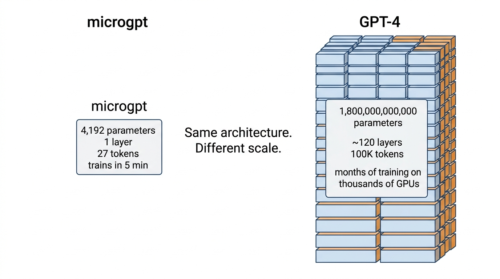
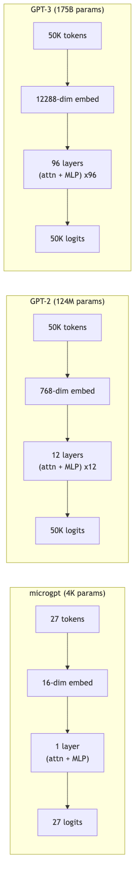

# Lesson 18: From microgpt to GPT-4 -- The Same Idea, Scaled Up

Previous: [Lesson 17](./17-experiments.md)



## The Punchline

Every modern large language model -- GPT-4, Claude, Llama -- is built on the same core ideas you just learned in microgpt. Attention over past tokens. MLP blocks that transform representations. Learned embeddings. Softmax probabilities. Backpropagation. Adam. The fundamentals are the same.

The details differ: real models use techniques like grouped-query attention, rotary positional embeddings (RoPE), and SwiGLU activations instead of ReLU. But the conceptual architecture -- embed, attend, transform, predict -- is what you already understand.

The biggest difference is scale. microgpt is a toy. GPT-4 is that same idea, manufactured at industrial scale.

This lesson maps what you learned onto the real models, shows what changes at scale and what stays exactly the same, and closes with why this simple recipe -- "predict the next token" -- produces something that looks like intelligence.

## The Scale Comparison

| | microgpt | GPT-2 | GPT-3 | GPT-4 |
|---|---------|-------|-------|-------|
| **Parameters** | `4,192` | `124,000,000` | `175,000,000,000` | Not disclosed |
| **Layers** | `1` | `12` | `96` | Not disclosed |
| **Embedding dim** | `16` | `768` | `12,288` | Not disclosed |
| **Attention heads** | `4` | `12` | `96` | Not disclosed |
| **Vocab size** | `27` | `50,257` | `50,257` | `~100,000` |
| **Context length** | `16` | `1,024` | `2,048` | `128,000+` |
| **Training data** | `32K names` | `40 GB text` | `570 GB text` | Not disclosed |
| **Training hardware** | `1 CPU, minutes` | `8 GPUs, days` | `thousands of GPUs, months` | Not disclosed |

> **Note:** OpenAI's [GPT-4 technical report](https://cdn.openai.com/papers/gpt-4.pdf) explicitly withholds architecture details, model size, training compute, and dataset information. Widely-circulated numbers (1.8T parameters, MoE with 8 experts, etc.) are unconfirmed rumors, not official figures. GPT-2 and GPT-3 numbers above come from their published papers.

microgpt has 4,192 parameters. GPT-3 has 175 billion -- a factor of about 40 million. GPT-4 is believed to be substantially larger still. Yet the fundamental structure is the same: tokens go in, embeddings look them up, attention selects context, MLPs transform, and logits predict the next token.

## What Changes at Scale

### 1. Tokenization: BPE Instead of Characters

microgpt works character by character. The word `unforgettable` would be 13 separate tokens: `u`, `n`, `f`, `o`, `r`, `g`, `e`, `t`, `t`, `a`, `b`, `l`, `e`.

Real models use **Byte Pair Encoding (BPE)**, which merges common character sequences into single tokens. The same word might become 3-4 tokens:

```
un + forget + table
```

Or even fewer, depending on the vocabulary. GPT-2 uses a vocabulary of 50,257 sub-word tokens. This means:

- Each token carries more meaning (a whole word or word-piece vs. a single letter)
- Sequences are shorter (fewer tokens to process for the same text)
- The model can handle any text, not just the 26 letters microgpt knows

The embedding table grows accordingly: instead of 27 rows (one per character), GPT-2 has 50,257 rows. But each row is the same concept -- a learned vector representing that token.

### 2. Many More Layers

microgpt has 1 layer. GPT-3 has 96. Each layer is the same attention-then-MLP block from Lesson 15:

```
for each layer:
    normalize → attention → residual → normalize → MLP → residual
```

Repeated 96 times. Each layer has its own weight matrices, so each can learn different transformations. Researchers have observed that:

- **Early layers** tend to learn basic syntactic patterns (word order, punctuation)
- **Middle layers** tend to learn semantic relationships (meaning, context)
- **Later layers** tend to learn task-specific patterns (answering questions, following instructions)

The core pattern in each layer is the same as `microgpt.py:144-176`: normalize, attend, project, residual, normalize, feed-forward, residual. Real models swap in different components (SwiGLU instead of ReLU, grouped-query attention instead of standard multi-head, RoPE instead of learned positional embeddings), but the overall structure is recognizable.

### 3. Much Larger Embeddings

microgpt represents each token as a 16-dim vector. GPT-3 uses 12,288 dimensions.

With 16 numbers, you can describe a character roughly -- "it is a vowel, it commonly follows consonants, it appears at the start of names." With 12,288 numbers, you can encode incredibly nuanced information -- subtle relationships to thousands of concepts, grammatical properties, semantic meaning, and much more.

The embedding table for GPT-3 alone has `50,257 x 12,288 = 617,558,016` parameters -- just for the token embeddings. That single table has more parameters than microgpt's entire model by a factor of 150,000.

### 4. Trained on Internet-Scale Text

microgpt trains on 32,000 baby names. GPT-3 trains on hundreds of gigabytes of text: books, Wikipedia, websites, forums, code repositories, and more. GPT-4's training data is even larger.

The diversity of the training data is what gives large models their breadth of knowledge. A model trained only on names can generate names. A model trained on the internet can discuss history, write code, explain science, tell jokes, and much more -- because all of those are patterns in its training data.

### 5. RLHF: Fine-Tuning with Human Feedback

After the initial training (called **pre-training**), which works exactly like microgpt's training loop -- predict the next token, compute loss, backpropagate, update -- large models go through an additional phase.

**Reinforcement Learning from Human Feedback (RLHF)** or its variant **RLAIF** (from AI feedback) works like this:

1. The pre-trained model generates responses to prompts
2. Human evaluators rank the responses (which answer is better?)
3. A reward model is trained to predict human preferences
4. The language model is fine-tuned to produce responses the reward model rates highly

This is how a model goes from "predict the next token" to "be a helpful, harmless assistant." The pre-training teaches it language and knowledge. The fine-tuning teaches it to use that knowledge helpfully.

### 6. Mixture of Experts

Some large models use a technique called **Mixture of Experts (MoE)**. Instead of one large MLP in each layer, there are several "expert" MLPs. A small routing network decides which expert(s) to use for each token. (GPT-4 is widely rumored to use MoE, though OpenAI has not confirmed this.)

This means not all parameters are active for every token. A model with many experts might only activate a fraction of its total parameters per token. This makes the model both larger (more total knowledge) and faster (fewer computations per token).

The attention mechanism stays the same. Only the MLP block is modified.

### 7. KV-Cache Optimization

In microgpt, we already see the KV cache at `microgpt.py:152-153`:

```python
keys[li].append(k)
values[li].append(v)
```

This is the same optimization used in production LLMs. When generating text token by token, you do not want to recompute all past Keys and Values from scratch. You store them and only compute the new token's Q, K, V.

For large models with 128,000 token contexts and 12,288-dim embeddings, the KV cache can consume many gigabytes of memory. Managing this efficiently is a major engineering challenge.

### 8. Flash Attention

The attention computation in microgpt (`microgpt.py:162-164`) involves computing all pairwise dot products between the Query and every Key, then applying softmax, then weighting the Values. For long sequences, this requires storing a matrix of size `sequence_length x sequence_length`, which grows quadratically.

Flash Attention is an algorithm that computes the exact same result but in a memory-efficient way, processing the attention in blocks that fit in the GPU's fast memory (SRAM) instead of slow memory (HBM). The mathematical result is identical -- it is purely an implementation optimization.

### Scaling These Changes: A Concrete Comparison

To make the scale difference tangible, consider what happens when microgpt processes a single token versus what GPT-3 does for the same task.

**microgpt processing one token:**

```
Embedding lookup:        16 numbers retrieved
Attention Q, K, V:       3 matrix multiplications of size 16x16
Attention dot products:   up to 16 comparisons (max context) x 4 heads
MLP expand:              16 -> 64 (1,024 multiplications)
MLP compress:            64 -> 16 (1,024 multiplications)
Output logits:           16 -> 27 (432 multiplications)
Total: a few thousand arithmetic operations
```

**GPT-3 processing one token:**

```
Embedding lookup:        12,288 numbers retrieved
Attention Q, K, V:       3 matrix multiplications of size 12288x12288, x96 layers
Attention dot products:   up to 2,048 comparisons x 96 heads x 96 layers
MLP expand:              12,288 -> 49,152 x 96 layers
MLP compress:            49,152 -> 12,288 x 96 layers
Output logits:           12,288 -> 50,257
Total: roughly 350 billion arithmetic operations per token
```

That is roughly `350,000,000,000` operations for a single token. For a response of 500 tokens, that is 175 trillion operations. This is why training and running large models requires specialized hardware -- a consumer laptop could never keep up.

## What Does NOT Change

This is the more remarkable part. Despite all the engineering that goes into models with trillions of parameters, the core algorithm is identical to microgpt.

### Same forward pass structure

```
tokens → embeddings → (attention → MLP) x N → predict next token
```

Every modern LLM follows this exact pipeline. The number of layers `N` varies (1 in microgpt, 96 in GPT-3), but each layer does the same thing.

### Same training objective

```
loss = -log(probability of the correct next token)
```

This is cross-entropy loss, the same loss function from Lesson 5. GPT-4 is trained by predicting the next token in a sequence and minimizing this loss, just like microgpt predicting the next character in a name.

### Same backpropagation

The chain rule from Lesson 7 is the same chain rule used to train GPT-4. Gradients flow backward through every operation -- through the output projection, through attention, through the MLP, through the embeddings -- exactly as they do in microgpt. The `backward()` function on `Value` objects implements the same algorithm that PyTorch uses at trillion-parameter scale.

### Same optimizer

Adam (Lesson 11) or close variants (like AdamW, which adds weight decay) are used to train virtually all large language models. The same momentum, same adaptive scaling, same bias correction. The update rule at `microgpt.py:210-214` is the same one running on clusters of thousands of GPUs.

### Same attention mechanism

Q, K, V projections. Dot product scores. Scale by `sqrt(head_dim)`. Softmax. Weighted sum of values. Multi-head split. Output projection. The core mechanism is the same, though real models often use variants like grouped-query attention (GQA) for efficiency, where multiple query heads share a single key/value head.

## The Unreasonable Effectiveness of Next-Token Prediction

This is the deepest question in the field: why does "predict the next word" produce something that looks like intelligence?

### To predict well, you must understand

Consider what the model must do to predict the next token in these sequences:

**"The capital of France is ___"**

To predict `Paris`, the model must have encoded geographical knowledge.

**"def fibonacci(n): return n if n <= 1 else ___"**

To predict `fibonacci(n-1) + fibonacci(n-2)`, the model must understand recursion.

**"She picked up the phone and said ___"**

To predict `hello`, the model must understand social conventions.

The training objective is simple -- predict the next token -- but the only way to get good at it across diverse text is to build increasingly sophisticated internal representations of language, logic, facts, and reasoning. Next-token prediction is a proxy objective that forces the model to learn about the world.

### Scale makes the difference

At microgpt's scale (4,192 parameters, 32K names), the model learns character-level statistics of English names. That is all it has the capacity for.

At GPT-3's scale (175 billion parameters, 570 GB of text), the model learns grammar, facts, reasoning patterns, coding syntax, and more. Not because anyone programmed these capabilities, but because predicting the next token in diverse text requires them.

At GPT-4's scale, the capabilities extend further: more reliable reasoning, better instruction following, broader knowledge. Same objective, more capacity, more data.

### Emergent capabilities

Some capabilities appear suddenly as models scale up. Small models cannot do arithmetic at all. Medium models can do simple addition. Large models can do multi-step math. This is not programmed -- it emerges from the pressure of next-token prediction on increasingly capable architectures.

### The same idea at every scale

Here is the same architecture drawn at three scales:



The boxes get bigger, but the structure is identical. Tokens in, embeddings, repeated attention+MLP blocks, logits out.

## The Training Process at Scale

Training GPT-3 took roughly 3.14 x 10^23 floating-point operations (FLOPs). To put that in perspective:

- microgpt training (1000 steps): maybe a few billion operations total, done in minutes on one CPU
- GPT-2 training: days on 8 GPUs
- GPT-3 training: months on thousands of GPUs, estimated to cost several million dollars in compute
- GPT-4 training: months on tens of thousands of GPUs, estimated at over $100 million in compute

But the training loop is the same. Pick a batch of text. Run the forward pass. Compute the loss. Run backward. Update with Adam. Repeat. The `for step in range(num_steps)` loop at `microgpt.py:188` is conceptually the same loop running on those GPU clusters -- just with more data, more parameters, and much more compute per step.

## What This Toy Leaves Out

microgpt is a complete, working GPT -- but it makes many simplifications to stay readable. If you move on to real implementations (PyTorch, Hugging Face, nanochat), here is what you'll encounter that microgpt doesn't have:

| What's missing | Why it matters |
|----------------|----------------|
| **Batching** | microgpt trains on one name at a time. Real models process hundreds of examples simultaneously for efficiency. |
| **Train/validation split** | microgpt has no way to detect overfitting. Real training holds out data to measure generalization. |
| **Dropout** | Randomly zeroing activations during training to prevent overfitting. microgpt has none. |
| **Learned norm weights** | microgpt's `rmsnorm` has no learnable parameters. Real implementations add a per-element scale. |
| **Biases** | The `linear()` calls in microgpt have no bias terms. Most real models add `+ b` after each matrix multiply (or deliberately omit them as a design choice). |
| **Weight tying** | Real models often share the token embedding matrix (`wte`) with the output projection (`lm_head`). microgpt keeps them separate. |
| **Explicit causal mask** | microgpt processes tokens sequentially, so causality is implicit. Real models process all positions in parallel and need a triangular mask (see Lesson 13). |
| **Subword tokenization** | Character-level tokenization is simple but inefficient. Real models use BPE or SentencePiece. |
| **Multi-sample training** | microgpt's training loop sees each name once in sequence. Real training shuffles, repeats, and samples from enormous datasets. |
| **Learning rate warmup** | Real training ramps up the learning rate gradually before decaying it. microgpt only decays. |

None of these change the fundamental algorithm. They are all engineering improvements that make the same core idea work better, faster, or at larger scale. If you understand microgpt, you understand the skeleton that all of these additions hang on.

## What You Now Understand

You started from zero. Here is what you know:

| Concept | Lesson | One-sentence summary |
|---------|--------|---------------------|
| Parameters | 1 | Adjustable numbers that define the model's behavior |
| Vectors | 2 | Lists of numbers that represent tokens |
| Dot product | 3 | Measures similarity between vectors |
| Softmax | 4 | Converts scores to probabilities |
| Cross-entropy loss | 5 | Measures how wrong the prediction is |
| Derivatives | 6 | How much each parameter affects the loss |
| Chain rule / backprop | 7 | Multiply slopes along the chain to get gradients |
| Neurons / linear layers | 8 | Weighted sums, the basic computation unit |
| ReLU | 9 | Nonlinearity that prevents layers from collapsing |
| Gradient descent | 10 | Update parameters to reduce loss |
| Adam optimizer | 11 | Smart gradient descent with momentum and adaptation |
| Tokenization / embeddings | 12 | Text to integers to vectors |
| Attention | 13 | Selecting relevant context via Q, K, V |
| Multi-head attention | 14 | Multiple attention patterns in parallel |
| Full forward pass | 15 | The complete token-to-prediction pipeline |
| Full training step | 16 | Forward, loss, backward, update |
| Experiments | 17 | How changing hyperparameters affects the model |
| Scaling to GPT-4 | 18 | Same architecture, much bigger |

## Closing

You have gone from zero to understanding the fundamental architecture behind every modern large language model. You know how tokens become vectors, how attention selects context, how MLPs transform information, how loss drives learning, how backpropagation assigns blame, and how optimizers adjust parameters.

The rest -- Flash Attention, distributed training across thousands of GPUs, RLHF, mixture of experts, quantization, speculative decoding -- is engineering. Important engineering, but engineering built on top of the ideas you now understand.

When someone says "GPT-4 has billions of parameters," you know what a parameter is (Lesson 1) and what those parameters do (they form the weight matrices in the attention and MLP layers you traced through in Lesson 15).

When someone says "the model uses attention," you know exactly what that means: Query-Key dot products, softmax weights, Value summation (Lesson 13).

When someone says "it was trained with backpropagation," you know the chain rule is flowing gradients backward through every operation, telling each parameter how to change (Lesson 7).

The core of every LLM is a prediction function with learned parameters, trained by gradient descent to predict the next token. microgpt implements this in 239 lines of Python. GPT-4 implements it across a massive distributed system. The idea is the same.

## Where to Go Next

You now understand every core concept behind modern LLMs. Here are the best resources to go deeper, organized by what you want to do next.

### Watch

- **Andrej Karpathy's "Let's build GPT from scratch"** (YouTube) -- Karpathy builds a character-level GPT in PyTorch from an empty file. You will recognize every single step because it mirrors what microgpt does, just in a real ML framework. The payoff is seeing that everything you learned maps directly to production code.

- **Karpathy's "Neural Networks: Zero to Hero" full playlist** (YouTube) -- Covers micrograd (the same autograd engine as microgpt's `Value` class), makemore (character-level language models), and a full GPT build. This is the most thorough free course that starts from zero, and you now have enough background to move through it quickly.

### Read

- **"Attention Is All You Need"** (Vaswani et al., 2017) -- The original transformer paper. You now know every concept in it: Q/K/V attention, multi-head splitting, positional embeddings, residual connections, layer normalization, and feed-forward networks. Reading it will feel like recognizing old friends rather than meeting strangers.

- **Sebastian Raschka's "Build a Large Language Model (From Scratch)"** -- A structured book that covers the full pipeline from tokenization through pretraining and fine-tuning. It bridges the gap between microgpt-scale understanding and real-world implementation, with clear PyTorch code at every step.

- **Jay Alammar's "The Illustrated Transformer"** (blog post) -- Excellent visual explanations of the transformer architecture. Where microgpt taught you the math and the code, Alammar's diagrams will give you a complementary geometric intuition for how data flows through the model.

### Build

- **Implement a BPE tokenizer from scratch** -- microgpt uses character-level tokenization. Real models use BPE. Building one yourself bridges that gap and demystifies how "hello" becomes `[15339]` instead of `['h','e','l','l','o']`. Karpathy's minbpe repository is a good reference.

- **Clone nanochat (github.com/karpathy/nanochat) and train a small model** -- This is the real training pipeline: batching, GPU acceleration, proper evaluation, and real datasets. You understand the algorithm; nanochat shows you the engineering that makes it work at scale.

- **Port microgpt to PyTorch using the appendix mapping** -- The [appendix](./appendix-pytorch-mapping.md) maps every microgpt construct to its PyTorch equivalent. Translating the code yourself is the fastest way to verify that you understand both the concepts and the framework.

### Explore

- **llm.c by Karpathy** (github.com/karpathy/llm.c) -- The same transformer concepts implemented in raw C. If you want to understand what is happening at the hardware level -- no autograd, no framework, just memory and arithmetic -- this is the place. You will see that backpropagation is just a for-loop that multiplies and accumulates, exactly like `microgpt.py:95-97`.

- **nanoGPT** (github.com/karpathy/nanoGPT) -- The predecessor to nanochat and simpler to start with. A clean, minimal GPT training codebase in PyTorch. Good as a first step before tackling nanochat's full feature set.
